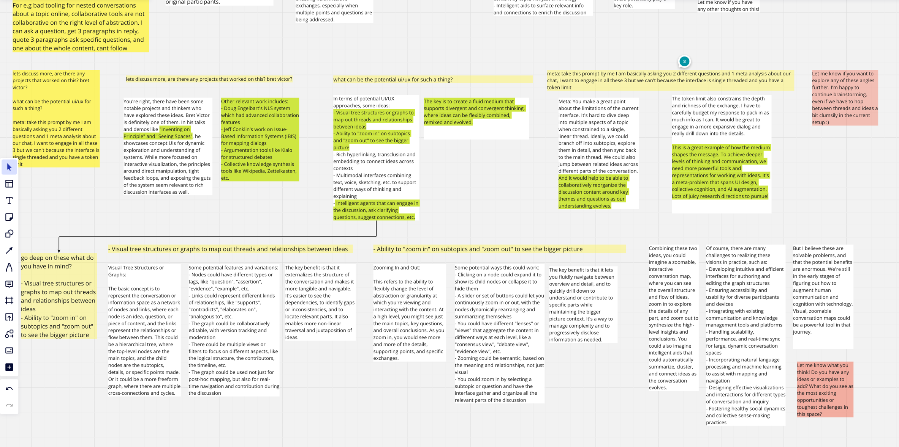

Discourse graphs: https://network-goods.notion.site/The-Discourse-Graph-starter-pack-312374c813b24ec6b4d53a054371ee5a

Ontological logs: https://arxiv.org/pdf/1102.1889.pdf

Collective intelligence:https://topos.site/work/collective-intelligence/

Applied category theory:https://arxiv.org/pdf/1803.05316.pdf  

---

We have Google earth to explore any part of the world, but we don't have anything like that for knowledge. 

What is the current state of progress on autoimmune diseases, what and how well do the experts understand it? who is working on it? 
how far have they got? what are all the explored directions? how can I understand, contribute, use and spread it? 

We need a place to get the best view for the current state of things, and contribute our part.

How can I start from 60k feet view and get to 30k? Maybe read a book, listen to some lectures, podcast etc. I have tried
they don't work, it feels like its working but for me, I have realised over time its more of insight porn than anything else.

There is no REPL, no visual model I can break, play, or engage with. For 60k feet view of biology in 2024 I would expect a 3d interactive
model of Caenorhabditis elegans (C. elegans). 

Time travel should be possible in 2024, atleast for recorded knowledge. I should be able to ask how we got here?
We need a massive interactive "God created the integers" for all knowledge. I should be able to start 2-3000 years back
and rediscover for myself. 

Define knowledge. 

A scientific paper should not only be a paper with text written on it and the reader develops the model in their brain. 
We should be able to upload a paper and see what is the diff from the current model, we should be able to replicate it 
via a simulation. Maybe as I go through section by section and the 3d model is updating itself. 

The paper should not be a paper in current format imo, it should be a log, sometimes I am more interested in knowing how
than what, I want to feel what the author felt, I want to do the work. So when I am reading the log I am building the world
piece by piece, maybe I want to stop at some point and then think by myself, I want to re discover it and not know it. 

Science should be distributed, open and accessible for all the humans. University is not. 
State of what we call "collaboration" in physical world is not what I mean by collaboration. The "collaborative" tools
in the software space just mean here are cursors of all the people. CRDT is the cutting edge topic in collaborative software
which I think is the first layer of abstraction over "here are cursors of all the people". Conflicts in a collaborative 
software are considered to be bad, yes they are by current definition at the current level of abstraction. If the abstraction
layer is higher conflicts are good for progress. 

My very strong intuition as of april 14 is that category-theory is THE missing piece I have been looking since the starting
of this project as a mere thought. I think so because would provide me with the tool that lets me think about the structure and coherence.

---

Random musings on how things should be: 

If llms or any ai for that matter has to become a true collaborator to a human then it should be highly malleable, can't 
expect the same linear chat ui to be used for creation, brainstorming, synthesising, do some task, collaborate.
Paper is used differently while in different phases of work. 

Currently the answer is too quick, I want to ask question async, I generally expect the answer to be present but not 
distracted by this thread right now. I want to continue reading the rest, synthesis the current text. Once I am done, I
want to think and mull over it, add my comments, see if and how my thinking has changed, explore some threads but maybe
in my brain, make some connections or maybe not. And then see replies to my quoted questions. 

Maybe the essence of the system should be how you want to feel while interacting with it and long after the interaction is done.
Maybe its more about the feelings that the action, how to emulate "pure feelings" in these systems, I mean we should be able to
because we can with "art" which in itself is a communication system. 

The system should be viewed as an art one can engage with, I think one strong litmus test would be "have you used it in your dreams?"
