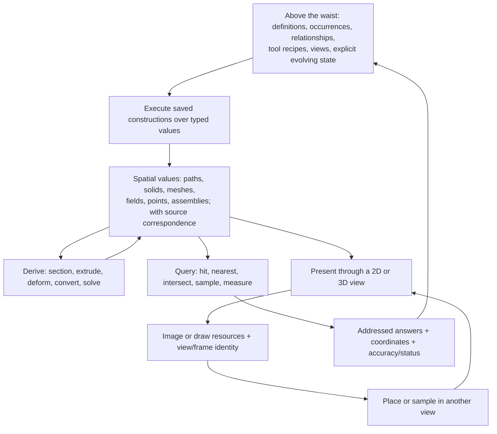

**3D as reusable spatial content — a working picture**

Exploration, 2026-09-06. The positions here are proposed for discussion, not decisions attributed to Sid. The starting picture is the current [path-kind page](../path-kind/path-kind.md), qualified by [HANDOFF-8 section 3](../path-kind/HANDOFF-8.md), and the demands in the [3D ceilings starter](../3d-ceilings-starter.md). Client claims below come from the README → namespace → function → implementation hierarchy under `src/app/client/`, read at source HEAD `eeaf4f9`. No runtime was exercised. The path page was read from the working tree, including its session 9 additions.

My position is **one computational waist, with several geometry and rendering libraries beneath it**. The common object is reusable spatial content with identity, a declared representation, and relationships. Spaces say how things are placed and related. Views say how some of that content is encountered. A page is a planar space; a face supports a planar or curved coordinate domain; a world is a spatial domain; Region3D is a view of spatial content placed on a page.

This keeps a useful page-first experience without making a page the owner of every world. It also permits a world-first experience with pages inside it. A window presents a chosen root view. Changing that root need not rewrite the content.



These arrows are operations and references. They do not prescribe one ownership tree, one storage format, or an instantaneous evaluation loop. Rendering recursion is bounded; simulation and feedback advance through explicit state or an explicit solver.

**Start with what the object must retain.** A drilled solid must remain something on which another hole can be cut. A scan must retain its measured values if later filtering or segmentation needs them. A stroke on a face must retain its identity and attachment when the object moves. A scene must survive being viewed in two different windows. None of those requirements follows from the image produced today.

The list “mesh, formula solid, scan, splats, extruded shape, scene” mixes several levels:

| Level | Meaning | Examples from this exploration |
|---|---|---|
| Source | What was authored, acquired, or imported | Pen samples, modeled mesh, scan samples, a supplied asset |
| Construction | A repeatable operation over inputs | Extrude a sketch, evaluate a solid formula, fit a scan, apply a deformer |
| Representation | What information a value retains and what operations it supports | Connected mesh, boundary-represented solid, implicit function, sampled field, points, splats |
| Occurrence | This use of a definition in a particular context | This copy of a part, with its pose and local overrides |
| Assembly or scene | Related occurrences evaluated in a spatial context | The object with attached ink; the other land with lights and objects |
| View | A presentation of content through a projection and aperture | The region on the page, a section view, a portal's displayed view |

A modeled mesh can be the authoritative editable value. A mesh derived from a solid is usually a presentation or computation representation of that solid. They may contain identical vertex arrays and still have different authority. Conversion therefore needs declared direction and provenance. An edit to a derived mesh does not automatically edit the feature history that generated it.

A geometric object can contain points, curves, surfaces, or occupied volumes; being in a 3D space does not make every object a solid. Topology supplies connectivity and boundary relationships. Geometry supplies coordinates, curves, surfaces, or fields. Attributes supply measured values, appearance, or physical properties. Assemblies add occurrences and relationships. Behavior supplies constructions and evolution over time. These pieces can be reused independently.

There is no reason to force all representations into one universal geometry. A point cloud does not necessarily enclose an inside. A splat representation can describe appearance without providing an editable watertight boundary. A sampled density field is not the same information as one selected isosurface. A formula may define occupancy without supplying distance, a smooth surface, or a practical intersection algorithm. An interface must declare which answers exist; it must not manufacture them from the type name.

The field supports this plurality. Open CASCADE distinguishes geometric curves and surfaces from the topology binding them into faces, shells, and solids. OpenVDB separates sparse samples from the mapping that locates them in physical space. These are useful precedents for distinct typed values, not evidence that either library supplies Softland's whole model. [OCCT modeling data](https://dev.opencascade.org/doc/overview/html/index.html), [OpenVDB overview](https://www.openvdb.org/documentation/doxygen/overview.html).

**The adopted scene model holds at the evaluated presentation boundary.** Objects, transforms, geometry, materials, lights, and a viewing camera describe a large class of rendered scenes. For authoring all the ceilings, add the constructions, constraints, topology, attributes, and time/state that produced the evaluated scene. A camera may be a saved scene asset; a particular scene need not own one compulsory active camera.

The claim that interchange is settled needs this scope. glTF explicitly leaves authoring information outside its purpose. USD provides rich scene composition and overrides, while its introduction explicitly says it is not a rigging system and does not automatically repair shading assignments after topology changes. My inference is that these establish strong interfaces for particular layers; they do not establish one complete authoring representation for CAD, film, BIM, and scans. [glTF design goals](https://registry.khronos.org/glTF/specs/2.0/glTF-2.0.html), [USD introduction](https://openusd.org/release/intro.html).

**Containment has several meanings that must stay independent.** Definition ownership answers where an edit is saved. Occurrence placement answers how local coordinates become coordinates in another space. A view reference answers which content is shown through an aperture. Computation dependencies answer what must update. Light and physical interactions answer which objects affect one another. One parent field cannot express all five without accidental consequences.

For the requested case, the page refers to a view of land A. An occurrence in A refers to an object definition. Its face carries an attachment to the stroke. A portal in A refers to a view or a spatial entrance in land B. A and B need not be children owned by the page. The same A can appear elsewhere through another camera. Transform hierarchies can remain trees per occurrence while references between definitions and views form a graph.

My default is a planar root view for the current page experience, with both planar and spatial spaces nestable through explicit mappings. It becomes only a default when the primary experience is inhabiting a world or using tracked head and hand poses. A spatial root then becomes appropriate. Neither change should alter the identities of the page, the part, or the stroke.

An offscreen region is a good isolation boundary when it means an independently viewed illustration or workspace. When objects must occlude, illuminate, or physically affect each other across an authoring group boundary, grouping them must not automatically isolate their rendering or simulation. The domain of interaction has to be declared separately from the grouping.

**“Render into a surface; use the surface as paint” is one composition operation.** It is powerful, symmetric, and recursively usable for images. It does not carry the full object through the seam. Three operations are needed:

| Operation | Input → output | What survives |
|---|---|---|
| Present a view in another space | Content + camera + aperture/mapping → a placed view | Target reference, projection, and an interaction route can remain live; an image is one render implementation |
| Embed or bind content | Local content + mapping to a host face or space → an occurrence/attachment | Geometry, identity, queries, and the relationship to the host |
| Derive across dimensions | Solid + section plane → section geometry; planar region + extrusion → solid | A new geometric result, with source correspondence and declared accuracy |

An image alone cannot answer which knot to edit, perform a solid boolean, or recover the geometry hidden behind the nearest surface. An interactive placed view can retain those abilities by referring back to the source and providing a query route. A section is an operation on geometry. It is not obtained by treating a rendered picture as editable geometry.

In the forward imaging direction, 2D region coverage can feed a 3D material or a depth-tested annotation. It is not a universal start of 3D. Extrusion needs a geometric planar region before pixels are produced; a volume renderer may sample a field directly without constructing such a boundary. Conversely, a 3D renderer eventually produces image samples that the 2D compositor can use.

There are also three distinct uses of “surface”: a geometric surface with coordinates and possibly topology; a sampled image of values; and a physical GPU render target. Their lifetimes, coordinate systems, and operations differ. A render target can be replaced while the image's source view and the host geometric face keep their identities.

**Here is the stroke-on-a-face case, through both directions.** Use a planar face first, so its local coordinates have an explicit physical scale. Assume the ink changes the face's appearance as a coating and belongs to this occurrence of the object. A screen-like annotation and ink shared across every occurrence are also expressible, but they are different declarations.

1. **Draw through the page into the face.** A pen event supplies a screen point, pressure, and time. Use the displayed frame's page transform to reach the region aperture, then the region view to form a ray in land A. Intersect the intended visible host, obtain its face identity, and map the point into the face's coordinate chart. Capture that attachment for the gesture. A chart is the mapping between local 2D coordinates and positions on the face.

2. **Run the pen definition.** The tool's data chooses sampling/fit behavior, a pressure response, the path stroke construction, width units, and paint. The evaluator executes the response; geometry operations fit the samples and construct the declared region. Save the gesture/source information needed for re-penning, the path result or its construction, paint, and an attachment referring to the occurrence and face. Changing the pressure formula can then derive a new path/region through the same machinery. This is the path picture used as a library.

3. **Give the attachment enough meaning.** It contains the content reference, occurrence identity, face reference, local mapping, and clipping/appearance rules. A plane frame alone is enough for a rigid planar placement. Attachment to a face also needs the face's valid domain, including holes, and a rule for changes to the host. Extending a gesture off the face cannot silently teleport it to the next object; crossing charts, splitting the stroke, or clipping are explicit tool behaviors.

4. **Draw from the face back out to the page.** The path library supplies coverage and paint in local coordinates. For coating ink, these control the local coating/material evaluation before lighting, with sampling appropriate to its coverage. For an annotation, it produces an explicitly unlit, depth-tested layer. For raised paint or a thread, geometry must also be produced. The view of A then contributes its image through the page aperture. The same coverage definition can support the first two interpretations, but multiplying a final color into an already shaded image does not make it a physical material.

5. **Zoom the page.** The outer mapping changes. The saved path, face attachment, object pose, and the region camera stay put. More screen pixels may require a sharper region image and finer curve/mesh approximation. A finite cached image must be refreshed or remain a declared approximation. The view's aspect/crop is kept stable unless a resize policy changes it.

6. **Orbit the region.** The camera in A changes. The face's projected size, visibility, and sampling footprint change. The stroke remains in face coordinates and disappears behind the object when occluded. Orbiting does not turn the stroke into screen coordinates. Moving the object changes its occurrence transform and carries the attachment along; it does not refit the path.

7. **Hover or click the stroke.** Reverse the same presentation route into A. Resolve visibility according to the query mode, reach the face, map into its chart, and query the path's declared painted region. Return both the editable identity and the occurrence/view route. The result can say “stroke K, segment S, parameter t, attached to face F of occurrence O, encountered through region R on page P,” with local coordinates, source correspondence, and the frame/geometry versions used.

8. **Look and act through the portal.** If it is a screen showing B through an independent camera, render B for that camera and sample it on the portal face in A. A pointer ray in A hits the portal face; its local coordinates become a point in B's view; another ray or planar query finds the target there. First respect occlusion in A. The return path includes the portal occurrence, so two portals showing the same object remain distinguishable.

9. **Make the portal a spatial window when that is intended.** Define the mapping from an entrance frame in A to an exit frame in B. Map the viewer and rays through that relationship, with aperture clipping, so moving sideways produces the appropriate parallax. Offscreen rendering can implement this, but a fixed independent camera does not. Allowing light, bodies, or navigation to cross adds their corresponding transport rules; a visual window alone does not supply them. Ray distances belong to their space segments and cannot be compared across a scaled portal as one unqualified number.

10. **Return 2D content from B through A to the page.** A planar page or ink surface in B is evaluated in its own coordinates, appears in B's view, then in A's portal, then in the region on P. Queries follow those same links in the other direction. If B shows P again, the reference is legitimate, but evaluation needs a finite recursion/depth or projected-error budget and a declared terminal result. Previous-frame feedback is another possible effect, with different temporal semantics.

11. **Edit the host and share the result.** A rigid transform preserves the face mapping. A topology-changing edit may split, delete, or replace the face. The construction must return correspondence, or an unresolved/ambiguous attachment, rather than attach to whichever triangle happens to occupy an old index. Sharing requires the content, dependency versions, and attachment references needed to resolve the result. The active camera may be personal view state or an explicitly saved/shared view; it need not be an edit to the object.

For the planar part of that route, the forward map is:

```text
stroke-local point
  → face embedding
  → object occurrence transform
  → region camera projection
  → region aperture placement on page
  → page camera
  → device pixel
```

The reverse route contains intersections because perspective projection loses depth. It is not one globally invertible transform. Forward transformations may be combined where mathematically valid, while the typed stages retain the information needed to construct the reverse query.

On a curved face, the chart mapping becomes nonlinear. Ray-to-chart recovery, seams, singularities, trimming, and deformation are additional work. Width measured in chart coordinates can stretch on the surface; physical width needs the surface's local metric. Thus the planar stroke construction is a good default for the requested planar case, not a proof of arbitrary surface painting.

**The two cameras compose as mappings; navigation chooses which one to change.** Page zoom magnifies and crops the existing region view. Moving the region camera toward an object changes perspective relationships between depths. Those are distinguishable operations.

“Zoom until I enter the region” therefore needs a declared navigation transition. One workable rule keeps wheel zoom on the page until the user enters that view, then gives its camera control ownership. A continuous transition must preserve the displayed crop/projection at handover and decide how it changes toward the new viewport. It cannot simply reset the page zoom and start a stock region camera without a visible jump. Other routing behaviors can be saved tool data.

Hover should expose the deepest relevant address and inform demand/quality priority. Gesture capture determines who owns a drag or camera manipulation until it ends. Hovering a different object mid-drag does not itself transfer ownership.

Quality derives from the complete mapping to final device pixels. Under perspective or a curved chart this is a local, generally anisotropic footprint, not one scalar zoom per object. A shared mapping service can provide derivatives or conservative error bounds to path packing, texture sampling, mesh refinement, portal resolution, and picking slop. Local-width ink and device-width borders retain different meanings. Device width must name the target view when the same object appears in multiple views.

**A hit is a structured answer, and hover is a changing query.** The underlying query protocol needs more than the topmost integer ID:

```text
Query input:
  displayed scene/view snapshot + pointer/ray/footprint
  + query mode and tolerance

Query output:
  hit/miss/unsupported/pending/approximate
  + definition and occurrence identities
  + view/portal route
  + subelement or source correspondence
  + coordinates tagged with their space
  + geometry/view versions and accuracy
```

The modes can include visible picking, geometry intersection, nearest feature, and field sampling. They share values and mappings; they do not all mean “the thing that supplied this pixel's color.” A reflection, translucent stack, and volume can have several contributors. The editing policy must choose the intended target interpretation. Lighting can make an ink patch dark without making it cease to be ink.

For the stroke, visibility first resolves the host layer and relevant occluders, then path classification resolves ink within that host. A small screen-space selection allowance uses the same mapping footprint. Picking the underlying face alone loses the stroke; picking ink on every intersected face ignores occlusion. A color texture alone loses both distinctions. An ID buffer can accelerate part of the route, while source correspondence and query semantics remain necessary.

Hover depends on pointer position, cameras, geometry, attachments, visibility policy, and relevant residency. Re-run it when those dependencies change even if the mouse is stationary. Diff the old and new addressed routes to produce enter/leave/hover changes. Highlight-only changes need not invalidate the geometric query that caused them.

For streamed or asynchronous work, distinguish a displayed-frame query from a query against the newest document state. Do not silently combine an old rendered camera, a new transform, and an unrelated tessellation. A fast approximate answer may be useful; it must carry that status and resolve to the intended source version before an exact operation uses it.

**Fine-grained change is about dependencies, not a promise of local pixels.** The useful decomposition is:

| Change | Work justified by that change |
|---|---|
| Stroke samples or pen definition | Re-derive that stroke and dependent bounds, coating resources, and queries |
| Stroke color | Update its appearance; geometry remains reusable unless appearance explicitly drives geometry |
| Object pose | Update the occurrence, attached placements, affected spatial indexes, visibility, and lighting consequences |
| Page zoom | Update outer projection and screen demand; refine requested representations as needed |
| Region orbit | Update view, visibility, view-dependent results, and demand; reuse source geometry |
| Another land changes | Update dependent portal views and then their consumers |
| Pointer moves | Update the query and hover presentation |
| Time advances | Update the constructions and state transitions that actually depend on time |

A shadow can move across many unchanged objects. Reflection and indirect illumination can spread an edit's consequences still further. The correct change set can be large even when the authored edit is tiny. Conversely, one changed light does not inherently require rebuilding unrelated object geometry. The runtime should preserve this distinction.

Hydra's scene-index protocol is a field precedent for individually addressed additions, removals, and dirty attributes, including dependency forwarding across relationships. That supports the feasibility of differential scene interfaces. It does not prove a particular rendering update will be cheap. [Hydra scene indexes](https://openusd.org/release/api/_page__hydra__getting__started__guide.html).

Long CAD operations and simulation cannot all become synchronous frame dependencies. The executor needs cancellation or bounded progress, versioned results, caching/materialization, and an explicit relationship between time and state. Constraints and simulations can contain coupled solves or feedback; they need a solver or time-step semantics rather than an arbitrary cyclic graph being labeled reactive. Meaningful cached simulation state can be saved; GPU residency is a separate lifetime.

**What must execute below the waist, and what remains editable.** The table names capabilities and input/output, not proposed namespaces. Some are substantial libraries. Merely registering an operation name does not implement it.

| Executing capability | Inputs → outputs | Why it is needed; what can remain data |
|---|---|---|
| Typed values and callable operations | Representation/schema + operation signature + arguments → admitted values or useful errors | Operations must agree on meaning. Definitions, parameters, references, schemas where supported, and composition can be editable |
| Saved-program execution | Expressions/graphs + inputs + explicit state/time → derived values, state transitions, dependencies, status | A pressure formula, procedural tool, or new reusable construction requires an evaluator/compiler and callable primitives. Its behavior definition can live above |
| Coordinates and mappings | Frames, units/CRS, placement, charts, views → transformed positions/rays/footprints | 2D/3D nesting, precision, and picking need real mathematics. Which view is active and how input controls it remain data |
| Geometry and numerical libraries | Paths, meshes, solids, fields, constraints + requested operation/accuracy → typed results + correspondence + diagnostics | Intersection, topology, conversion, deformation, and solving must be implemented. Features, rigs, assemblies, solver inputs, and composition remain data |
| Spatial query machinery | Typed content + query + snapshot → addressed answers | Acceleration structures and representation-specific query operations make interactive answers practical. Query modes, selection rules, and tool responses remain data |
| Appearance and image production | Evaluated content + materials/lights + view + quality → images/draw resources and frame metadata | Coverage, visibility, surface/volume appearance, and sampling need executable backends. Material graphs, scene lighting, and render choices can be data to the extent the executor supports them |
| Scheduling and resource ownership | Demand + dependencies + budgets → scheduled work, retained resources, completion/fidelity status | Streaming, bulk buffers, cancellation, allocation, and execution must happen somewhere. Priorities, quality policies, and meaningful persisted results can be editable |

The dividing rule is not “hard mathematics is forever hardcoded.” If an above-waist language can express an operation at the required precision and throughput, its implementation can itself be a reusable data-defined program. Native geometry, sparse-field, and solver libraries are a practical default for demanding kernels. Their parameters and orchestration do not have to become fixed application policy. Shared implementation and fixed behavior are different decisions.

MaterialX makes the underlying distinction concrete: a node has an interface, and its implementation can compose a graph or associate executable source for a target. A graph interface alone does not provide the implementation. This is a precedent for an extension mechanism, not a recommendation to make MaterialX the general Softland executor. [MaterialX node interfaces](https://materialx.org/docs/api/class_node_def.html), [MaterialX implementations](https://materialx.org/docs/api/class_implementation.html).

One waist therefore means a common way to name, execute, revise, query, and reuse typed values, with shared identity, mappings, and resource semantics. It can have multiple ports. It does not require B-rep topology, a planar fill rule, and volumetric extinction to share one geometry schema or one renderer.

**The ceilings expose where a name still owes an implementation.** These are construction routes, not declarations that a ceiling has been reached:

| Ceiling | Construction above the waist | Capability the construction calls, and the difficult return value |
|---|---|---|
| Parametric CAD | Constraint sketch → extrude/revolve → boolean/fillet → assembly → section/drawing/toolpath | Constraint solving, robust geometric/topological operations, intersection and meshing. Results need valid topology, modeling accuracy, and face/edge correspondence, including ambiguous or deleted references |
| Procedural film | Geometry operators → rig/deform → simulate/cache → material → viewport or offline render | Bulk geometry operations, numerical solvers, state/time evaluation, sparse fields, and render backends. Simulation state and reproducible dependencies cannot be replaced by a static scene row |
| Open worlds and XR | Instance/prototype graph → animation/physics → view-dependent demand → stereo views | Hierarchical queries, streaming/residency, culling/refinement, physics, multi-view rendering. Results need frame/timing and approximation status; large editable data does not imply all of it is resident |
| BIM | Semantic elements and host relations → constraints → geometric results → sections/plans/schedules | Relationship evaluation, geometric kernels, correspondence and consistent edit publication. Concurrent wall/door edits can be mechanically merged yet leave a semantic conflict that requires an explicit outcome |
| Planet-scale geospatial | Georeferenced sources → local frames/tiles → view-driven refinement → overlays/time | Coordinate reference conversion, precise placement, spatial hierarchies, loading and sampling. Canonical coordinates must survive changing local render origins |
| Volumes and scans | Samples → filtering/segmentation/reconstruction → field, mesh, points, or splats → view/query | Sparse sampling, neighborhood/numerical operations, conversion and appropriate render/query paths. “Inside,” “nearest,” and “visible contributor” differ by representation; conversion needs declared information loss |

For CAD, “exact” must mean more than “many triangles.” It also should not promise infinite numerical exactness. Modeling tolerances can affect whether surfaces join and which topology results. They are separate from the screen-error tolerance used to draw the result. OCCT exposes both tolerance-sensitive modeling and modification history, including generated, modified, and deleted subshapes; history is useful input to attachment maintenance, not an automatic solution to every ambiguous reference. [OCCT modeling algorithms and history](https://dev.opencascade.org/doc/overview/html/occt_user_guides__modeling_algos.html).

For scale, keep authoritative coordinates and units at suitable precision, and derive local GPU representations relative to appropriate origins. Rebasing after precision has already been lost cannot recover it. Depth encoding and near/far policy are separate from coordinate precision. Spatial hierarchies and projected error are existing field mechanisms—3D Tiles specifies hierarchical spatial content, transforms, and geometric error—but Softland still needs executable admission, demand, and residency behavior. [3D Tiles 1.1 specification](https://docs.ogc.org/cs/22-025r4/22-025r4.pdf).

The four proposed differences from 2D are useful pressure points, with a qualification. 2D already has nonlocal effects, ordered transparency, several representations, and very large coordinate/residency demands. 3D intensifies these and adds depth-dependent visibility, projection that loses a dimension, surface topology, and volumetric/light transport. The qualification argues for sharing more machinery; it does not erase the hard 3D work.

**Where the attractive names still hide work.**

| Name | Work it must expose |
|---|---|
| Spatial content | Actual representations, operations, serialization/dependencies, and a source of authority; an opaque handle alone does not make a modeling library |
| Surface | Geometric chart/domain versus image values versus GPU allocation; binding, filtering, color interpretation, and attachment maintenance |
| Region | Geometric subset versus view aperture versus an isolation boundary; these cannot inherit each other's rules accidentally |
| Scene | Evaluation of sources and time, occurrences, materials, spatial/physical dependencies, and streaming; a bag of meshes is only one evaluated scene form |
| Portal | Screen or spatial window; camera/ray mapping, aperture clipping, target identity, recursion, and any light/body traversal |
| Evaluator | Executable operations, types, bulk access, state/time semantics, precision, termination/progress, and extension; a list of node names does not supply these |
| Stable identity | Definition versus occurrence versus view route; correspondence across remeshing/topology edits and explicit unresolved outcomes |

A rendered surface also needs a declared interpretation. A display-referred image, an emissive screen, and a reflectance texture can have identical dimensions and very different effects. Keep color/alpha conventions and the stage of display conversion explicit. Physically based appearance depends on material response and incident illumination; the final shaded color does not contain those inputs separately. [Light transport equation](https://pbr-book.org/4ed/Light_Transport_I_Surface_Reflection/The_Light_Transport_Equation).

**What this changes in the path picture.** The core path/paint distinction survives. Camera-independent authored geometry survives. A local path library is exactly what the face attachment consumes. The 3D round sharpens its surrounding boundaries:

- Coverage is a reusable geometric/appearance contribution. On a 3D face it may feed a material, an unlit annotation, or an explicitly geometric construction; the choice must be declared.
- Position 6, reusing the coverage lane on a plane, is plausible for that scope. Perspective-correct coordinates, filtering, clipping, visibility, and layer order still need qualification. It does not by itself establish curved-face attachment or physical paint.
- The full composed projection determines approximation and selection footprints. A single per-object zoom is insufficient in general. A device-unit path may have a different derived envelope in each view while retaining one authored definition.
- Keep display tolerance outside authored geometry, but do not forbid source fitting accuracy or modeling tolerance in saved constructions. Those quantities can change meaning and must be reproducible.
- CAD sketch circles, conics, constraints, and section curves may need richer authoritative forms than polynomial display paths. They can lower into the existing path language for presentation while retaining the authoring source. This does not require making the path filler a CAD kernel.
- Geometry/query results need correspondence back to editable sources. Screen-space ink selection and a CAD edge snap can use the same presentation route while choosing different operation semantics.
- The evaluator introduced by the path waist test is also needed here. Bulk geometry, iterative solving, explicit state, and native-call access put substantially more demands on it than a scalar pressure expression.

**What today's Region3D establishes.** Its library shape is real: components are values, scene derivation returns caller-owned state, and renderer systems own GPU preparation. Its public vocabulary currently combines a bounded scene and view with a page rectangle. That is useful starting machinery; it does not settle the long-term object or containment model.

| Checked source edge | What it establishes |
|---|---|
| [Region3D folder map](../../../src/app/client/region3d/README.md) and [component schema](../../../src/app/client/region3d/component.cljc) | A region declares scene, view, extent, ambient/background, and rectangle. Object kinds are mesh/light/empty/text/ink; mesh geometry is indexed triangles or six named primitives (`component.cljc:24`, `:373`, `:501`, `:593`) |
| [Scene derivation and maintenance](../../../src/app/client/region3d/scene.cljc) | Returned maintained state; world triangles/BVH; transform changes can update descendants and refit. Evaluation separates static content from transforms (`scene.cljc:825`, `:926`, `:1071`) |
| [Camera and region picking](../../../src/app/client/region3d/scene.cljc) | Projection/inverse projection and a ray from region coordinates exist. `pick-region` explicitly picks mesh objects and excludes placed text/ink. Its selected public result does not include the barycentrics computed by the triangle routine (`scene.cljc:626`, `:739`, `:764`, `:965`) |
| [Plane adaptation](../../../src/app/client/region3d/on_plane.cljc) | Rays can intersect an object's local z=0 plane and produce local 2D coordinates. This is a coordinate utility, not a persistent semantic-face binding (`on_plane.cljc:72`) |
| [Placed ink rendering](../../../src/app/client/region3d/on_plane_renderer.cljs) | Ink is supported through flat triangle draws with depth testing and surface bias; the namespace explicitly marks other kinds unsupported. It does not establish physically shaded coating ink |
| [Frame gate](../../../src/app/client/region3d/frame.cljc) and [preparation](../../../src/app/client/region3d/renderer.cljs) | Outer ID/revision/container/zoom/DPR/session keys, then static/transform/view/background/placement comparisons. Region image demand is computed from rectangle size, zoom, and DPR (`renderer.cljs:1023`) |
| [Shared transform transport](../../../src/app/client/engine/device.cljs) | Shared affine and camera values are packed into float32 GPU buffers (`device.cljs:88`, `:149`). This does not establish planet-scale precision handling |
| [Harness map](../../../src/app/client/harness/README.md) | Controlled rendering execution and evidence collection; its documented scope does not establish an interactive product editing loop |

These are source facts. No live pen/hover/portal interaction, performance claim, or completed ceiling is inferred from them.

**The trade-offs a strong team would have to name.** I would give the team the object invariants and the complete stroke/portal trace as its problem brief, then ask it to choose the following deliberately: lossless authoring versus cheap evaluated representations; physical coupling versus isolated views; geometric picking versus visible-contributor picking; exact operations versus interactive approximation; shared definitions versus occurrence-local edits; personal cameras versus shared view state; automatic attachment repair versus explicit ambiguity; and open-ended programmability versus predictable execution cost. These are my framing of the task, not a report of an industry consensus.

The concurrency promise also needs its own meaning. Stable entities, small editable components, reusable definitions, and explicit dependencies reduce source-file contention. They do not make two incompatible dimensional edits compatible. The data layer needs an outcome for conflicting edits and a consistent publication boundary for related changes. Derived geometry should correspond to that published input version. Nothing in this picture assigns that implementation to an uninspected server subsystem.

**The positions and their exit conditions are now concrete.**

| Position | Support | When it is only a default, and what changes |
|---|---|---|
| Spatial content is independently identified; representations are typed | The same solid/stroke/world must survive another view and further nonvisual operations | For a pure asset viewer, evaluated scene assets can be the primary input. The authoring/construction ports then belong to another service, and the viewer alone cannot satisfy all the ceilings |
| Planar and spatial spaces can nest through explicit mappings and view references | The requested case contains both directions; shared worlds and world-first interaction should not require copying content into a page | A planar root is a page-product default. A spatial root changes navigation and projection demand, while content and query identity remain stable |
| A rendered image is one composition result; geometry derivation and interaction also cross boundaries | Face ink, section geometry, and portal picking require information absent from pixels | Image-only embedding is sufficient for a noninteractive illustration. Dropping the live route deliberately drops internal interaction and editability |
| One computational waist with specialized libraries | Identity, evaluation, coordinates, queries, demand, and reuse are common; geometric meanings and algorithms differ | Independently shipped services may require distinct transport boundaries. They still need shared correspondence/mapping rules if they participate in one window |
| Reusable programs over kernels are the practical implementation direction | Both pressure response and procedural 3D need executed behavior, with demanding operations available as libraries | A closed operation catalog is simpler, but each unexpressible behavior needs an engine extension. A general programmable substrate moves more implementations above the waist and increases execution/resource obligations |

**The remaining input/output decision is the breadth of executable meaning admitted at the waist.** A working contract shape is already visible:

```text
Construct:
  typed source values + operation/program + parameters + modeling accuracy
    → typed derived values + source correspondence + status

Present:
  content/occurrences + bindings + view/time + sampling demand and budget
    → image/draw resources + frame identity + achieved quality/status

Query:
  content and view snapshot + addressed query/mode/accuracy
    → addressed geometric or interaction answers + coordinates/status
```

The source values and programs may be references into shared data; they need not be copied into one enormous region row. A pure construction can be evaluated without opening a window. A result can become another operation's input, be deliberately saved, or be shown through several views. That is the library test.

Given the stated goal, my proposed direction admits executable definitions composed over typed libraries, with an explicit route for adding a primitive when the substrate cannot express it adequately. A closed catalog of evaluated rendering forms can be an early implementation boundary. It cannot stand for the whole computational waist.

The remaining input/output decision is the extension interface: what a spatial value must expose, which operations may be supplied as saved programs, and which require an engine-native implementation. The exact question still open is:

**What must an above-waist definition of a new spatial representation supply so the existing engine can construct it, render it, and return an editable hit without a new hardcoded kind?**

A concrete test is an implicit or sampled object: its definition may supply a field, yet useful bounds, intersection/selection semantics, sampling behavior, and correspondence to editable inputs still need implementations. Deciding which of those arrive as executable data and which are kernel capabilities gives the input and output a real meaning. It also determines the limits of the claim that a new behavior needs no engine change. The scalar evaluator in the path picture becomes a special case of the same decision. The planar root, the first mesh renderer, and the fixed-camera portal can each be useful defaults while this is explored, but they do not answer it.
