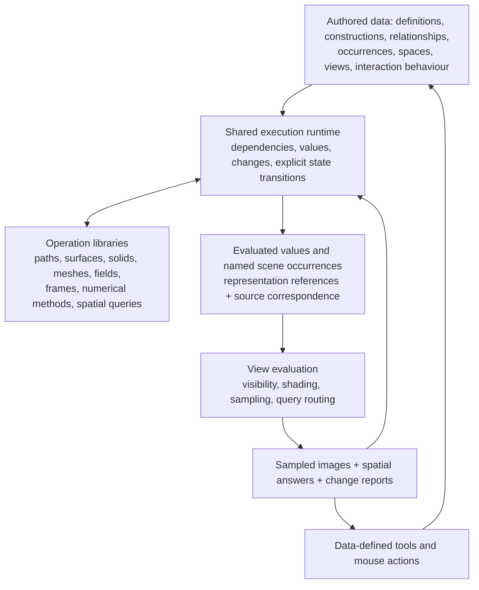

# 3D: objects, spaces, views, and answers

2026-09-06. Exploration, before a contract. Positions here are proposals for Sid, not rulings or an implementation plan. This document is an independent contribution; other existing files in this directory were not read or replaced.

The question is what executable floor lets humans and agents build, edit, share, and reuse every 2D and 3D tool as data. The merging store is above the kind. The floor must preserve the identities and changes that store needs, without owning collaboration policy.

Input reading: the client README, folder READMEs, then namespace/function docstrings and selected code; `path-kind/path-kind.md`, `path-kind/HANDOFF-8.md` section 3, `path-kind/fact-base-8.md` Parts 4 and 7, `3d-ceilings-starter.md`, and selected Sid passages in `vision/LOG.md`. No other project documents were used as design authority. Primary external sources are linked beside the claims they support. Current-code statements below are source observations, not runtime or performance receipts. HEAD observed during the reading: `4b8e986751d663b68882a0ccb645cb78bfcc0077`.

**The position.** One waist for named values, executable constructions, changes, and queries; several geometry and imaging libraries behind it. Preserve the thing that an edit acts on. Derive representations for each consumer. A scene has occurrences of things and relationships among them; a view observes a scene. A page and a room can both host views. A portal shows a view of another space; an embedding places something in the same space. These are different operations.

**The important limit.** This establishes a composition model, not proof that a small fixed list of geometry operations reaches all ceilings. A general evaluator can make new algorithms data, but it does not supply robust booleans, correspondence after topology edits, simulation solvers, or adequate throughput merely by existing. Those algorithms must actually be implemented, whether as saved executable data or accelerated libraries.



Arrows describe exchange, not a mandate for a new central conductor. The libraries can be caller-driven, with explicit retained state. The store resolves authored state; execution derives values; resource owners retain temporary machine state. A derived value can also be deliberately saved as a new reusable artifact.

**What the 3D thing is made of.**

The general editable thing is an identified definition with properties, relationships, and one or more spatial descriptions. An occurrence uses that definition in a particular context. Neither a camera nor a material is required for the thing to exist: a construction plane, a collision volume, and an unlit measurement can all be useful before drawing. A light is an emitter, not necessarily a shape. A camera is a view parameter, even if an editor also draws a camera object.

There is no single camera-free geometry that retains all the intended operations of every source:

| Source or authoring mode | Meaning that must survive | Derived representations and answers |
|---|---|---|
| Direct mesh modelling | Authored vertices, edges, faces, incidence, attributes, stable subelement references | Draw mesh, spatial index, normals, subdivision or collision products |
| Subdivision modelling | Control cage, crease rules, subdivision scheme, face-varying data | Limit surface, query structure, view-dependent tessellation |
| Parametric solid | Parameters and construction history, constraints, plus evaluated B-rep topology and its surface/curve geometry | Display tessellation, section curves, mass properties, manufacturing geometry |
| Implicit or formula shape | Function/construction, domain, parameters, units; a signed distance promise only if it actually is one | Intersections, samples, isosurfaces, direct rendering |
| Volume | Sample field, grid/index-to-world map, physical quantity and reconstruction rules | Slices, measurements, isosurfaces, volume integration |
| Scan or splat capture | Captured/estimated samples, attributes, calibration and provenance; inferred models separately | Render hierarchy, selection/query proxy, reconstruction with a declared loss |
| 2D shape given depth | Source sketch/path, extrusion or sweep construction, constraints and frame | Surface or solid, face correspondences, display representation |
| Reusable assembly or whole scene | Occurrences, references, overrides, relationships and environments | Chosen scene expansion, bounds, render/query indexes, multiple views |

An authored triangle mesh is valid truth for a triangle-mesh editor. The leak occurs when a tessellation replaces a source whose future operations require more. A sphere already illustrates the distinction in the current code: its input retains `radius`, but also requires segment counts; display sampling is coupled to the primitive declaration ([sphere schema](/mnt/data/projects/Softland/src/app/client/region3d/component.cljc:267)).

The 3D analogue of storing the curve is therefore: **retain the description that owns the intended edits, and retain the relationship from every derived representation back to it**. Keep original evidence too when later operations need it. This is not a universal ranking with one representation strongest for every purpose, nor simply “store NURBS” or “store a field.” A B-rep alone does not recover the feature history that produced it. A scan may never have had a designed solid to recover. A field can be meaningful without a surface, and a nonmanifold mesh need not have an inside.

Use an open set of typed spatial values. Each operation states which types and guarantees it accepts. A missing solid-membership operation on a point cloud is `unsupported`, not `outside`. Rendering, collision, selection, and measurement may use different representations of the same definition. There must be explicit authority and derivation links so they do not become independent truths edited by accident.

**What survives the attack on the working basis.**

Meaning before rendering remains the right discipline here. The concrete test is whether two sources that require different future edits have collapsed to the same retained input. The path round's outcome supports that discipline; it does not prove that every rendering-derived idea is wrong.

The usual scene inventory—objects, transforms, geometry, materials, lights, camera—is a good account of an evaluated imaging scene. It does not describe a constraint history, an uncertain scan, or the executable construction of an object. Projection, visibility and shading describe image formation; they do not describe all of 3D computation.

USD strongly supports separating composition from imaging. But its own introduction says identifiers are namespace paths rather than GUIDs, warns that topology changes can invalidate stronger-layer work, and describes an extensible, domain-independent core. “USD has no 2D” should mean it does not give us Softland's page and interaction semantics ready-made, not that 2D data cannot be represented. Layer strength also does not establish a general conflict-free merge of concurrent semantic edits. [OpenUSD introduction](https://openusd.org/release/intro.html).

Execution is not wholly absent from current USD: OpenExec supplies dependency-based computation and caching. Its documented callbacks are C++ implementations; it does not author the stage, and does not supply the click handler or hit test. It is useful precedent for separating those responsibilities, not an implementation of Softland's entire data-defined tool layer. [OpenExec introduction](https://openusd.org/release/intro_to_openexec.html).

The interchange forms describe different boundaries, not one interchangeable object type. glTF explicitly targets runtime delivery rather than retaining authoring information. [glTF specification](https://registry.khronos.org/glTF/specs/2.0/glTF-2.0.html). IFC permits multiple geometric representations of one product. [IfcProductDefinitionShape](https://ifc43-docs.standards.buildingsmart.org/IFC/RELEASE/IFC4x3/HTML/lexical/IfcProductDefinitionShape.htm). OpenVDB separates sparse values from their physical interpretation through a transform and metadata. [OpenVDB overview](https://www.openvdb.org/documentation/doxygen/overview.html). Gaussian splatting represents appearance with spatial Gaussian primitives and visibility-ordered blending; that does not by itself provide a solid's modelling topology. [Original Gaussian splatting paper](https://repo-sam.inria.fr/fungraph/3d-gaussian-splatting/3d_gaussian_splatting_low.pdf).

Two further corrections matter. Practical B-rep computation is tolerance-aware, not arbitrary exact arithmetic; OCCT's boolean definitions explicitly use tolerances attached to vertices, edges and faces. [OCCT boolean operations](https://github.com/Open-Cascade-SAS/OCCT/wiki/boolean_operations). And nonlocal pixels, sampled representations and stateful painting already occur in 2D through compositing, filters and brushes. 3D greatly expands these obligations; it does not invent all of them.

**Containment: distinguish three relationships.**

| Relationship | What it says | What composes |
|---|---|---|
| Geometric embedding | This occurrence or planar content occupies this frame/surface in this space | Coordinates and, when included in the same physical scene, visibility, lighting and interaction |
| View/portal placement | This area or geometric surface displays a specified view of another scene/space | A sampled appearance and an explicitly declared query/navigation route |
| Geometric derivation | This section, silhouette, projection or drawing was computed from these sources | New reusable geometry, with correspondence and error information |

A page is a planar workspace with ordered composition. A spatial workspace has depth and potentially shared illumination. Both can contain planar and spatial occurrences and host views of other spaces. Being a planar scene does not oblige the page to behave like a sheet lit by a sun; ordered paint semantics remain available. Being spatial does not oblige every object to own a camera or a render target.

The ownership/reference graph, transform occurrence graph, computational dependency graph and graph of visible views have different jobs. Reusing a scene twice should create two view or occurrence contexts, not two contradictory owners. A recursive view can show itself; a frame executor must bound its expansion or use an explicit previous-frame/sample rule. A containment tree alone cannot express all these relationships.

This position is supported by Sid's requirements for per-object control, building and modifying things inside 3D, and point-and-say with machine-readable context ([vision](/mnt/data/projects/Softland/vision/LOG.md:563)). It also fits his demand that even the portal can be edited as an instance of Softland space ([vision](/mnt/data/projects/Softland/vision/LOG.md:764)). Those requirements do not select a privileged root dimension.

The page as the default entry view is workable. It stops being the universal answer when the user inhabits a room, a map or a headset view. Conversely, embedding every page into one physical 3D world is only a default for applications that want shared spatial lighting and depth. Two independent render targets are insufficient when objects must intersect, cast shadows or reflect one another across the supposed boundary: those objects must enter a shared physical scene or use an explicit cross-scene transport mechanism.

**The actual library boundaries and their input/output.**

The kind's imaging input and the full waist are not the same line. Saved constructions can call geometry libraries before producing a scene, and can consume geometry answers without rendering at all. That is already the direction of the path picture's fifth piece, the construction executor.

Proposed common envelopes, not an ECS schema:

```text
operation request
  operation + version, named input values/revisions, parameters
  coordinate/quantity context, requested result and error contract
  previous derived state or handle when incremental execution is supported

operation result
  typed reusable values, dependencies and changed parts
  correspondence from result features to source features/parameters
  achieved error/quality, status and explanatory failure data

3D view input
  named occurrences + typed representation references + named changes
  transforms/attachments, material and emitter bindings, visibility facts
  explicit view/projection + time or time interval + scene environment
  output footprint, quality/resource request, query policy

3D view output
  renderable/presentable image result and its view/sampling metadata
  a queryable view of the evaluated scene, preserving source correspondence
  hit/query answers and changed-answer notifications
  resource/quality status; optional auxiliary image channels
```

Representation references may address typed value storage or retained evaluators, but must resolve to executable capabilities. They are not arbitrary opaque blobs with a promise that something will understand them later. The renderer need not understand the meaning of a CAD fillet history: the solid/construction library evaluates it. It does need supported geometry, material, visibility and query adapters with correspondence to the named source.

| Executable responsibility | Input → output | Why there must be machinery; what remains editable data |
|---|---|---|
| Construction execution | Saved expressions/programs, named values and explicit state → values, dependency information, proposed updates | Makes new behaviour executable. Tool choices, graphs, formulas, operation order and meaningful state remain data. A fixed menu with parameters is not enough for new algorithms. |
| Typed geometry and numerical libraries | Curves, topology, surfaces, meshes, fields, constraints + operation/tolerance → geometry, measurements, solutions, correspondence, failures | Implements actual construction/query mathematics. Domain histories, equations, constraints and choices of algorithm can be data; a callable operator still needs a real implementation. |
| Frames and attachments | Frame graph, units/CRS, occurrence transforms, surface maps and time → forward/inverse maps, local differentials, bounds and attachment resolution | Makes coordinates and measurements comparable. Units, calibrations, frame choices and attachment policy are data. |
| Incremental execution and storage | Coherent initial state + identity/field/range changes + dependency state → affected outputs and reusable caches | Supports fine-grained reactions without deep comparison of whole scenes. The store's merge policy and authored identities stay above. |
| Spatial query and view routing | Point/ray/aperture, view route, evaluated geometry, visibility/policy → physical hit facts, source locations, route, status | Enables hover, picking, snapping and agent context. Selection meaning, click actions, capture and navigation are data-defined behaviours. |
| Imaging and material execution | Scene representations, materials, view and output request → coverage/visibility/shading and sampled outputs | Needs execution for surfaces, curves, volumes and other supported media. Saved material graphs and render strategies can be data; one fixed PBR shader cannot stand for every material. |
| Resource and bulk computation runtime | Work and residency requests, typed arrays/chunks, device capabilities → allocations, jobs, changed uploads, completion and quality status | Reaches GPU, workers and external compute without making them authored truth. Priorities, budgets and refinement preferences are data within physical limits. |

These are responsibilities, not a proposed seven-file refactor. They do not all have to be new compiled domain code. The logically necessary core is execution, machine access, resource ownership, and the semantics of the primitive operations it exposes. Robust geometry and bulk numerical kernels are strong candidates for accelerated libraries because of correctness and throughput. Requiring all their implementations to be hardcoded forever would contradict the open-ended data-programming ambition. Claiming they are solved by an interpreter would be equally misleading.

A new algorithm can live above the waist if the saved program can perform it using available numerical, storage, iteration and dispatch capabilities. An additional compiled primitive is justified by a missing capability or a demonstrated accuracy/performance need. Whether this floor is sufficient for a given ceiling must be shown through that ceiling's hard operation, not inferred from a node labelled “solver.”

**The four path pieces transfer as responsibilities, not as four universal programs.**

| Path piece | 3D counterpart | Where the analogy breaks |
|---|---|---|
| Path type | Typed spatial representations with identity, frames and source relationships | No single geometry representation preserves all sources. Surface, volume and open mesh have different valid queries. |
| Geometry | Construct, evaluate, intersect, deform, measure, convert, and report correspondence | Results can change topology, require iteration, or be approximate. A result may be another kind, such as a 2D section. |
| Packer | Derive and retain consumer representations; tessellate, refine, page data and upload | Demand depends on a full projected footprint, multiple views, lighting and residency. Volume/splat rendering need not produce triangles. |
| Filler | Image formation: coverage plus visibility, material evaluation and light transport | Colour depends on other objects and potentially a time interval. A 2D coverage filler remains useful on surfaces but is not a general 3D renderer. |

The executor belongs beside these libraries and is shared with 2D. The text/path coverage implementation can remain shared. Full image formation needs several algorithms behind a stable exchange, just as spatial queries do. The 2D coverage boundary is a reusable imaging service inside that process, not where the meaning of a 3D solid begins. Solid construction and section queries can run without making an image at all.

**Rates follow dependencies.**

Per edit / per scale / per frame is a good first sorting, but time, queries and resource completion are independent causes of change. An object may also be observed simultaneously at two scales, with two cameras and different output requirements.

| Dependency changed | Work potentially invalidated | What should retain its identity |
|---|---|---|
| Authored feature, knot, mesh element or material parameter | Its dependent constructions, representations and query data | Unchanged source elements, unrelated assets and occurrences |
| Object transform | Descendant transforms, world bounds, affected visibility/shadows/query results | Local geometry and source attachment |
| View, output footprint or page zoom | Projection, demanded detail, visibility, sampling; sometimes view-defined geometry | Authored definition, units and local geometry |
| Time or simulation input | Animated values, state transition and its dependents | Authored rules; explicit state identities and reproducible inputs |
| Pointer/query | Spatial candidates and answer | Scene and geometry, unless another dependency changed |
| Asset arrival, eviction or job completion | Available representation, draw/query quality and affected views | Source identity and authored geometry |

Fine-grained input does not imply a small pixel difference. A single light edit can change an entire image. A single feature edit can alter an entire body's topology. The useful promise is to report the actual affected scope, preserve reusable results, and avoid unrelated work—not constant work per edit.

**The hard case, with the data written down.**

Let page `P` host view placement `R`. `R` observes spatial scene `A` through view `V`. Scene `A` contains occurrence `O` of body definition `B`. Body `B` has face `F`. Stroke `S` uses path `C` and paint `M`. Its attachment relates the path to `O/F`. Another occurrence `Q` will move in front of it. A portal occurrence `T` shows view `W` of land `L`.

```text
R: host P, displayed scene A, view V, host mapping, clip
O: definition B, occurrence transform, scene A
S: path C, paint M
attachment: stroke S, occurrence O, source face F, source revision
            face chart/map, metric/units, placement and continuation policy
T: host occurrence in A, target land L, view W
   host-to-view mapping, query/navigation mode, recursion/time policy
```

These are distinct identities. A GPU slot, tessellated triangle number, namespace path or screen coordinate cannot replace them. An instance override can attach ink only to `O`; attaching it to the definition instead deliberately affects other occurrences. The declaration chooses that scope.

Drawing starts with the pointer and the currently observed scene state. Reverse the page placement to find coordinates in `R`; unproject through `V` into a ray in `A`; intersect `B` in occurrence `O`; resolve the hit to source face `F` and its parameter coordinates. For a planar face these can be coordinates in a rigid face frame. Retain the samples/source fit and authored curve in those coordinates, with stable curve-element identities, rather than freezing screen pixels or the display triangle index.

For a curved face, a surface chart maps `(u,v)` to a point on `F`. Chart coordinates need a metric: a circular nib in UV is generally not a circular nib measured on the surface. Surface-distance ink, projected decal ink, and UV painting are different constructions. A stroke may cross chart seams and require several patches. The planar hard case has a simple answer; “ink on any face” must expose these choices.

Forward drawing follows:

```text
path coordinates
  → attachment map into face F
  → occurrence O's transform into scene A
  → view V's projection into region R
  → R's placement in page P
  → page camera and device pixels
```

The composed map determines local pixel footprint. On a plane it is projective; on a curved surface it varies over the surface. Its local derivative, or a conservative bound over a piece, guides sampling. Page zoom multiplied by a single region scale is insufficient under perspective, shear, nonuniform scale or nested view mappings. Ill-conditioned or edge-on mappings need clipping/refinement and a declared query result, not a fictitious inverse.

**Page zoom and orbit.** Zooming the page changes the displayed footprint of `R`; it may require a sharper rendered view and finer derived representations. It changes neither the body's radius nor the stroke's local width. Orbit changes `V`, visibility, projected footprint and the inverse ray. The attachment to `O/F` remains. Moving `O` changes its placement and the world query structure, not `C`.

There is no mathematical threshold where page zoom becomes orbit or dolly. “Enter this view” is a navigation action with a camera-control target. The transition may be a saved behaviour driven by zoom, focus or an explicit action. It should preserve the pointed-at anchor and visible framing when possible. Exact seamless camera transfer is available only when the views and space maps support it; an arbitrary remote camera shown on a monitor does not define a continuous walk into its land.

**Hover and click.** Reverse the same chain, but do not pretend that reversing a projection produces a unique 3D point. It produces a ray; intersection supplies the missing depth. In the visible opaque case, resolve the nearest visible surface and any attached content there, then classify against `C` and the same stroke construction that determines its coverage.

```text
query input
  pointer position + aperture in device units, observed view state,
  query mode, optional expected source revision

hit output
  route: P → R → O → F → S
  occurrence identity, source stroke/feature identities
  local path/face coordinates; segment and parameter when meaningful
  point and normal in a named frame; boundary/distance information
  source/view revision context, quality and visibility status
```

The route gives the user or agent “this stroke on this face in this occurrence through this view.” Source identity persists if a display representation is repacked. The route can change on reparenting while the object identity persists. A source location need not exist for every result: a smudged texel or volume integral may instead return a contributor set, a field location, or unresolved provenance.

Visible hit, geometric intersection and selection intention are separate questions. Picking must account for the chosen clipping, sidedness, opacity and displacement semantics. An unselectable opaque object can still occlude ink. Glass, hair, volume and splats do not always provide one unique surface winner; the query can request a nearest surface, candidates, a field sample or a contribution rule. Hit policy is data. Query execution is code.

Click actions consume the hit and issue edits against the referenced data. They do not bake “click means select this kind” into the renderer. A tool may capture a target during a drag; that does not redefine the current visible hover.

**The stationary pointer and moving occluder.** `Q` moves over the stroke while the pointer does not move. The hover result must now leave `S` and enter the visible blocker or its declared hit target. Subscribe to the query's relevant scene/visibility dependencies as well as pointer changes. Watching only the previously hit stroke misses the arrival of `Q`.

For the opaque case, a spatial index plus old/new changed bounds can determine which active rays/apertures need rechecking. Changes to the view or query policy can invalidate the whole query. Report a patch to the answer: changed route suffix, winner and local facts; report nothing when the observed answer remains equal. A new internal scene stamp must not by itself turn every answer into a public “changed” event.

A CPU query structure, GPU identity/depth products, or a hybrid are implementation options. A single low-resolution ID texel is inadequate for a thin stroke on a magnified page. Image and query results must identify coherent evaluated view state; asynchronous results cannot silently attach a current identity to old pixels. Pointer-rate hover on a bounded visible working set is a requirement to measure, not a property proved by having diffs. Unloaded geometry is not an established miss; stale or approximate results must be distinguishable from a current precise answer. Heavy exact modelling queries need not run synchronously on every pointer event.

**The portal inside the region.** For a view portal, first intersect `T` in scene `A`. A closer host object blocks it. Map the visible hit on `T` to the target view's coordinates, query `W` in `L`, and prefix the target route with `P → R → T`. If `L` is a 2D page containing another 3D view, repeat the same operations. This is the seam in both directions.

The target's depth is local to `W`; it cannot be compared numerically with host depth. A monitor-like portal is occluded at its host surface and may forward queries, without making the target world physically present in `A`. Its target image can be unlit/emissive paint if that appearance is wanted, or be treated as reflectance and receive host lighting. Those look different.

A doorway with motion parallax is a stronger construction: map host eye/ray into the target space, clip at the aperture, specify handedness/scale and traversal behaviour, and decide whether light and physical objects can cross. A rendered image plus a depth texture does not establish these rules. If the two sides are simply one physical scene, use geometric embedding and shared visibility instead of hiding it behind a texture boundary.

The view-dependency graph needs finite execution. A cycle such as `L` showing `P` can use a recursion budget, a previous result, or explicit time feedback. That policy is data; budgeting, completion and cancellation are executable machinery. Arbitrarily recursive appearance cannot require infinitely many render passes per pointer sample.

**Back onto the page.** There are several deliberately different results:

| Operation | Data retained on the page | What subsequent actions can mean |
|---|---|---|
| Another live view of `A` | Scene reference, independent view, host placement and query route | Orbit and pick original sources; edits propagate through the shared definition |
| Section or silhouette of `B` | Derivation and resulting curves with source correspondence and tolerance | Measure/edit through the declared relationship; reuse paths for a drawing or further construction |
| Projected copy of stroke `S` | Projection construction or detached path, explicit edit target and units | A live projection can recompute; a detached copy becomes a new authored value |
| Screenshot of `R` | Image bytes, pixel dimensions, colour/alpha tags and optional capture provenance | Crop, paint and transform the image; a normal image hit identifies the image and texel coordinates |

The screenshot and live view can have the same pixels at the captured size, camera, time, colour pipeline and sampling. What differs is the live dependency and query capability. A provenance link saying “captured from R” is not a live link to its editable interior. A frozen scene snapshot can remain queryable; that is a different artifact from plain screenshot pixels. Colour, depth and ID buffers alone still omit hidden geometry, material behaviour and construction history.

When the screenshot is pasted back inside a 3D scene it is image paint on a surface. It cannot recover the original body's shape or the source stroke by being rotated. Matching an unlit capture's appearance also requires the chosen material and colour pipeline; applying host illumination to it is an intentional new effect.

**What a surface carries.**

Do not let one word fuse a geometric supporting surface, a sampled render result, and an editable painting medium. Each is useful and they exchange values, but they preserve different things.

For rendering, a surface result needs a logical identity, colour/alpha semantics, extent and sample mapping, view/time/source context, achieved resolution/error and validity/lifetime. Depth, normals, motion and identity/contributor products are optional declared outputs. Their interpretation includes the generating view and sample convention. Identity is categorical and cannot be averaged like colour. Different channels may have different resolution and resolve rules.

Interaction can instead use an associated queryable view of the retained scene; it need not allocate a full identity texture for every portal. Depth cannot be omitted from the *visibility computation* merely because it is absent from the exported image. Conversely, exporting depth does not make an image a geometry source. One depth/ID sample cannot describe all transparent layers, hidden surfaces or participating media. Cross-scene physical composition needs geometry or a richer transport contract.

Resolution is requested by consumers through the complete mapping to final pixels, including filtering and clipping, and admitted under a budget. The engine's existing leases/rungs/limits are useful execution mechanisms here. A logical surface is not defined by its current texture dimensions or allocation. Large outputs require tiles/refinement; a maximum texture size should be an allocation limit, not the maximum meaningful size of the land. Shadow maps, volumes and reflections have additional error demands beyond the primary image footprint.

**The unit of change.**

Use named changes to semantic values, with representation-specific bulk edits where appropriate:

```text
set occurrence O.transform.translation
set feature Extrude.depth
update path C / knot K / pressure
insert edge E with incidence changes as one coherent edit
replace attribute range in stable mesh chunk H
update sparse volume brick J
change portal T.target-view
remove source face F, with topology correspondence for dependents
```

The result of a topology operation needs a relation, not just `old-id → new-id`: unchanged, generated, split, merged, deleted, ambiguous, plus parameter maps where known. A boolean can split a face into two or remove it. Stable IDs alone cannot decide which successor carries its annotation or whether the ink is trimmed. OCCT's naming machinery explicitly combines operation history, registered shape evolution and selection/recomputation; its description also acknowledges that topology changes can defeat a one-to-one mapping. [OCAF topological naming](https://dev.opencascade.org/doc/overview/html/occt_user_guides__ocaf.html).

The floor receives coherent changes against identified versions and returns correspondence and failure/ambiguity information. The store owns merging. A topology edit may need to publish several incidence changes atomically; that does not mean a whole scene is the merge unit. Huge vertex/voxel sets need chunk/range storage rather than an ECS entity per sample. Authored subelements that need independent editing still require stable references.

Authored state, evaluated values, prepared representations and GPU allocations have distinct revisions. Replacing a texture or refitting a BVH must not look like a new object. Renaming or moving an object must not change its source identity. A change to a definition may deliberately fan out to many occurrences; a change to one occurrence should not rewrite the definition. Derived results must not publish mixed old/new geometry, correspondence and picking data while a long calculation completes.

**What the ceilings demand from this floor.**

These are construction paths and missing executable capabilities, not claims that any ceiling is already met.

| Ceiling | Saved data above the kind | Executable hard operation and useful output | Where the proposal still owes real work |
|---|---|---|---|
| Parametric CAD | Sketch topology, dimensions, constraints, feature history, assembly relationships | Constraint solve → solution/status; sweep/boolean/fillet → tolerant B-rep + topology history; section → source-related curves | Robust intersections/fillets, under/overconstrained cases, persistent subshape correspondence, assembly scale. A mesh renderer supplies none of these. |
| Procedural film | Operator/deformer graphs, control cages, rigs, material graphs, time and cache declarations | Subdivision/deformation and solver kernels → geometry/state samples; shading/transport → viewport or film output | Bulk execution, temporal samples/motion blur, branching/checkpoints and cache invalidation; renderer-specific material capability. |
| Open world | Instances, spatial streaming structures, behaviours, physics state and simulation rules | Hierarchical selection/refinement, collision/simulation, animation and lighting → resident working set and current views | Instance identity at scale, multiview/stereo scheduling, predictable latency, loading priorities, frame consistency and interaction while refining. |
| BIM | Meaningful building parts, hosting/dependency relationships, discipline overrides | Geometry/constraint operations → parts; sections/plans → curves; relationship queries → schedules | Stable element/subelement identity across geometry edits and interdisciplinary semantic conflicts. IFC-shaped data does not execute wall/roof propagation. |
| Geospatial | CRS, datum, units, local frames, tiled assets, temporal datasets and refinement policy | Coordinate conversion and hierarchical streaming → precise local working sets and per-view approximations | Precision across scale, camera-relative upload/depth strategy, terrain/imagery alignment, provenance and partial residency. |
| Volumes and scans | Calibrated fields/points/splats, quantity tags, reconstruction and segmentation definitions | Sparse sampling, integration, reconstruction and extraction → slices, measurements, surfaces and render products | No universal surface hit; uncertainty, filtering, large sparse updates and lossy conversions must stay visible in the data contract. |

3D Tiles is a useful concrete precedent for keeping source-space error and coordinate systems distinct from a view's screen-space refinement demand. Its specification defines hierarchical detail, a geometric error, transforms and metadata. This supports a refinement interface; it does not give arbitrary imported data a reliable error bound. [3D Tiles specification source](https://github.com/CesiumGS/3d-tiles/blob/main/specification/README.adoc).

Time and simulation require more than a pure acyclic expression graph. A state transition can be `step(rules, inputs, prior-state, dt) → next-state`, with explicit time, seeds and checkpoints. Constraint systems can contain cycles solved as one operation with convergence/failure data. Networked simulations may need an authority above the kind; a GPU's numeric behaviour does not promise identical simulation histories on all machines. Reusing a cached simulation or a saved generated mesh is legitimate when the data says what was saved.

Units, tolerances, coordinate reference systems, orientation conventions and uncertainty belong to meaning. A model tolerance, an import/fit tolerance, a query accuracy request and an image error are different quantities. Device float32, a depth format and a texture size are execution choices. Large worlds need local frames and adequate upstream precision before narrowing near the camera. Exact-looking pixels cannot certify a manufacturing measurement.

**What changes in the path-kind picture.**

The curve-consumable source, independent paint declaration, reusable geometry answers and scale-dependent lowering all survive. The common executor and correspondence return path become more central. The nib/ribbon position remains Sid's open path choice; this 3D exploration does not settle it.

Several claims become conditional:

1. A local 2D path is sufficient for a stroke on a plane. A stroke on a curved/deforming surface also needs an attachment map, a metric, chart seams and continuation semantics. That extra data belongs to the construction/attachment, not to a fixed camera baked into the path.
2. A shared analytic coverage filler is plausible for planar placed ink. Screen derivatives help with footprint; they do not settle clipping, anisotropic minification, depth ties, transparency with other marks, displacement or curved-surface parameterization. Reuse of the same coverage definition is supported; universal pixel agreement is not established by the shader's existence.
3. Line/ordinary quadratic/cubic paths are an imaging language, not a lossless language for every CAD section. Exact circles/conics and rational surface intersections need retained analytic/rational geometry upstream, or a broader shared curve vocabulary. A cubic approximation must carry correspondence and a declared loss; it cannot become the measured CAD truth. The path packer may still lower such geometry for display.
4. “No tolerance in the value” must be limited to device sampling tolerance. Model/fit tolerances and units can be necessary authored or result metadata. The current path picture already separates source fit, consumer request and device error; 3D adds tolerance-bearing topology and uncertainty.
5. Pick membership can share the stroke construction without treating the display approximation as source truth. Visible picking also depends on the containing scene's occlusion and clipping. A local `classify` answer is one part of a page-wide hover answer.

These are extensions to the combined picture, not authorization to change the path implementation or cut its current placement lane.

**What today's source establishes.**

| Checked source edge | What it establishes; limit of the observation |
|---|---|
| [Region3D schema](/mnt/data/projects/Softland/src/app/client/region3d/component.cljc:593) and [mesh dispatch](/mnt/data/projects/Softland/src/app/client/region3d/component.cljc:386) | One input fuses scene, view, environment and page rectangle. Geometry dispatch is a closed set of primitives and indexed triangles. This is a bounded rendering model. |
| [Scene derivation](/mnt/data/projects/Softland/src/app/client/region3d/scene.cljc:825) and [evaluation](/mnt/data/projects/Softland/src/app/client/region3d/scene.cljc:1088) | Derivation builds mesh triangles/BVH. Static changes rebuild; transform changes use maintenance. The code has useful incremental structure, but is not a general field/subfeature diff interface. |
| [Mesh picking](/mnt/data/projects/Softland/src/app/client/region3d/scene.cljc:965) | Nearest mesh/background result. Placed text and ink are explicitly excluded; returned triangle index is not durable source-face correspondence. |
| [Triangle query](/mnt/data/projects/Softland/src/app/client/region3d/scene.cljc:626) | CPU query is two-sided; docstring notes a difference from GPU backface culling. This alone prevents equating geometric hit and visible hit universally. |
| [Plane adaptation](/mnt/data/projects/Softland/src/app/client/region3d/on_plane.cljc:72) and [ink packing](/mnt/data/projects/Softland/src/app/client/region3d/on_plane.cljc:101) | Ray-to-local-plane calculation and reusable ink tessellation exist; placement zoom is fixed at 1. This is not source-face tracking under topology edits. |
| [Placed pipeline](/mnt/data/projects/Softland/src/app/client/region3d/on_plane_renderer.cljs:74) and [interior pass](/mnt/data/projects/Softland/src/app/client/region3d/renderer.cljs:1295) | Placed ink tests depth without writing it, with a bias. Mesh transparency and placed ink are separate draw groups. General mixed transparency is not established. |
| [Region preparation](/mnt/data/projects/Softland/src/app/client/region3d/renderer.cljs:1023), [frame key](/mnt/data/projects/Softland/src/app/client/region3d/frame.cljc:9) | Caller revisions gate entry; zoom/DPR affect target preparation. This is not a pointer-driven reactive query protocol. |
| [Composite shader](/mnt/data/projects/Softland/src/app/client/region3d/renderer.cljs:245) | Projects a rectangle with the page camera and samples resolved colour. Interior depth and object identity are not exported by that shader. |
| [Compositor ownership](/mnt/data/projects/Softland/src/app/client/engine/compositor.cljs:1) and [logical leases](/mnt/data/projects/Softland/src/app/client/engine/leases.cljs:1) | Physical colour/depth/resolve/shadow bundles and logical region identity already have separate owners. A useful base for logical view outputs; not scene truth. |
| [Harness map](/mnt/data/projects/Softland/src/app/client/harness/README.md) | The allowed tree describes a harness rather than a product interaction loop. A scoped search found `pick-region` calls in that harness and no calls to the plane-query helper. No page-wide pointer-rate result was exercised here. |

**Positions and the conditions under which they change.**

| Position | Support | When it is only a default; consequence |
|---|---|---|
| Scene separate from view; root dimension unrestricted | One object must support pages, rooms, reuse, alternate views and agent context | A page-only product can use a planar root everywhere. That would narrow the stated ambition, not establish a universal containment law. |
| Heterogeneous authoritative spatial descriptions | CAD, subdivision, scans and volumes lose different meanings when collapsed | A mesh-only editor can make a mesh canonical. Its library is then narrower and cannot promise preserved CAD/field meaning. |
| One waist, several libraries | Shared data-defined computation, identity, frames, derivatives and queries; kinds consume one another's results | Separate waists are reasonable across external runtimes with incompatible semantics or guarantees. They require an explicit bridge for identity, versions, units, quality and queries. One process or renderer is not required. |
| Image composition with optional query delegation | Explains live region versus screenshot and works in both host dimensions | Shared shadows, geometry intersections and walk-through continuity require geometric embedding or richer portal transport. A texture boundary alone ceases to be sufficient. |
| Fine-grained change and source-aware answers are public obligations | Necessary for editable reusable data and hover while the scene changes | An operation can legitimately affect a whole body/image. It must report that scope, not fabricate locality or silently change identity. |

An experienced team should define this as preservation of editable meaning through evaluation, representation changes and observation. The revealing trade-offs are source authority versus optimized representations; shared physics versus isolated views; output quality versus bounded latency; exact geometric questions versus displayed visibility; deterministic reusable state versus hardware-dependent simulation; subfeature identity versus topology change. Choosing a renderer first cannot settle those trade-offs.

**The remaining input/output decision and the exact next question.**

The proposed imaging boundary is now concrete: **named evaluated spatial occurrences and representation references, plus an explicit view/time/quality request, in; image results and source-related query answers out**. Authoring histories stay in saved constructions, evaluated through shared geometry libraries. Region is one view placement assembled from these values, not the universal 3D object. Whether Sid adopts that split remains a decision; this document does not mark it settled.

The hardest unfinished part of that input/output is the correspondence contract across topology-changing operations. Merely writing `face-id` or `source-map` has not implemented it. The next exact question is:

> When a parametric edit splits, merges or deletes the face supporting the stroke, what result must the geometry operation return so a saved attachment construction can preserve, split, trim or explicitly detach the stroke without consulting display triangles or guessing the user's intent?

Work one extruded sketch with an attached stroke through a boolean split, then return the surviving ink as a 2D drawing and query it from both views. Specify the old/new subfeatures, parameter correspondences, ambiguous cases and changed outputs. That is the next discriminating construction. It can show whether the proposed library exchange is real before anyone claims the CAD ceiling—or the universal waist—is covered.
