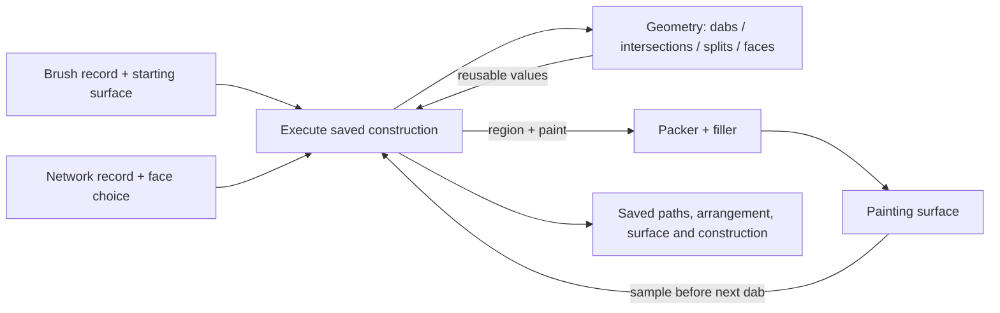

# Attack 2 — a brush that reads paint, and a network that discovers faces

2026-09-06. Definer's chair, continuing [attack 1](attack-1.md) against the folded [page](path-kind.md), [fact base 9, Part 7](fact-base-9.md), and [Waist Bench](bench-9/HANDOVER.md). Exploration: these are constructions and provisional positions, not implementation acceptance. Position 7 stays with Sid; neither construction needs it closed.

1. Keep the five pieces in the picture; these cases make the evaluator's calls and returned values concrete.
2. The surface-reading brush reuses the path, dab geometry and coverage program, but each dab's paint depends on the surface left by earlier dabs.
3. Its new input is a particular painting surface, and its reusable output is a new surface together with the construction that produced it.
4. The network keeps vertices and edges as its source, asks geometry for their subdivision into faces, then chooses which face boundaries to paint.
5. Its new reusable result is an arrangement: intersections, split edges, their connections and the faces between them, with links back to the source.
6. Both fit code that exists once, provided the evaluator can call those capabilities and receive their results.
7. An interpreter's ability to evaluate arithmetic does not supply a surface operation or a correct arrangement algorithm.
8. The page should show where each construction rejoins the drawing pipeline and what survives outside that pipeline.



The loop is the addition. A network rejoins at path boundaries; a brush can visit the same filler repeatedly while producing a surface. Neither needs a new coverage meaning. The evaluator, geometry interface and surface interface still owe the work described below.

**The records below are complete JSON for the bench's record editor.** They retain its `tool`, `source`, `paint`, `snap` and `identity` fields. `program` and `surface` are proposed additions; `source.kind: network` is a proposed source record. The program strings denote bindings, not JavaScript callbacks. Their small instruction format makes the dataflow explicit for this walk; it is not a proposed final language. Pasting these records into today's bench does not implement the added fields.

I checked that distinction by executing the bench's actual functions in Node, extracted from its script without changing the file. `buildPath` accepts `pen`, `rect` and `anchors`; an unrecognized kind returns an empty path. `normStroke` retains a fixed set of fields. The expression parser accepts numeric names and its listed functions, but `read(surface,x,y)` fails with `unknown function read`. See [source dispatch](bench-9/waist-bench.html#L409), [stroke normalization](bench-9/waist-bench.html#L768), and [expression evaluator](bench-9/waist-bench.html#L192).

| Supplied data | Observed result in the current bench functions |
|---|---|
| Add surface and program fields to the 24-dab source | Identical path; the ordinary dab builder still emits 24 dabs. |
| Add a surface-read field to the stroke | The normalized stroke is identical: that field has no consumer. |
| Supply the network source | `{ "subpaths": [], "meta": { "kind": "none" } }`. |
| Supply a derived selected face as `anchors` | Accepted and lowered by the existing path and packer functions; its CPU coverage query reports the selected interior. |

The record editor accepting JSON is therefore different from every field participating in execution. For these two additions, the useful bench response is to identify the unconsumed field or unavailable operation. An empty drawing or an ordinary colored stroke must not count as the requested tool having run.

At the proposed waist, the recipe is an entrypoint: its source record is an argument, not a request to add another native `buildPath` branch. The brush below requests the existing path and dab construction as its inputs; the network produces a path as an output. The executor needs bindings for both directions. Once those bindings and the called operations exist, another tool is a saved recipe plus its records. Changing the recipe or its input changes behavior; choosing one of its returned values makes that result an input to another construction.

**The brush starts with the same four samples and 24 dabs as attack 1.** Charge it with red pigment, place it over an opaque blue painting surface, and let it pick up half the color under each dab before depositing. Keeping width linear here preserves the established geometry and isolates the surface dependency.

```json
{
  "tool": {
    "name": "pickup brush", "size": 16, "streamline": 0,
    "fit": "polyline", "width": "size * p", "pickup": 0.5
  },
  "source": {
    "kind": "pen",
    "samples": [[26,28,0.65,0], [102,100,0.9,90], [28,100,1,180], [102,28,0.7,270]]
  },
  "paint": {
    "fill": null,
    "stroke": {
      "overlap": "accumulate", "spacing": 12, "tip": "nib",
      "width": "knot", "unit": "local", "cap": "round", "join": "round",
      "align": "center", "color": [1,0,0,0.62]
    }
  },
  "surface": {
    "id": "paint", "revision": 0, "width": 128, "height": 128,
    "localToTexel": [1,0,0,1,0,0],
    "color": "linear-premultiplied-rgba",
    "initial": { "clear": [0,0,1,1] }
  },
  "program": {
    "each": "dabs",
    "state": { "carry": [1,0,0,1], "surface": "surface.initial" },
    "steps": [
      { "out": "sample", "op": "sample", "surface": "state.surface", "point": "dab.xy", "filter": "nearest" },
      { "out": "carry", "op": "mix", "a": "state.carry", "b": "sample", "amount": "tool.pickup" },
      { "out": "surface", "op": "paint", "surface": "state.surface", "region": "dab.path", "rgba": "carry", "opacity": "paint.stroke.color.3", "blend": "source-over" }
    ],
    "next": { "carry": "carry", "surface": "surface" },
    "return": ["state.surface", "path", "dabs"]
  },
  "snap": false,
  "identity": { "id": "surface-read", "revision": 1 }
}
```

The existing path builder and dab emitter produce the geometric input. Before the loop, the surface binding materializes the `initial.clear` declaration at the specified dimensions and mapping; `surface.initial` then refers to that immutable logical image. This materialization is a missing host operation, not scalar evaluation. `dab.xy` constructs a point from the emitter's existing `x` and `y`; `dab.path` is its existing footprint. The proposed executor then runs the three steps in order for each dab. `state.surface` and `state.carry` refer to the state at the beginning of that dab; `sample`, `carry` and `surface` name its newly computed values. Only `next` advances the state. The paint port consumes premultiplied color; the coverage calculation remains the filler's job. The recipe's carried color supplies RGB, while `paint.stroke.color.3` supplies deposition opacity.

For this record, pixel centers are `(i+0.5,j+0.5)` in local units and nearest sampling reads texel `(floor(x),floor(y))`. All dab centers are inside the declared surface. Surface dimensions and the coordinate mapping are painting inputs; changing the display camera does not resample that input or rerun an already applied dab.

The meaning is small enough to write without a machine. Let `S[k]` be the surface before dab `k`, `q[k]` the carried premultiplied RGBA, `c[k](x)` the footprint's coverage, and `a=.62`:

```text
u       = sample(S[k], dab[k].center)
q[k+1]  = mix(q[k], u, pickup)
w       = a * c[k](x)
S[k+1](x) = w * q[k+1] + (1 - w * q[k+1].alpha) * S[k](x)
```

The new surface value includes every untouched texel. Reading at the beginning of a dab and publishing its result before the following dab prevents execution order from changing the mark. This is a deliberately simple pickup brush, not a claim about simulating wet pigment.

I executed the record's `sample`, `mix`, `paint` and `next` sequence in a small CPU reference. It used the bench's actual `buildPath`, `buildDabs`, `lowerPath`, `packRegion` and `coverageAt`, with a 128×128 floating-point surface, one texel per local unit, pack tolerance `.25`, and nearest reads. Even the componentwise `mix` used the existing expression evaluator. This supplies an executable construction, not an implementation of surface operations in the bench.

Then I changed just the first step's `surface` binding from `state.surface` to `surface.initial`. Deposition still accumulated onto the current surface; only pickup read the frozen starting image. Dab labels below use the bench's zero-based numbering.

| Reference observation | Read the current surface | Read the starting surface |
|---|---|---|
| Geometry | 24 identical dab footprints | The same 24 footprints |
| Color sampled by dab 19, on the later crossing passage | `(0.019375, 0, 0.980625, 1)` | `(0, 0, 1, 1)` |
| Carried red after that pickup | `0.009688745811` | `0.000000953674` |
| Final RGBA at texel center `(64.5,64.5)` | `(0.013369522403, 0, 0.986630477597, 1)` | `(0.007363091278, 0, 0.992636908722, 1)` |

The first divergence actually occurs at dab 9, near the earlier bend; dab 19 also reads paint from the first crossing passage. This is useful: the required dependency is the preceding surface, not just a special crossing rule. Alpha is `1` in both runs because the initial surface is opaque. The current bench's alpha comparison alone would miss this difference; the next brush readout needs sampled RGBA, carried RGBA, the read version, and the resulting pixel color.

**The missing surface operation has a concrete first implementation.** Retain a target at the surface's declared resolution. Before each dab, sample its texel, evaluate the record's color update, then give the dab footprint and resulting paint to the existing filler drawing into that target. A CPU read between draws is a possible reference route. A GPU route can keep carried color in a small resource and use separate resources for the reads and writes of each pass. Neither is a measured latency recommendation here.

There is a small paint adapter to make that route exact: the existing [fragment output](bench-9/waist-bench.html#L703) expects straight RGB and multiplies it by alpha and coverage. For carried premultiplied `q`, supply uniform color `(q.rgb / q.alpha, a * q.alpha)`, or zero when `q.alpha=0`. Its output is then the source term in the equation above. Every carried alpha is `1` in this fixture, so the division is an identity here. Supporting translucent pickup must preserve this conversion.

The implementation must keep the distinction between an ordered read-before-write and sampling an image while that same image is attached for the draw. The latter is a prohibited texture/framebuffer feedback loop in WebGL. A separate sampling pass or suitable source/destination resources implements the declared sequence. Merely allocating an offscreen texture does not. [WebGL feedback-loop rule](https://registry.khronos.org/webgl/specs/latest/1.0/).

The bench presently binds curves and bands plus one color per region, then clears and redraws its canvas. Its `readPixels` call is the cursor's observation, after drawing. It is not a brush input. See [dab-region paint assignment](bench-9/waist-bench.html#L789), [render](bench-9/waist-bench.html#L811), and [cursor readback](bench-9/waist-bench.html#L929). The geometry and filler remain useful; the host must add the logical surface, sampling, ordered execution and per-dab paint result.

**What survives the brush is a choice of result with real consequences.** During a live continuation, the caller needs the current surface, carried color and next emission distance or ordinal. It can cache these without storing every intermediate image. To save an editable construction, retain its source, recipe and particular starting-surface revision; a replay can reconstruct the state. To save just the painted result, retain the resulting pixels and their resolution. The physical framebuffer handle belongs to execution and is replaceable.

A pressure edit that changes an earlier footprint replays from the starting surface or an earlier valid checkpoint. Replaying it onto its already painted result would deposit twice. Later operations that sample the changed surface also have a changed input. A camera move only presents the retained surface. These facts belong on the rates/dependency picture; “per edit” alone does not describe which earlier surface a step must read.

The behavior remains changeable through data: set pickup to zero for a loaded brush; change the mix amount or expression; read `surface.initial` for a fixed-source variant; change the sampled point to a point behind the dab for a simple drag behavior. Neighborhood pickup needs a sampling/reduction operation and a declared footprint. Those are further callable capabilities, not implied by the current scalar `mix` function.

There is also a specific missing return value for pressure-driven behavior. Today's dabs return only `x`, `y`, `r`, `at` and `path`. A program that changes pickup with pressure needs the source location and pressure there; radius is not a general inverse of a pressure function. The packet should carry the source segment/parameter and the attributes the construction requests.

One related fix recurs at that boundary: with stroke width expression `size*p*p`, the current dab emitter interpolates already evaluated flattened widths at its emission point. For dab 4, it produces radius `4.801338939016`; evaluating `8p²` at that dab's interpolated source pressure produces `4.677200212096`. The scalar width function arrived, but the dab emitter still needs to call it at the final sample location. This was checked through the same functions used by `rebuild`; it does not affect the linear-width control above. See [flattening](bench-9/waist-bench.html#L269) and [dab radius interpolation](bench-9/waist-bench.html#L544).

**The network starts as four vertices, four perimeter edges and two diagonals.** It does not supply any precomputed face path. Its data chooses the face containing a point, leaving the choice of filled face outside geometry's definition of the arrangement.

```json
{
  "tool": { "name": "network face tool" },
  "source": {
    "kind": "network",
    "vertices": { "A": [0,0], "B": [120,0], "C": [120,80], "D": [0,80] },
    "edges": [
      { "id": "AB", "from": "A", "to": "B", "kind": "L" },
      { "id": "BC", "from": "B", "to": "C", "kind": "L" },
      { "id": "CD", "from": "C", "to": "D", "kind": "L" },
      { "id": "DA", "from": "D", "to": "A", "kind": "L" },
      { "id": "AC", "from": "A", "to": "C", "kind": "L" },
      { "id": "BD", "from": "B", "to": "D", "kind": "L" }
    ],
    "fillSeed": [60,10],
    "onBoundary": "return-location-without-selecting",
    "coincidentEdges": "one-geometric-edge-with-all-source-owners"
  },
  "program": {
    "definitions": {
      "edge-curves": {
        "parameter": "source", "map": "source.edges", "as": "edge",
        "emit": {
          "id": { "ref": "edge.id" },
          "kind": { "ref": "edge.kind" },
          "start": { "lookup": "source.vertices", "key": "edge.from" },
          "end": { "lookup": "source.vertices", "key": "edge.to" },
          "c1": { "ref": "edge.c1", "default": null },
          "c2": { "ref": "edge.c2", "default": null }
        }
      }
    },
    "steps": [
      { "out": "curves", "op": "edge-curves", "source": "source" },
      { "out": "arrangement", "op": "arrange", "curves": "curves", "coincident": "source.coincidentEdges" },
      { "out": "selection", "op": "locate", "arrangement": "arrangement", "point": "source.fillSeed", "onBoundary": "source.onBoundary" },
      { "out": "path", "op": "face-boundaries", "arrangement": "arrangement", "selection": "selection" }
    ],
    "return": ["path", "arrangement", "selection"]
  },
  "paint": { "fill": { "rule": "nonzero", "color": [0.2,0.6,0.3,0.6] }, "stroke": null },
  "snap": false,
  "identity": { "id": "network-faces", "revision": 1 }
}
```

Here `edge-curves` has a saved definition in the record: for each edge, look up its `from` and `to` positions, attach its ID, and copy its kind and any control points. `ref` reads a binding, `lookup` resolves a vertex by its ID, `map` iterates, and `emit` constructs a record. Those are generic evaluator operations. Their interpreter is missing today; the definition does not call for a native implementation of this particular tool. `arrange`, `locate` and `face-boundaries` are proposed capability calls whose work is spelled out next.

For the line case, I executed this construction:

1. Intersect the source edges. `AC` and `BD` have one proper interior crossing at `(60,40)`, at parameter `.5` on each. Their shared endpoint contacts with perimeter edges are already source vertices.
2. Split both diagonals at that crossing. Each resulting edge piece carries its source edge and source parameter interval: for example, `AC:[0,.5]` and `AC:[.5,1]`. The authored source still has six edges.
3. Represent each piece in both directions, with a link to its reverse. At each vertex, order the outgoing directions. Walking the next edge around one side of each directed edge enumerates boundary cycles.
4. Assemble the faces and the exterior. This connected example has five geometric vertices, eight edge pieces, sixteen directed edges and four bounded faces. Each face has area `2400`.
5. Locate `(60,10)`, choose its face, and return its oriented boundary `A → B → X → A`. The fill declaration applies to this result. The graph and split maps remain available to other consumers.

An arrangement implementation does not stop at an unordered set of intersections. It must create incidence, order around vertices, boundary cycles, and the relation of those cycles to faces, including holes and the unbounded face. This matches the distinction between geometry and topology in an established arrangement interface; the precedent is evidence about the work, not a recommendation to adopt a particular library. [CGAL arrangement model](https://doc.cgal.org/latest/Arrangement_on_surface_2/index.html).

The selected line face can paste into today's bench with no proposed fields:

```json
{
  "tool": { "name": "selected network face" },
  "source": { "kind": "anchors", "contours": [
    { "closed": true, "anchors": [
      { "id": "A", "p": [0,0] },
      { "id": "B", "p": [120,0] },
      { "id": "X", "p": [60,40] }
    ] }
  ] },
  "paint": { "fill": { "rule": "nonzero", "color": [0.2,0.6,0.3,0.6] }, "stroke": null },
  "snap": false,
  "identity": { "id": "selected-network-face", "revision": 1 }
}
```

Executing that record through `buildPath → lowerPath → packRegion` produces one subpath and three quadratics. The bench's CPU winding is `−1` at `(60,10)` and `0` at `(10,40)`; coverage at the selected interior is `1`. No stroke or envelope is requested in this case. A tool should be able to bypass an operation it does not need.

The derived record is a reusable output, not a replacement for the authored network. Its `X` is a computed intersection. Keeping only that record would lose which source edges created it and what should happen when a vertex moves.

**Now change the network through data.** Move `C` to `[100,100]`. The crossing moves to `(48,48)`, at `.48` on `AC` and `.6` on `BD`. There are still four bounded faces, now with areas `2880`, `3120`, `2080` and `1920`. The face containing the same seed is still selected. `BD`'s source endpoints did not change, but its split intervals did because its intersecting partner changed. Invalidation therefore follows the arrangement's dependencies, not only the list of edges incident to the edited vertex.

Return `C` to `[120,80]`, then replace only the `BD` edge object with this cubic:

```json
{
  "id": "BD", "from": "B", "to": "D", "kind": "C",
  "c1": [80,168.88888888888889],
  "c2": [40,-88.88888888888889]
}
```

The control ordinates are `1520/9` and `−800/9`. For cubic parameter `u`, the difference between the cubic's `y` and the diagonal's `2x/3` is `(2560/3)(u−1/4)(u−1/2)(u−3/4)`. The same two source edges now intersect three times. Returning one nearest intersection would miss two faces.

| Result after this data change | Worked result |
|---|---|
| Parameters on cubic `BD` | `.25`, `.5`, `.75` |
| Corresponding parameters on straight `AC` | `.75`, `.5`, `.25` |
| Crossing positions | `(90,60)`, `(60,40)`, `(30,20)` |
| Derived topology | Seven vertices, twelve pieces, twenty-four directed edges, six bounded faces |
| Face areas | `3800`, `900`, `3800`, `900`, `100`, `100`; total `9600`, the rectangle's area |
| Boundary selected by `(60,10)` | `A → B → (90,60) → (60,40) → (30,20) → A`; it alternates line and split-cubic pieces |
| Existing packer result for that face | Three line pieces plus two cubic pieces lower to thirteen quadratics at local tolerance `.01`; CPU coverage at the seed is `1`. |

The reference isolated the three roots, used the bench's actual de Casteljau `splitCubic`, ordered directed edges by their outgoing tangents, walked the cycles, integrated each curve's signed area, and sent the resulting boundaries through the existing packer. The point query selected exactly one of the six faces. This is a worked curve case as well as a line case. It does not constitute a general robust arrangement solver.

**Two small changes show what `intersections` still has to return.** Add an edge `CA-copy` from `C` to `A` on top of `AC`. Their common part is an interval, not finitely many crossing points. Under the record's declared coincidence policy it is one geometric edge with both source owners and opposite traversal directions; it does not create a new face. The relation needs to carry something like `AC:[0,1] ↔ CA-copy:[1,0]`. A single `(seg,t,seg,t)` result shape cannot express it.

A curve can also touch another curve without crossing it. For example, the quadratic with points `(24,64)`, control `(64,−16)`, endpoint `(104,64)` touches the horizontal line `y=24` at `(64,24)`. Its height relative to that line is `160(t−.5)²`. Classifying the event, and ordering incident curve branches when their tangents tie, is geometric work. A blind angle sort or screen-resolution polyline approximation is not the general answer.

The geometric capability consequently owes isolated contacts, overlapping spans, reliable ordering and split provenance. The arrangement owes face assembly, including a face with several boundary loops. Counting every positive cycle as a separate face would fail on holes or disconnected components. These stay on the fix list for the geometry service; they do not require graph semantics in the filler.

**The face-choice policy is data too.** This record selects the face containing a seed. If the seed lies on an edge or vertex, `locate` returns that location without inventing a selected face. A different saved tool could choose all bounded faces, faces below a specified area, or faces neighboring an already selected one. Those edits reuse the arrangement and change its consumer. Source edge and vertex IDs preserve references; they do not decide which new face inherits a human's selection after a topology change.

**My positions follow from these constructions.** They concern what the interfaces promise; they do not settle a new namespace or language implementation.

| Position | Why it holds here | What would change it |
|---|---|---|
| A. The fifth piece executes a construction with named inputs, outputs and state transitions, including calls to host capabilities. | The brush's three-step loop and the network's geometry queries cannot run in the current scalar-width environment. | If a pure evaluator returning an ordered operation plan gives the host the same dependencies and results, I would put effect execution in that host. The record still needs a way to consume the results before its next dependent step. |
| B. Surface sampling and painting belong to an explicit surface interface beside geometry. Keep coverage shared. | The same dab boundaries produce different colors solely because the read version differs. A surface has resolution, coordinates, content and execution dependencies. | A measured live-brush cost can move work to a different backend. A recipe that reads neighborhoods instead of one point expands the sampling operation. Neither change makes a surface handle part of path geometry. |
| C. Expose arrangement construction as a reusable geometry result, with face selection as an editable caller. | Intersections and splits must become an incidence graph before a caller can choose faces; the result also supports adjacency and later edits. | If a data construction over lower geometry predicates provides the same guarantees and acceptable cost, I would keep it as a saved construction above the waist instead of adding a native arrangement primitive. Either implementation returns the arrangement independently of rendering. |
| D. Keep authored sources, logical results and execution resources distinct. Materialize the result the next operation needs. | The brush can save pixels or replayable history; the network can save its graph and reuse selected boundaries. Neither result is a GPU allocation. | An explicit freeze can discard the construction for a particular saved result. Live editing or replay requires retaining the dependencies it uses. |

The arrangement interface is justified here by its input and returned geometric/topological values; the surface interface by the content and read/write ordering it owns. Sharing a calculation is evidence of possible reuse, not sufficient evidence for either interface's home.

**If these positions hold, these are the page changes.**

| Page location | Concrete change |
|---|---|
| Position 8 | Keep the evaluator, and spell out `execute(recipe, inputs, state) → named results + next state`. Under Sid's current stated aim, tools being data is the task; the open implementation question is the evaluator's substrate and callable operations. An interpreter alone does not discharge those operations. |
| “Pen anchors already are a path” | Scope this to the bench's contour preset. A network with discovered faces has an authored graph and an executing source construction before it emits boundaries. |
| Contract input block | Keep `path + paint + identity` as the path consumer's boundary. Beside it, show a construction's input bindings and, when requested, an identified surface revision with resolution and coordinate mapping. Do not insert GPU handles into the path value. |
| Contract answers | Expand intersections to a collection of isolated contacts and overlap spans; carry source parameters through splits. Name the arrangement result, its faces/boundary loops and point-location answer. Dab results carry the source location/attributes their recipe consumes. |
| Position 2 and the drawing | Show ordered surface sampling and painting beside the path machinery, returning a surface result. The path alone is not enough to replay this brush: the starting surface and program matter. Ordinary accumulation already has a destination and emission state; surface-reading makes that destination's values inputs to behavior. |
| Rate table | Geometry changes on source edits; face selection can reuse unchanged topology. Surface execution advances with brush steps or explicit replay. Presentation changes with the camera. A committed operation is not applied again merely because a frame is drawn. |
| Waist-test table and bench readouts | Add the two complete records, display unconsumed fields/unknown operations, and show derived arrangement and surface results. For the brush compare RGBA and read versions; for the network show source edges, split intervals and the selected face. |
| Fix list | Carry the final-dab attribute evaluation, overlapping edge spans, tangent contacts, holes, and state/replay dependencies. Keep renderer cost claims separate from these constructions. |

**What was actually executed and what remains proposed.** The baseline is the committed bench from `d202c90`; attack 1 was subsequently committed as `4b8e986`. The bench file read for these checks has SHA-256 `98b749c73f85450f4cb03ad21ffc264d982b1a57e890c4d848ae8ed2e28abe05`. Node was `v20.20.2`. I extracted the script's pure declarations before its GL setup, plus `normStroke`, and called the real functions named above. No bench code or client implementation was changed.

The surface reference used floating-point CPU arrays and the bench's CPU coverage twin, not GPU surface reads or a new brush route in the live artifact. Its record-driven loop and numeric results are the construction receipt. The network references cover the specified line graph, its vertex edit and the three-crossing cubic variant; they exercise the actual curve splitter and packer but supply reference intersection/topology code. They do not prove general coincidence, tangency or hole handling. The proposed records' ignored fields and empty source result were checked through the current dispatcher/normalizer; they were not claimed to have executed in the published UI.

Repository implementation-source inspection stayed under `src/app/client/`; the supplied bench source was read as explicitly requested. No server source was inspected. The contribution is this file. The next useful fold is to make the two loops callable and visible on the picture: geometry returning an arrangement to a tool, and a painting surface returning sampled color to the next brush step.
