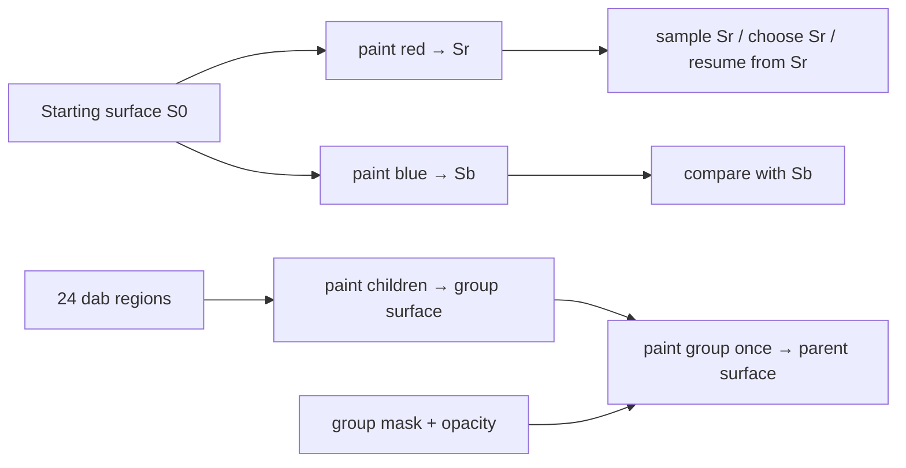

# Attack 3 — a result that survives its next use

2026-09-06. Definer's chair, after [the session 10 fold](HANDOFF-10.md), [the page](path-kind.md), [fact base 10](fact-base-10.md) and [the bench handover](bench-9/HANDOVER.md). Positions 7, 8 and 9 remain Sid's; this does not ask them again. The contribution continues the construction walk, with the executor and compositor in the picture.

**The new pieces hold these constructions. Their contracts need to distinguish a saved result from a writable target, and a mask on a completed group from masks on its children.** Both distinctions are already on the handoff's unfinished list. Here they become records and observations:

1. A brush-preview tool makes red and blue alternatives from one starting surface, then reuses the red result. The existing vocabulary says the whole construction. Both hosts run it, but the GPU changes the saved red result into blue.
2. The two different CPU results also have the same surface ID and revision. A revision counter that measures depth in a sequence does not identify branches of that sequence.
3. A checkpoint after twelve dabs can resume the pickup brush to a byte-identical CPU result. What is reused is the surface **and** the carried color and continuation point, under the same inputs.
4. A masked crossing at group opacity `.62` needs the mask applied when the group is painted into its parent. Moving that mask to each child changes the result. The record's proposed `group.clip` currently has nowhere to go; the bench reports it.
5. The existing surface-draw operation can perform the missing group-mask draw. The unfinished work is binding the record to the right draw and preserving the right coordinate frame.



The return arrows are useful only if their values survive another operation. That is the next concrete meaning of “reuse its results.” These cases need no additional named piece in the picture.

**First record: two paint proofs, one selected result.** A person previews two colors over the same saved canvas, compares them, and chooses the red version. One dab makes the dependency unambiguous; more geometry is unnecessary for this test. Every operation and field below already belongs to the bench's construction vocabulary.

```json
{
  "tool": { "name": "two paint proofs", "size": 8, "streamline": 0, "fit": "polyline", "width": "size*p" },
  "source": { "kind": "pen", "samples": [[8,8,1,0]] },
  "paint": {
    "fill": null,
    "stroke": { "overlap": "accumulate", "spacing": 12, "tip": "nib", "width": "knot", "unit": "local", "cap": "round", "join": "round", "color": [1,0,0,0.5] }
  },
  "surface": {
    "id": "proof", "revision": 0, "width": 16, "height": 16,
    "localToTexel": [1,0,0,1,0,0], "color": "linear-premultiplied-rgba",
    "initial": { "clear": [0,0,0,0] }
  },
  "program": {
    "each": "dabs",
    "state": { "base": "surface.initial" },
    "steps": [
      { "out": "red", "op": "paint", "surface": "state.base", "region": "dab.path", "rgba": [1,0,0,1], "opacity": 0.5, "blend": "source-over" },
      { "out": "before", "op": "sample", "surface": "red", "point": "dab.xy", "filter": "nearest" },
      { "out": "blue", "op": "paint", "surface": "state.base", "region": "dab.path", "rgba": [0,0,1,1], "opacity": 0.5, "blend": "source-over" },
      { "out": "after", "op": "sample", "surface": "red", "point": "dab.xy", "filter": "nearest" },
      { "out": "other", "op": "sample", "surface": "blue", "point": "dab.xy", "filter": "nearest" }
    ],
    "next": { "surface": "red", "red": "red", "blue": "blue", "before": "before", "after": "after", "other": "other" },
    "return": ["state.surface", "state.red", "state.blue", "state.before", "state.after", "state.other"]
  },
  "snap": false,
  "identity": { "id": "branch-proof", "revision": 1 }
}
```

`state.base` remains the starting image. Red and blue are sibling results of painting on that same image; blue is not painted over red. `next.surface` selects red for presentation. Changing that one binding to `blue` selects the other proof. Returning both surfaces lets another construction compare, sample or continue either one.

I ran this record through the actual `applyRecord → rebuild` route in a headless WebGL2 bench, then inspected both runs and sampled their returned surfaces. The CPU and GPU runs both report `ok: true`. These are premultiplied RGBA values at texel `(8,8)`:

| Observation | CPU host | GPU host |
|---|---|---|
| Sample `red` before making blue | `(0.5,0,0,0.5)` | `(0.5,0,0,0.5)` |
| Sample the same `red` after making blue | `(0.5,0,0,0.5)` | `(0,0,0.5,0.5)` |
| Sample `blue` | `(0,0,0.5,0.5)` | `(0,0,0.5,0.5)` |
| Reuse the returned red surface after the run | Red | Blue |

The handover predicted this disagreement. The taken path shows what causes it: [CPU paint](bench-9/waist-bench.html#L762) copies the input array, while [GPU paint](bench-9/waist-bench.html#L1053) returns the same live target for both branches. When blue copies the frozen start into that target and paints, red's returned handle still names that target. This difference is much larger than the float precision differences in the pickup fixture; it is which image a result refers to.

Both CPU outputs are also `{id: "proof", revision: 1}` despite containing different pixels. That pair cannot be the complete identity of a reusable surface result once two paints share a parent. The record's output names distinguish them inside this run; an external cache, saved reference or later construction needs that distinction too.

**My provisional surface contract is persistent logical results, with physical reuse when earlier contents are no longer needed.** `paint(S0, ...) → Sr` leaves `S0` and any previously returned sibling readable with their original meaning. The compositor can implement this with copies, copies of changed tiles, or recomputation from retained commands. It can paint in place along a linear chain after proving that the old contents have no remaining use. It does not need to allocate a full image for every dab.

For this preview, the concrete first implementation is two result targets, both derived from the same starting surface. For the original pickup brush's linear chain, a live target can still advance in place if nothing retains an earlier version. Assign each returned result an identity distinct from its parent's sequence depth: an opaque version ID or a construction-result key including the invocation, step and iteration. Record its parent dependency separately. The particular key scheme is open; two different images must not collide because both are one paint deep.

The alternative is an explicitly consuming surface API, where an input token becomes invalid after paint. That can also work, but this preview then needs an explicit fork or snapshot capability. The current value-shaped API silently allowing reads of overwritten versions supplies neither contract. I prefer persistent logical results because the stated purpose includes comparison, branching and reuse. Evidence that tools should explicitly manage consumable states would change that preference, and the records would need to say so.

**The same distinction makes a checkpoint useful.** I used the unchanged attack-2 pickup record with the current CPU host:

1. Run all 24 dabs as the control.
2. Run dabs 0–11 and retain `run.state`.
3. Use that state as the next run's initial state and pass dabs 12–23 as its input collection. No source fitting or dab emission is repeated in this check.

| Receipt | Result |
|---|---|
| Prefix | 36 steps; surface revision 12 |
| Carried RGBA after the prefix | `(0.000318927639455, 0, 0.999681070446968, 1)` |
| Continuation | 36 steps |
| Difference from the full run | Zero differing Float32 components across all 128×128×4 components |
| Final texel `(64,64)` | `(0.0133695220575, 0, 0.986630439758, 1)` |

This is in-memory reuse through the existing executor and CPU host. It is not a saved-checkpoint loader in the bench. To save and reload it, the reusable object needs the surface content reference and its mapping/color interpretation, carried color, next dab ordinal or emission position, and the versions of the source, recipe and capability behavior that produced the prefix. For a live emitter, its unfinished fitting/emission state matters too. The current initializer supplies a clear image; a checkpoint content reference still needs a resolver and a binding into the run.

A valid unchanged prefix can be reused. An edit before the checkpoint invalidates it; an edit to later dabs need not. The checkpoint belongs to the construction's dependency history. A target-pool lease does not supply that history, and retaining only the surface would lose this brush's carried pigment.

**Second record: put the crossing's mask on the group.** Keep the original 24 footprints, paint them opaque into a stroke layer, and composite that layer at opacity `.62`. Put the mask edge through texel center `(64.5,64.5)` so it has half coverage there. Dabs 4 and 19 each fully cover that point. This isolates the difference between masking the completed stroke and clipping each dab.

```json
{
  "tool": { "name": "crossing masked as one stroke", "size": 16, "streamline": 0, "fit": "polyline", "width": "size*p" },
  "source": { "kind": "pen", "samples": [[26,28,0.65,0], [102,100,0.9,90], [28,100,1,180], [102,28,0.7,270]] },
  "paint": {
    "fill": null,
    "stroke": { "overlap": "accumulate", "spacing": 12, "tip": "nib", "width": "knot", "unit": "local", "cap": "round", "join": "round", "color": [1,0,0,1] }
  },
  "group": {
    "opacity": 0.62, "isolate": true,
    "clip": { "source": { "kind": "rect", "x": 0, "y": 0, "w": 64.5, "h": 128, "r": 0 }, "rule": "nonzero" }
  },
  "snap": false,
  "identity": { "id": "group-mask", "revision": 1 }
}
```

This record uses the page's proposed group declaration, with the bench's source format for its clip. Today the exact unread-field result is `group.clip`. The group has opacity `.62`, but no clip reaches the draw. Moving `clip` to the root of the record activates the current per-child clip route; that is a different operation.

Let `m=.5` be the mask's coverage at the chosen texel. With two opaque children there:

```text
unmasked group:       .62 × 1                         = .62
clip each child:      .62 × (m + (1−m)×m)            = .465
mask completed group: .62 × m × 1                   = .31
```

These numbers follow the bench's coverage-multiplication semantics. I executed the current `buildPath`, `buildDabs`, packer and CPU coverage function: 24 dabs, only 4 and 19 covering the point, each at coverage 1, clip coverage `.5`.

I also drove the existing GPU operations at one texel per local unit into 128×128 RGBA32F targets. Children used `drawRegion`; the completed layer used `drawSurfaceAsRegion`. The three observed alphas were `.620000005` without a mask, `.461126685` with the mask on each child, and `.310000002` with the mask on the completed group. The child route has a residual difference from the CPU's `.465`; I have not attributed it. It stays a pixel-agreement fix, and this run is not a claim that every declaration agrees with the CPU twin. The group placement difference is observable on both routes. WebGL reported no error.

**The missing binding is small and specific.** Compile `group.clip` as a region, draw the group's children into its surface with their own clips, then pass the group mask to the surface's composite draw. The [surface draw](bench-9/waist-bench.html#L1028) already accepts a clip. The current [layer route](bench-9/waist-bench.html#L1209) instead passes the record clip to every child and supplies no clip to the final draw. It also needs to transform a group-local mask into the coordinate frame used for that composite. The fixed identity-map probe above avoids that transform question; arbitrary camera/group transforms still need it implemented.

This placement need not require a second coverage implementation. It requires the executor/compositor to retain the scope of the declaration. A mask made from a selected network face can take the same place: `arrange → locate → face-boundaries` yields its boundary. The current `clip.source` builder does not run a network construction, so that returned path also needs a direct binding into the clip input. Copying an authored source into another source slot is not yet general result reuse.

**A layer stack and group declarations can coexist.** An editable painting document can store an ordered layer stack with names, visibility, masks and retained pixel content. Its saved construction can emit ordered render groups with opacity, blend and clip. The compositor consumes those groups. The authored layer stack retains its editing meaning, just as the network retains its graph after emitting face paths. This does not require the group to lose its compositing fields.

My position is that Position 9 should distinguish the document's source structure from the renderer's scoped declarations, without making them mutually exclusive. The mask record above tests the latter. It does not settle which document model Sid wants users to author.

**The executor's vocabulary is a useful starting position; its guarantees come from the operations it binds.** The preview uses only `paint` and `sample` and already runs, so neither recursion nor a more general language explains its failure. The same record has different result semantics on two hosts. Replay therefore needs stable inputs and defined capability behavior; a restricted syntax alone does not give it. A code-as-data substrate could be given the same restricted capability bindings. This narrows the substrate choice without choosing it for Sid.

One entry for `paint` must say which surface version it reads, what result survives, which coordinates and color representation it uses, and how another operation consumes its output. A read receipt is useful but weaker: `group.clip` being unread identifies this missing binding; reading a field would not by itself show that it affected the right composite. Keep the unread-field panel and add result observations like these.

There is also a specific limit to the throughput claim. In the pickup record, carried color at dab `k+1` depends on the color carried from dab `k`, even when the next dab is in another tile. Tile-local surface storage does not remove that cross-tile state dependency. A GPU implementation can keep the carry on the GPU and avoid CPU round-trips; it still owes an order and a way to pass the carry between the affected tiles. Independent tile runs that each restart with the initial red pigment implement a different brush. No throughput magnitude for that implementation was measured here.

The record scheduler may have little overhead in the measured fixture. The broader claim that only surface reads serialize is too strong: dependencies are stated by the construction, and the compiler schedules around them. The network's locate step needs its arrangement; the brush's next pickup needs both its surface and its carry. Parallel instances and compiled expressions remain compatible with that account.

**Provisional positions and the page changes they imply:**

| Position | What would change it | Page change if it holds |
|---|---|---|
| Returned surfaces retain their content meaning across later operations. Physical storage can be reused after the last needed read. | An explicitly consuming API plus a callable fork/snapshot, carried in the record, would be an alternative. | Spell out value lifetime and parent/result identity in `paint → new revision`; show retained results separately from target leases. |
| A checkpoint is a construction continuation, including its surface and carried state. | A stateless brush needs less state; a frozen pixel result need not retain an editable recipe. | Extend the per-brush-step row with the actual checkpoint inputs and validity dependency. Add a content resolver to the missing bindings. |
| A group mask applies when the completed group is painted into its parent. | A tool declaring per-child clipping should use that different scope. | Bind `group.clip` at the composite; keep child clips on children; show coordinate conversion. Preserve both meanings. |
| Document layers can compile to groups with compositing declarations. | A chosen document model may coincide with those groups, but that does not make the general relationship exclusive. | Remove the either/or between authored layer structure and group fields from Position 9. |
| Capability semantics, captured inputs and numeric rules establish replay across hosts. Syntax is one implementation choice. | A narrower application might deliberately accept different host results; that would be an explicit limit on reuse. | Qualify Position 8's “deterministic, replayable by construction”; include input/result contracts and resource limits in the vocabulary, without prescribing an interpreter. |

Keep six pieces as the current map. Naming outputs helps place an operation, but the list of broad output categories is not proof that all future tools have been expressed: a record can contain almost any returned value. These walks should continue to supply the evidence, rather than the count becoming a restriction on what they may find.

**Execution scope.** Baseline page commit `320e849`, bench commit `2684577`; bench SHA-256 `36ef38610872b67af0f2c6ccadcacc6ae4ac01b2789cecc3ddfdadc11a28a0f5`. Node `v20.20.2` executed the bench's pure declarations, including its executor and CPU host. A headless Chrome run used SwiftShader, RGBA32F support, and the unchanged bench function bodies. A temporary in-memory HTTP response added a probe inside the script's closure so it could apply the records, read returned values and drive the two group-mask placements; it did not modify the bench file. The branch and unread-field findings used the real record entry/rebuild route. The group-mask GPU result used direct calls to existing draw operations because that record binding is missing. The checkpoint receipt is CPU, in memory, under unchanged inputs; it is not a saved replay or a multiplayer determinism receipt.

This file is the only addition from this turn. No implementation source was changed or read outside the standing fence. Remaining details are the fix list above; the executor, compositor and shared filler stay in the picture.
