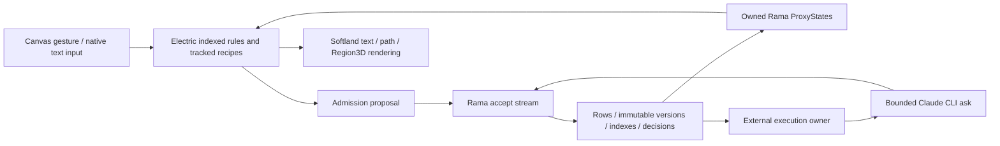

# Softland in Softland — runnable build

Implemented on `main` in `/mnt/data/projects/Softland`. Initial pending work was
preserved in `5450ac0`, `2c1047d`, and `a484881`. Nothing was pushed or merged.
The implementation is ready for the final registered browser/recovery receipt;
the close result and source revision belong in [NOW.md](NOW.md).

From this checkout, launch the complete isolated product with:

```sh
cd /mnt/data/projects/Softland
bin/inland up
```

Open **http://localhost:8127**. A `?workspace=your-name` URL creates a separate,
durable workspace from the same authored seed. Revisiting that URL retrieves its
accepted material. Browser sessions own their own selection, drafts, pins and
active context. The recorded demonstration workspace will be linked in NOW.md.

This machine already has Java/Clojure, Node dependencies, Rama 1.6.0, the activated
Electric compiler, Chrome with WebGPU, and Claude CLI 2.1.268 with normal account
authentication. A fresh machine needs those dependencies and normal Electric
compiler activation. `INLAND_RAMA_RELEASE` can point to another Rama distribution;
the default reads distribution files from `/mnt/data/rama`. The launcher copies
only binaries and libraries, never existing cluster data or configuration.

`bin/inland down` stops the owned processes and preserves saved material.
`bin/inland status` reports the fixed ports. Startup refuses occupied ports with
unknown ownership. `bin/inland seed` refreshes untouched genesis records in the
default workbench through admission; it preserves records a person has edited.

## Try the instrument

1. Point at Orb and Ring. Initially each part selects itself. Point at the visible
   instrument below the scene: it selects itself and opens its executable
   `targeting` definition.
2. Choose **Draft a containing-object rule**, then **Apply record**. The draft is
   ordinary EDN calling the named `containing-object-or-self` definition. Point
   at both parts again: they now select Assembly. An invalid record is rejected
   and the previously accepted rule remains active.
3. Use **Open presentation** to edit `instrument-appearance`, or **Open this
   editor** to edit `editor-view`. Arrangement, text, controls, lighting and tool
   appearance are authored records over the same generic primitives.
4. Give the variation a name and choose **Keep**. The new tool initially shares
   its named references. **Keep record as…** copies a definition; editing the
   tool's `:targeting` reference makes the variation independent. The Definitions
   tab addresses either record. **Keep candidate / Use candidate / Use base**
   separate candidate behavior; **Pin this / Follow live** control resolution;
   **Promote candidate** checks the base revision before accepting it.
5. In **Walk**, run the authored frontier/visited algorithm, open its step and
   caller, try a budget of 1, or cancel. In **Resident**, enter a short request
   and choose **Ask**. **Open reply record** retrieves the complete text beyond the short preview.
   Activity history retrieves accepted replies and explicitly
   labelled non-success outcomes. Closing the canvas leaves durable material and
   independently owned external activity intact; **Reopen** returns to the world.

The editor is intentionally a small EDN record editor. It exposes real construction,
but it is not yet a visual recipe editor or a general source/build environment.

## Runtime and data path



`src-inland/softland/inland/module.clj` owns accepted state in the isolated Rama
module `softland.inland.module/material`: two tasks, two threads, one worker,
replication factor one. Operations partition by workspace. Rows, immutable
revisions, indexes and decisions are subindexed within a workspace; a durable
workspace directory lets the executor recover interrupted activities.

All runtime data is under `.inland-runtime/data`; ZooKeeper uses port 2217 and
root `inland-electric`, conductor 1997, cluster UI 8917, supervisor 35970 and worker
ports in 35970–36970. The product binds loopback port 8127. The original Rama
data, preservation archive and previous experiment worktrees were not mutated.
`src/app/server/env.clj` was never read.

`store/watch-path` adapts foreign ProxyStates to cancellable flows. Actual Electric
owns the indexed applicability, addressed reads, named calls and view lifetimes
in `execution.cljc` and `app.cljc`. It uses Electric's normal client/server
transport. There is no accepted-world mirror, optimistic shared write, custom
transport, opaque world evaluator, or application result cache. Draft/session
atoms are local; accepted shared behavior follows Rama decisions.

`paint`, `nodes`, `render`, `input` and `scene` adapt the existing Softland text,
2D path and Region3D engines. A hidden textarea supplies native input and
composition; rendered application UI is WebGPU. Each render occurrence owns its
GPU resources and native input. The previous experiment supplied these physical
mechanisms, Electric/Rama boundary patterns, and launcher ideas; its compiled
selection/inspector branches and narrow targeting DSL were replaced. Two small
shared font/shaper hooks provide explicit resource disposal.

The new floor adds contextual admission and references, indexed patterns and
named recipes, maintained support identities and finite relational closure,
generic session/admission effects, and owned repetition. The authored seed has
56 records. The walk uses ordinary finite record/collection operations; no native
traversal function contains its frontier/visited algorithm. See the full
[native capability log](NATIVE-CAPABILITIES.md), including additions before the
first pointer loop at `0501468` and repairs made afterward.

The resident admits an intent before claiming execution. One app process holds
the execution lock; each accepted call has an execution token. The provider is
Claude (`haiku`), with tools disabled, one CLI turn, a $0.03 CLI budget, a 60-second
seeded timeout and a 400-token requested output allowance. CLI safe mode and a
small resident system prompt avoid loading coding customizations while preserving
normal authentication and permissions. These options are documented in the
[Claude CLI reference](https://code.claude.com/docs/en/cli-reference).

Only an explicit successful terminal result becomes an accepted machine reply.
The normal owner never automatically retries an uncertain intent. SDK retries are
disabled; retained CLI metadata reports retry events and assistant-message count.
A CLI invocation can have internal continuation messages, so this is not a claim
that one intent always produces exactly one upstream HTTP request. Timeouts and
lost confirmation become `unconfirmed`; a recovered running intent is not rerun.
Controlled fault responses are visibly labelled and never count as a real ask.

## Verification and limits

The five browser scenarios are executable tripwires in `test-inland/browser.mjs`.
The focused suite in `test-inland/softland/inland/test_runner.clj` exercises real
two-task Rama IPC, admission/revisions, narrow proxies, total steps/derivation,
and external claim/result ownership. Before source freeze it passed 5 tests and
72 assertions. Browser mutations use canvas hits and native keyboard input;
diagnostic HTTP endpoints only read isolated Rama state, hold admission, or
inject explicitly labelled provider faults.

To repeat the registered checks (including a new small real provider request):

```sh
bin/inland up --test-controls
bin/inland check
bin/inland verify
```

The browser driver needs the local graphical display and `/usr/bin/google-chrome`.
It launches Chrome with the flags recorded in the script. The observed GPU adapter
is AMD RDNA-3. Generated JSON and three captures are under
`target/inland/receipts`; the final close preserves representative copies here.
The recovery scenario replaces both browser and app JVM against the same real
disk-backed Rama cluster. It does not prove full cluster crash recovery, disk-loss
recovery, replication failover, or production-scale concurrency.

Relevant edits dispose dependent reads while leaving unrelated headline and
Region3D preparation counters unchanged. This is a focused dependency receipt,
not a performance benchmark or zero-work claim for context changes. Closing a
view disposes its proxies, inputs and GPU owner; the small reopen surface has its
own explicit demand. App-owned diagnostics retain counts until process exit.

Early real ask attempts did not yield an accepted reply. One old adapter labelled
an unread result failed; its discarded raw output cannot establish the external
outcome. Later 120-token requests reported terminal errors and 480 aggregate
output tokens. Stream framing and the request allowance were corrected; these
old records remain preserved. A real in-product request subsequently completed
with 247 reported output tokens and $0.002681 cost. Final receipt details, including
any subsequent failure, belong in NOW.md and the saved browser JSON.

This is a loopback product with independent sessions, not an internet identity or
permission product. Positive recursive closure and stratified negation have a
focused finite test; large rule sets are unproved. Recipes have explicit bounds
(64 steps, call depth 24; repeated activities at most 128 iterations). Each step
can yield a bounded wait and local/record effects, but cannot spawn a child
activity to escape its budget. Full live compiler/renderer rebuilding, language
sufficiency, permanent Electric adoption and broad ECS integration remain outside
what these demonstrations prove.

## Final close receipt

The registered close bundle ran from frozen source `ed93ec5` with the document
checkpoint `c4cb1a3`: `bin/inland check` passed **5 tests / 72 assertions** and
`bin/inland verify` passed its first five demonstrations plus recovery (**7 receipt
checks**, no browser errors or failures). Its durable material is
[`receipt-1789146056386`](http://localhost:8127/?workspace=receipt-1789146056386).
The final real `ask` reached `:complete` while the initiating view had observed it
as `:running` at close; the accepted result used Claude `haiku`, stream framing,
exit `0`, `336` output / `451` input tokens, `$0.003121`, zero retry events and
two assistant messages. This records actual activity status at the observation
point; it does not strengthen the source-only lifetime claims.

The narrow read receipt fell **4 → 3**. Headline and Region3D preparation remained
unchanged; support withdrawal was **2 → 1 → 0**. The closed view recorded
`opened=1311`, `closed=1309`, `changes=28`; the two remaining bootstrap/reopen
reads are explicit demand by design. Recovery replaced the app JVM
`1236079 → 1243113` and recovered both instruments and the accepted reply from
the same isolated Rama storage. GPU adapter: AMD RDNA-3; browser errors: none.

The representative goldens are [initial instrument](evidence/01-instrument.png),
[opened accepted definition](evidence/02-opened.png), and [kept instrument with
resident reply](evidence/03-kept.png). The factual browser receipt is
[`browser.json`](evidence/browser.json), and the focused suite transcript is
[`inland-close-check.log`](evidence/inland-close-check.log). The earlier provider
failures and all unproved boundaries above remain unchanged.

Against the preserved initial baseline `a484881`, the source/checkpoint change
set is `.gitignore`, `bin/inland`, `deps.edn`, `shadow-cljs.edn`,
`resources/inland/{index.html,seed.edn,style.css}`, `src-inland/softland/inland/{activity.cljc,app.cljc,boot.cljs,execution.cljc,geometry.cljc,input.cljs,logic.cljc,module.clj,nodes.cljc,paint.cljc,reactive.cljc,render.cljs,resident.clj,scene.cljc,seed.clj,server.clj,session.cljs,store.clj,total.cljc}`, `src/app/client/text/{fonts.cljs,shaper.cljs}`, `test-inland/{browser.mjs,softland/inland/test_runner.clj}`, and `docs/build-softland-in-softland/{BUILD.md,HANDOFF.md,MODEL.md,NATIVE-CAPABILITIES.md,WORK.md}` plus `docs/decisions.md`.

## What the build revealed

Named references did useful compositional work: the pointer calls targeting, the
second pointer can share or replace that reference, and the editor and repeated
algorithm use the same addressing and invocation path. Pinning and candidate
contexts make the dependency choice explicit. The self-editing demonstration
reaches the editor's own presentation and behavior records; it does not close the
entire native implementation over itself.

The floor remained consequential. Pending-read semantics, scheduler ownership,
native input clipping, GPU lifetime and external-outcome framing all needed
compiled repairs. The capability log records those additions so a successful
example cannot conceal them. This run establishes a useful authored construction,
not that the smallest sufficient floor has been found.

The existing ECS-shaped rendering components remain useful for realizing scene
material. Indexed fact matching and authored definitions add application behavior
and composition above them. An ECS storage or renderer arrangement by itself
would not have supplied the editable targeting rule, invocation, admission and
lifetime behavior demonstrated here. This build does not replace or settle the
repository's broader ECS design. Adoption remains Sid's decision.
