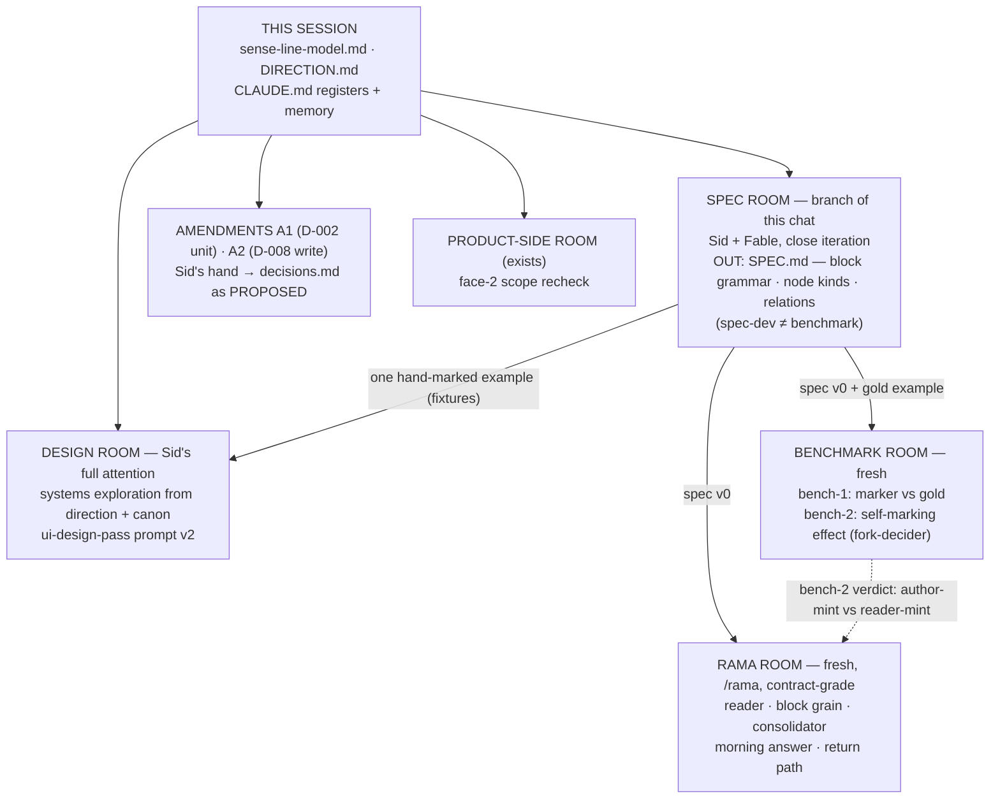

# Sense-Line MVP — dependency map (rendered)

Same DAG as `DIRECTION.md` §2. Arrows read "feeds / unlocks".

Plain English: the SPEC ROOM gates three rooms. Design's systems exploration, the amendments, and the face-2 recheck need only this session's docs. Nothing depends on ingesting the past.
