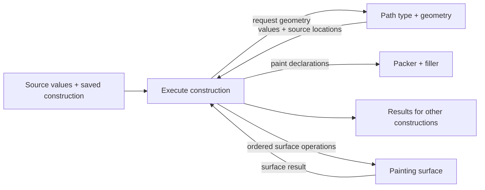

# Attack 1 — three tools walked through the waist as data

2026-09-06. Definer's chair, successor to session 6. This is an exploratory contribution to [the existing picture](path-kind.md), at the level of capabilities, values and ownership. The constructions below are proposals, not implemented APIs or a new schema contract. Sid carries the contribution between chairs. Position 7 remains his open decision; nothing here closes or asks it again.

1. The path picture survives these three tools as a common language for their geometric results.
2. Its four code boxes receive a path after much of the tool's behavior has already happened.
3. To make that behavior data, the picture needs to show what executes a saved construction and which operations it can call.
4. The draw tool supplies a gesture and rules for turning it into curves; the pen tool supplies an editable graph; the border tool supplies a box and dimensions.
5. Each can produce paths while keeping the information that makes its next edit possible.
6. The same pressure-varying crossing can become one painted region or a sequence of painted dabs through the same filler.
7. A brush that reads existing paint also needs an ordered surface operation and surviving surface state.
8. The missing return arrow is from geometry back to a construction, so someone can measure, split, combine and reuse its results before deciding to draw them.

**POSITION A: keep the four boxes and make their callers visible.** The waist test asks whether a new tool is a new saved construction over available operations. Producing a path is only one result of that construction. A record containing `brush: custom` would merely select native code unless the machinery can execute the custom behavior represented in the record.



The executor and surface operation are proposed machinery to account for, not claims about code found in `client/`. The four boxes remain the geometric and drawing machinery in the picture. Showing a callable geometry operation does not assign its interface to the path renderer.

**What “as data” means in these walks.** A saved construction has inputs, constants, operations, references to intermediate results, and declared state updates. The operations used here are arithmetic and vector arithmetic; conditions; iteration over collections; accumulation of an ordered sequence; record updates; calling another saved construction; and calls to geometry or surface capabilities. A browser input adapter supplies pointer events and performs pointer capture. An executor evaluates the construction and applies its declared changes. Neither an ECS record nor a drawing program supplies that executor by itself.

For example, the following pressure expression contains editable arithmetic, rather than a callback whose implementation lives elsewhere:

```clojure
[:multiply
 [:parameter :size]
 [:power [:clamp [:input :pressure] 0 1]
         [:parameter :pressure-power]]]
```

With size `16` and power `1`, it means `16p`. Changing power to `2` means `16p²`. Adding a branch or composing another expression can change the behavior beyond the original controls, provided those operations are in the executor. These are illustrative data instructions, not syntax being proposed for settlement. If an existing general executor supplies them outside this read fence, the picture can name that dependency. This investigation makes no claim about that uninspected code.

**The first walk is tldraw's draw tool.** The real tool combines freehand and straight segments, uses pen pressure, can derive pressure from mouse movement, and snaps straight segments to 15-degree increments. Its documented controls include streamline, smoothing, taper and pressure easing. Those are the behaviors used for this walk; the construction below does not claim to reproduce its exact stroke appearance. [Draw shape](https://tldraw.dev/sdk-features/draw-shape), [Stroke options](https://tldraw.dev/reference/tldraw/StrokeOptions).

| What the tool supplies | Concrete value in this construction |
|---|---|
| Gesture | Ordered samples with IDs, local position, pressure when available, time and segment mode. Preserve which pressure was reported and which was synthesized. |
| Behavior | Size `16`; pressure power `1`; smoothing amount; straight-angle increment `π/12`; close-near-start threshold with a declared unit; selected curve builder. |
| Drawing intent | Unfilled centerline; round tip; constant color and alpha; one union paint. The varying-width region operation remains conditional on Position 7. |
| State during input | Active gesture ID, latest pointer sample, active freehand/straight mode, segment start, smoothing state and unfinished curve tail. |

Here is code that must execute, expressed as a construction someone could save and change:

1. On pointer-down, create the gesture record and convert the event position into its local coordinates. On a mode change, end one source segment and begin the next. On pointer-up, mark the source complete. The event adapter, state transition evaluator and record writer perform those actions.
2. For a straight segment with displacement `d`, calculate `θ = atan2(d.y,d.x)`, replace it by `round(θ/step) × step`, and reconstruct the endpoint at the chosen length. Shift chooses this branch; the step is data. No `tldraw-straight-line` operation is needed.
3. For freehand input, one possible smoothing recipe starts at `q[0] = sample[0].position` and uses `q[i] = mix(q[i-1], sample[i].position, amount)`. One possible cubic recipe takes `v[i] = (q[i+1]-q[i-1])/2`, then emits controls `[q[i], q[i]+v[i]/3, q[i+1]-v[i+1]/3, q[i+1]]`. The first and last tangents are the differences to their adjacent points. Vector arithmetic, a sequence scan and adjacent-item access execute this recipe. Its overshoot and endpoint behavior belong to this editable builder; they are not a definition of a path or of tldraw's smoothing.
4. If pressure is absent, one explicit recipe uses `speed = length(position-change)/elapsed-time` and `p = clamp(1 - gain × speed, 0, 1)`, retaining the previous pressure when elapsed time is nonpositive. Initial pressure, gain and units are data. Apply the pressure expression and carry the source-to-curve correspondence alongside the curves. In this particular builder, each curve piece corresponds to a pair of source samples, and pressure interpolates over that interval. Another fitter must return its own correspondence.
5. Request the stroke region, then paint it once. Return the centerline, width function, source correspondence and region as reusable results before packing any GPU data.

Changing the pressure expression reuses the gesture and centerline. Changing the curve builder reuses the gesture but rebuilds the centerline and correspondence. Changing Shift snapping from 15 to 30 degrees changes a constant in a saved construction. The persisted source retains the mode changes, so replay knows which samples belonged to straight segments. Transient smoothing state can be reconstructed from that source; it need not become document truth.

This supplies a route for inventing behavior through data. The unfinished work behind **“builder”** is the executor, the input/state interface, curve construction with source correspondence, and incremental tail replacement. The four boxes as spelled out do not provide those source-side operations. A native fitter could be a callable optimization, but its availability does not require making every fitting policy a native operation.

**The second walk is Figma's pen tool.** Figma exposes vertices, edges with curve handles, and regions described by edge loops. More than two edges may meet at a vertex; individual vertices can carry cap and join properties. This makes a graph a real authored source, even though a selected face can be emitted as a closed path. [VectorNetwork API](https://developers.figma.com/docs/plugins/api/VectorNetwork/). Clicks place vertices and dragging creates curve handles. [Pen tool behavior](https://help.figma.com/hc/en-us/articles/360040450213-Vector-networks).

Use a rectangle with vertices `A=(0,0)`, `B=(120,0)`, `C=(120,80)`, `D=(0,80)`, and add diagonal `AC`. This is a small geometric construction using the real tool's graph behavior. The source owns four vertices and five edges. The two faces reference the loops `AB, BC, reverse(AC)` and `AC, CD, DA`. Initially only the first face is selected for fill. Both `A` and `C` have three incident edges.

| What happens | Data supplied and code executed | What survives and can be reused |
|---|---|---|
| Draw or edit an edge | Pointer-state rules create/update vertex records and handle vectors. A line uses its endpoints; a cubic uses the endpoints and handle-derived controls. | Vertex/edge IDs, incidence and handle constraints remain in the network. |
| Fill the selected face | Walk its oriented edge loop; emit one closed subpath and a fill declaration. | The loop still refers to original edge IDs. The face path is usable as a mask or a geometric region. |
| Stroke the network | For this construction, choose uniform width and round junctions. Construct each edge's stroke region, union those regions, then paint once. | All five edges remain available as curves. The diagonal is not duplicated merely because it borders two faces. |
| Move `C` | Update one vertex; all incident curves read that reference again. Rebuild the affected loops and stroke regions. | Connectivity survives the move. Four unrelated endpoint coordinates in emitted paths would not preserve it. |
| Change handle behavior | An editable update expression either leaves the other handle alone or sets `other-handle = −dragged-handle`, relative to the same vertex. | The policy and graph remain reusable together. |

The round-junction construction is explicit and limited. It does not claim to reproduce arbitrary Figma junction styles. At a branching vertex, a non-round join needs a construction saying which incident directions define which corner. **“Compile network to paths” hides that work if it simply emits separate capped edges.** Such pieces can be combined into a region before painting; the renderer need not understand graph vertices.

Face discovery is also work. The explicit loops above can be emitted immediately. If an edit makes curves cross and the tool offers the newly enclosed faces, the construction must find curve intersections, split derived edges at their parameters, order outgoing directions, and walk the resulting boundaries. A face-selection rule must then say what happens to an old selection when its face splits or disappears. IDs alone cannot choose the user's intended new face.

My provisional placement is to expose intersections and curve splitting as reusable geometry capabilities, returning original edge IDs and parameter intervals. The graph traversal and selection policy can be saved constructions over those results. A compiled arrangement operation remains a possible implementation if robustness or cost warrants it; the word **“arrangement”** is not evidence that any such implementation exists. Its interface would return topology and provenance to its callers, not just triangles to a renderer.

The same operation that finds `(edge1,t1,edge2,t2)` at an intersection also serves the self-crossing gesture below. That is evidence of a useful shared result. It does not establish a namespace or an ownership boundary by itself.

**The third walk is a UI border made from a box.** Use a solid, single-color border with unequal side widths and rounded corners. CSS provides a concrete reference: outer corners have elliptical radii, inner radii subtract the adjacent border widths with a zero floor, and oversized outer radii shrink together to fit. [CSS corner shaping and overlap rules](https://www.w3.org/TR/css-backgrounds-3/#corner-shaping).

Supply this source data:

```text
box:        x=0, y=0, width=120, height=48
widths:     top=2, right=6, bottom=4, left=10
outer radii: (12,12) at each corner
paint:      one color, one alpha
presentation: local-size geometry, unsnapped
```

The construction calculates the outer boundary and the inner box `(10,2)–(114,44)`. In top-left, top-right, bottom-right, bottom-left order, the inner radius pairs are `(2,10)`, `(6,10)`, `(6,8)`, `(2,8)`. It emits the outer and inner loops in opposite winding directions and fills the resulting ring once. It does not need a centerline stroke to describe these unequal sides. No general Boolean operation is necessary for this contained, explicitly constructed pair of loops.

The executing work is arithmetic, radius normalization, construction of lines and corner curves, loop reversal, and fill. For this equal-outer-radius input, normalize `r = min(requested-radius, width/2, height/2)` before calculating inner radii. One explicit quarter-ellipse recipe, relative to its center, emits cubic controls `(rx,0)`, `(rx,k×ry)`, `(k×rx,ry)`, `(0,ry)`, where `k = 4(√2−1)/3`; transform it for the other quarters. With equal radii this also supplies a round dab's approximate outline. These pieces approximate the intended ellipse; retain the box and radii so a consumer can request a finer derivation. Choosing how finely to derive them is separate from changing the corner radius. This is another place where “tolerance only in the packer” is too narrow if a geometric consumer needs the boundary.

Resize the box and the same construction runs with new dimensions. Change only the paint and reuse both loops. Reuse the outer boundary for a clip, the inner box for placement, and the ring for border picking. The box and radii, rather than the final cubic controls, preserve the meaning of the resize.

A one-device-pixel option introduces an explicit view input. Under a uniform projection scale `q` measured in device pixels per local unit, a one-pixel width is `1/q` local units. Snap the relevant edges in device coordinates and map the derived presentation back. Under shear or nonuniform scale, perform the construction with the full transform instead of guessing one scalar width. This needs numeric and coordinate operations, not a new border renderer. The source identity remains camera-free; the presentation result has a view dependency because the tool asked for one. Packer approximation alone cannot produce this deliberate change in geometry.

This walk establishes a solid border construction, not all CSS border styles. Different colors on adjacent sides would additionally require an explicit division of the corner region and a coverage/compositing treatment for their common boundary. Calling that **“paint on top”** does not define it.

**What the three walks say about new code below the waist.** “No new path kind” and “no additional executable machinery” are different claims. The first survives. The second is not established by the picture as written.

| Tool | Can its geometric result cross the proposed path boundary? | What the data waist still has to supply |
|---|---|---|
| Draw | Yes: centerlines, attributes and painted regions. | Event/state execution, editable arithmetic and sequence construction, source correspondence, geometry calls. These may be supplied by a general executor; they are not supplied by naming a brush. |
| Pen/network | Yes: selected face paths and constructed stroke regions. | Graph edits and traversal; intersection/split results for discovered faces; junction and face-selection policies. A list of closed paths cannot recover the authored graph. |
| Solid UI border | Yes: an explicitly constructed ring. | Numeric construction and optional view-dependent presentation. Once those operations are callable, this case needs no border-specific native opcode. |

The bounded conclusion is constructive: show the executor and expose the results these recipes need. It is premature to infer that each named source needs its own native subsystem, or that the four boxes already execute every source recipe.

**The hard crossing uses the sample sequence already in the client harness.** Its four `(x,y,pressure)` triples are `(26,28,.65)`, `(102,100,.9)`, `(28,100,1)`, `(102,28,.7)`, with color alpha `.62`. The fixture builder derives width as `16/zoom × pressure`. See [the fixture](../../../../src/app/client/harness/path.cljs#L263) and [the builder](../../../../src/app/client/harness/path.cljs#L74). For the construction here, take those supplied coordinates as local units and use `width=16p`; the harness's inverse zoom conversion is a fixture placement device, not part of the proposed tool.

Use the three line segments `AB, BC, CD`. This is a legitimate path in the proposed grammar. Let pressure interpolate linearly on each source segment. `AB` and `CD` cross at `(64.5066667,64.48)`, at parameters `38/75` and `37/75` respectively. Their pressures there are `.7766667` and `.852`, so the two widths are `12.4266667` and `13.632`.

One spatial point therefore has two source visits and two pressure values. “Pressure at this point” is not a function until a passage or reduction rule is specified. The region union can discard that distinction for membership. A painting process, an editor, and an over/under edit cannot discard it before doing their work.

| Route for this same source | Data and execution | Surviving result |
|---|---|---|
| Vector stroke | Construct the continuous variable-width region using whichever operation Sid selects at Position 7. Apply the constant paint once to its union. The crossing is interior under either candidate. | Source, centerline, width function, correspondence and region. At the crossing the mark's alpha is `.62`. |
| Accumulating round brush | Emit round dabs at arc lengths `0,12,24,…` through the path, with no extra terminal dab. Each dab gets radius `8p` at its own source location and paint alpha `.62`. Paint the same color in emission order using source-over, starting on a transparent surface for this calculation. | Source and recipe; an ordered list of footprint/paint commands, or a surface result produced by replaying them. |
| Smudging variant | Use the same emitter, but at each dab read the declared input surface, update the brush's carried pigment according to its data expression, and write the footprint into the next surface state. | In addition: the starting surface dependency, operation order and brush state or a sufficient replay record. A region outline cannot stand in for these. |

For these line segments, the emitter calculates each segment's Euclidean length and their prefix sums, locates each multiple of 12 within a segment, and linearly interpolates its position and pressure there. Curves use a length-to-parameter calculation at a declared error. Total path length here is `281.9372946`, giving 24 dabs. Exactly dabs 4 and 19 cover the crossing: their arc lengths are `48` and `228`, their radii are approximately `6.116993` and `6.853781`. The crossing lies inside their footprints by approximately `1.074050` and `5.228440` local units. Its point alpha is therefore:

```text
first deposit:   0.62
second deposit:  0.62 + (1 - 0.62) × 0.62 = 0.8556
```

These numbers follow from the declared dab spacing and pressure function, not from counting centerline crossings. Other spacings can deposit more times at the same point. This brush also deliberately has a different footprint from a continuous union stroke. Both statements belong to its saved behavior.

The accumulating case can submit its footprint regions through the same filler in order. It does not require a different coverage algorithm or a permanently stored bitmap. A cached raster is one possible result; the saved command sequence is another. **POSITION B: accumulation alone does not force a separate rasterizer.** Keep the surface lane beside the path machinery for operations that need it, and show ordered paints as a construction the shared filler can already mean. This changes if measurements favor a specialized deposition implementation, while the command meaning remains the same.

For the smudging variant, start with `pickup[0] = brush-color` and use `pickup[k+1] = mix(pickup[k], read(S[k], dab-position[k]), pickup-rate)`, followed by depositing that pigment through the footprint to obtain `S[k+1]`. Reads observe the pre-dab state; writes become visible to the following dab. Surface resolution, the local-to-texel transform, color interpretation and sampling rule are declared inputs; display zoom does not redefine this painting surface. The executor must support that ordering and the surface read/write capability. Merely supplying an offscreen target allocates somewhere to paint; it does not implement the recurrence.

A reproducible saved smudge needs the surface it started from, its parameters, and the ordered operations. A frozen raster result instead preserves the resulting pixels. If a pressure edit changes an earlier operation in a replayable painting, later surface-dependent operations must replay against the changed result. This is meaningful state and dependency ownership, beyond a renderer's geometry cache. Its storage home is not settled by whether the work runs per edit or per frame.

**The change-it moves show which results must stay available.**

| Change or reuse | Concrete construction and required surviving information |
|---|---|
| Change pressure response | Replace `16p` by `16p²`, retaining the centerline and source-pressure correspondence. At the two visits above, widths become `9.6513778` and `11.614464`. Reconstruct the vector region or each dab's footprint. No source gesture is recaptured. |
| Change the tip | Replace the round footprint with an authored closed tip boundary and its size/orientation rule. The dab emitter can transform that boundary immediately. A continuous sweep of that arbitrary tip is additional geometry work: orientation along the curve, envelope construction and overlap treatment must exist before the same edit works for the vector stroke. |
| Edit the centerline | Change curve controls and retain locations expressed as segment IDs plus parameters, including maps created by splits. My default is that an explicitly edited curve becomes the geometric source for that branch; its original gesture remains available for an explicit refit. A background refit must not silently overwrite the edit. Width-only changes can still reuse its attached pressure function. |
| Use it as a mask | Hand the constructed region to a consumer that clips or multiplies coverage with content. The consumer can use its own coordinates and does not need the gesture. Arbitrary mask application is a required composition capability, not something established by the current rectangular scissor. |
| Use it as a text guide | Measure the centerline's arc length; map chosen glyph advances to curve locations; evaluate position and tangent there; emit glyph placements with source mappings. Text layout and the path's measurements are shared inputs. The usable result is placed glyphs, not a picture of a path. |
| Make a crossing go over or under | Record the pair `(AB,38/75)` and `(CD,37/75)` plus the desired relation. Split derived display intervals, retain their relation to the original segments, and compose the crossing according to that relation. At several crossings, whole-object draw order may be insufficient; intervals can be ordered or masked locally. A gap must reveal content beneath, rather than painting the paper color. |
| Save the construction for someone else | Save the recipe, parameter defaults, input references and explicit result choices. Another caller can bind a different source, request the centerline or region, or run the painting process against another declared surface. GPU handles and incidental caches are not its portable inputs. |

In the pressure edit above, interpolate pressure first, then square it. Interpolating already-squared knot widths gives a different width between the knots. The input contract therefore owes a width function or a piecewise representation with explicit interpolation and error; `per-knot width` by itself does not express every pressure recipe. This is an attribute-representation fix, independent of which region operation Sid selects at Position 7.

The text-guide move exposes a specific omission in `classify / bbox / outline / flatten`: callers need curve evaluation, tangents, length-to-parameter mapping and source locations. They could initially derive measurements from a tolerance-bounded flattening that preserves those locations. A bare polyline result loses the link back to edited curves. The same measurements serve dab placement, so this is a concrete shared consumer pair rather than a speculative library inventory.

The live version of the accumulating recipe keeps its next emission distance when a pointer batch ends. Changing batch size, tessellation, or curve subdivision must not create extra dabs. If the live curve builder revises an earlier tail, its dependent preview deposits need replacement or replay. For a union stroke, the wet and dry parts must resolve as one region where they overlap, or the crossing darkens during the handoff. A provisional cheap wet route can have a declared geometric approximation; it still needs the selected stroke meaning and one-paint semantics. The bench has not established this behavior yet.

**The names that still hide work are a fix list for the picture.** These do not reopen its framing.

| Phrase on the page | Unfinished work exposed here | Smallest useful correction |
|---|---|---|
| “Everything else is data” | Sources need arithmetic, traversal, input/state updates and calls to shared operations. | Draw or name the construction executor and its dependencies. Distinguish operations already offered from proposed ones. |
| “Optional attributes at knots” | A split changes parameterization; a crossing has several visits; nonlinear pressure response is not linear interpolation of endpoint widths. Varying opacity can offer several paints at one point. | Carry attribute interpolation and source/curve locations. Define passage reduction where a consumer needs it. Constant alpha suffices for this round's crossing construction. |
| “Envelope / region / outline” | Correct union construction, arbitrary tip sweeps, junctions, holes, and boundary extraction remain algorithms. A winding rule does not turn arbitrary folded contours into a correct sweep automatically. | Allow a constructed region to survive as a geometric result. For a curve boundary request, name the error and required provenance. Correct positively wound region pieces can be unioned by nonzero winding; obtaining such pieces is the builder's responsibility. |
| “Tolerance is never in the value; only in the packer” | Authored smoothing, geometric approximation requested by another tool, and screen error have different meanings. | Keep the camera out of authored geometry. Carry source fitting policy with the construction; permit tolerance-bounded geometric results; keep device error in lowering. An interpolating spline does not uniquely recover what happened between pen samples. |
| “Only union goes through the filler” | Ordered dabs are themselves painted regions. Surface-reading brushes need more than coverage. | Let a recipe emit ordered paints; give surface reads/writes a declared execution interface beside geometry. |
| “CPU and GPU agree by construction” | Sharing a region definition is necessary; approximated boundaries, query slop and pixel coverage still differ. | Define membership separately from boundary distance and coverage, then compare each implementation against that meaning at its declared error. |
| “Cells the outline touches” | A large filled region also has interior cells. Covering only boundary cells drops its middle. | Cover the painted region, with interior cells and boundary cells treated as required by the chosen lowering. |
| “A source that compiles faces” | Network topology, branch joins and selection after topology edits cannot be recovered from emitted paths. | Preserve the graph and return intersections, split maps and loops to its recipe. Keep its editing policy outside the filler. |

The predecessor's remaining geometry fixes stay attached: a stroked loop can have a hole; min/max of signed-distance fields can preserve Boolean membership without yielding exact boundary distance; one nearest passage or three scalar values cannot represent arbitrary ordered passages; the current tapered projection rule is not the swept-nib definition; and a round sweep does not supply butt caps or miter joins without additional construction. Per-scale caches remain legitimate. None is a reason to rank a chair or restart the picture.

**My provisional positions and what would change them.** These letters are separate from the page's numbered positions.

| Position | Reason from a construction | What would change it |
|---|---|---|
| A. Keep a common path/region output; expose the construction executor and geometry return values. | All three tools emit that output, but each still needs editable behavior and reusable intermediate results. | An existing executor with demonstrated calls can discharge the missing dependency. A tool that cannot express its intended geometric result would require extending that result language. |
| B. Ordered accumulation may reuse the filler; surface-dependent painting needs explicit ordered state. | The 24-dab construction and the smudge recurrence separate those requirements. | A measured need for a specialized deposition program changes implementation placement, not the distinction between geometry, commands and surface state. |
| C. Keep source meaning and correspondence when later edits need them; allow an intentional frozen result. | Re-penning needs gesture pressure; moving a network vertex needs incidence; resizing a border needs dimensions. | A caller that explicitly wants only a finished outline or raster can materialize that result and stop carrying its construction. |
| D. Expose geometry by useful returned values before assigning its interface a home. | Curve measurements serve dabs and text guides; intersections serve network faces and crossing edits. Neither consumer needs GPU packing. | Evidence about existing ownership, independent consumers, precision or throughput may choose the implementation and custody. Sharing the calculation alone cannot. |

**What was checked.** The requested handoff, page, fact-base Parts 5–8, ledger, predecessor contribution and fix list were read in order. Client inspection followed its README maps and namespace/function docstrings. Repository source inspection stayed under `src/app/client/`. The present component accepts two kinds, requires width per ink point and treats pressure/time as optional: [component grammar](../../../../src/app/client/path/component.cljc#L41). Its tapered hit computation samples width at the projected centerline location: [segment-delta](../../../../src/app/client/path/component.cljc#L176). These source facts support the separation of captured input, derived width and declared geometry; they do not implement the proposed recipes.

The current compositor owns targets and presentation, and its clip helper sets a rectangle: [ownership](../../../../src/app/client/engine/compositor.cljs#L1), [scissor](../../../../src/app/client/engine/compositor.cljs#L612). The transform code supplies forward/inverse point calculations: [coordinate operations](../../../../src/app/client/engine/transform.cljc#L293). The text layout entry describes retained layout and its readers: [layout contract](../../../../src/app/client/text/layout.cljc#L1). These are current building blocks, not proof of an executable tool or smudge engine. No server source was inspected.

Arithmetic was checked with Python 3: the intersection parameters and position, the two pressure functions, all 24 dab footprints and the two covering the crossing, and the source-over alpha result. These are mathematical receipts for the specified constructions. They are not a renderer run, product reproduction, image comparison or performance measurement. No client implementation changed in this contribution.

**For the composer's next fold:** preserve the common path output, independent fill/stroke declarations, the per-edit/per-scale/per-frame distinction, and the shared coverage candidate. Add the execution and return arrows that make the three tools buildable as data. Let ordered paints reach the filler; let surface-dependent operations name their state. Expand geometric answers where the constructions actually consume them. Carry the remaining details as the fix list above. Position 7 stays exactly where Sid left it.
