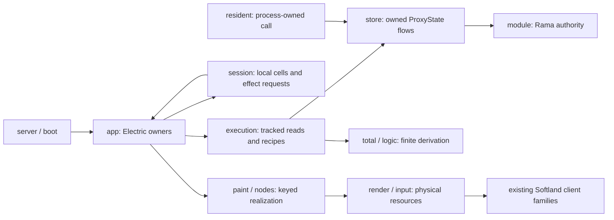

# Inland — execution, authority and realization

[Parent: namespace root](../README.md) · [Product entry](../../README.md).

This folder turns addressed authored records into live instrument behavior and
Softland rendering. Rama owns accepted state; Electric owns tracked computation
and demand lifetime; native adapters own physical resources and external calls.
The [seed](../../../resources/inland/README.md) supplies the first workbench,
including its rules, views, editor, traversal and resident invitation.

Arrows show dependencies or delivered work, not new transports. Electric's native
client/server machinery spans `app` and `execution`; `store` is the foreign Rama
source boundary. Its process handles do not retain accepted application results.

| Immediate file | Responsibility and ownership |
|---|---|
| [server.clj](server.clj) | Local HTTP/WebSocket host; starts store/resident and boots Electric per connection. Test controls are opt-in. |
| [boot.cljs](boot.cljs) | Browser entry; cancels the prior Electric root on development reboot. |
| [app.cljc](app.cljc) | Composition root: snapshots event basis, dispatches generic effects, owns visible/reopen branches and repeated work. |
| [execution.cljc](execution.cljc) | Indexed applicability, contextual rows/fields, named recipe calls and maintained demand answers; subscriptions belong to Electric branches. |
| [total.cljc](total.cljc) | Pure expression leaves, structural contracts and tagged outcomes; no I/O or lifetime owner. |
| [logic.cljc](logic.cljc) | Finite relational closure and alternative supports over explicit inputs; temporary calculation only. |
| [activity.cljc](activity.cljc) | View-owned repeated recipe, iteration state snapshots and bounded yields; cancelled with its branch. |
| [session.cljs](session.cljs) | Per-session cells, event/request slots, local drafts and effect delivery; retains cells for reopen. |
| [module.clj](module.clj) | Rama operation admission and five PStates: rows, versions, scoped indexes, decisions and workspace registration. |
| [store.clj](store.clj) | Process connection handles, narrow foreign reads, admissions and per-demand proxy acquisition/cancellation; retains diagnostic counters. |
| [resident.clj](resident.clj) | Process lock, durable claim, bounded Claude attempt, observation and restart uncertainty; independent of browser lifetime. |
| [seed.clj](seed.clj) | Explicit default-workspace genesis refresh through revision-checked admission; skips user-edited rows. |
| [paint.cljc](paint.cljc) | Authored descriptions to keyed text/path/scene/input occurrences, with visible validation/read outcomes. |
| [nodes.cljc](nodes.cljc) | Thin Electric ownership wrappers around renderer node flows and updates. |
| [render.cljs](render.cljs) | Surface device, font providers, compositor, node resources and event delivery; prepares changed nodes and composites retained resources. |
| [input.cljs](input.cljs) | Hidden native editing delivery, source-addressed caret/selection geometry and listener disposal; visible text remains Softland-rendered. |
| [geometry.cljc](geometry.cljc) | Pure instrument path construction using shared primitives and presentation colors. |
| [scene.cljc](scene.cljc) | Pure authored shapes/options to validated Region3D material. |
| [reactive.cljc](reactive.cljc) | Generic owned asynchronous acquisition and bounded delay flows; handles cancellation during resource setup. |

For a focused challenge, descend in this order:

- **An edit changed the wrong thing, or a rejection appeared live:** `app/Events`
  → `session/submit!` → `store/submit-result!` → `module/outcome*`; then
  `execution/Field` for the accepted read. Evidence: admission and context checks
  in the [verification map](../../../test-inland/README.md).
- **An unrelated value recomputed, or a read survived closing:**
  `execution/ReadStatus` → `store/watch-path`; for target work, `nodes` →
  `render/remove-node!` and `dispose!`. Browser counters and the narrow-proxy test
  measure different parts of this path; neither establishes a general benchmark.
- **A rule stops applying or a supported result disappears:**
  `execution/Conditions` → `Query` → `total/conclude`. `logic/derive` is a separate
  full closure over explicit facts, with its own range/stratum/budget checks.
- **A walk continues or an ask finishes after close:** `activity/Run` and
  `session/advance!` explain view-owned repetition; `resident/execute!` and
  `recover!` explain process-owned external work. These are different owners.

The compiled floor still includes bootstrap addresses, expression/capability
vocabulary, generic effects, the provider adapter and rendering primitives.
Authored records choose applicability, references, arrangement and behavior
within that floor. `app` has a compiled unanswered-event fallback. This is not a
claim that the environment can rebuild its compiler or renderer through itself.

Known source limits are documented where they arise: request/event slots are not
queues; repeated admission effects do not await durable acceptance before the
next step; relational closure is not internally incremental; support identities
do not capture full transitive definition provenance; and `render` has one shared
workbench scene slot. `module/outcome*` derives revisions from current rows, so
override delete/recreate does not guarantee distinct version identities. These
are source-grounded limits, not newly exercised failure receipts or accepted
changes to the [intended model](../../../docs/build-softland-in-softland/MODEL.md).
