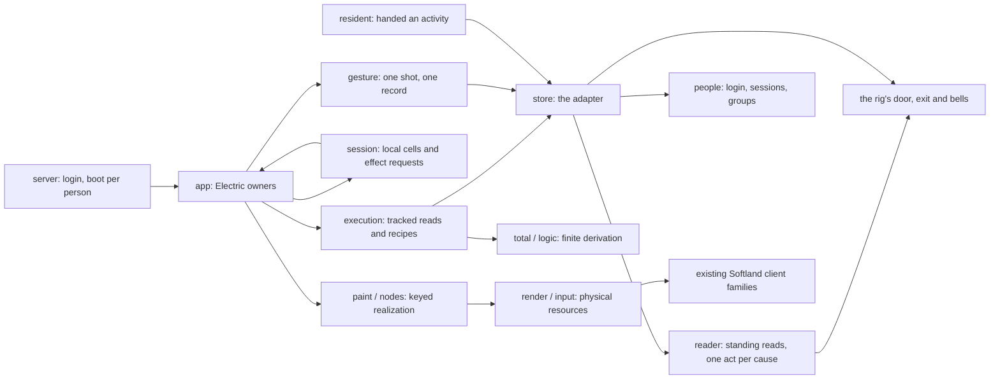

# Inland — execution, authority and realization

[Parent: namespace root](../README.md) · [Product entry](../../README.md).

This folder turns addressed authored records into live instrument behavior and
Softland rendering. The rig's store owns accepted state (its module,
`rig.store.module/Store`, from [src/proposal/rig-2026-09-25](../../../src/proposal/rig-2026-09-25/README.md),
deployed by `bin/inland`); Electric owns tracked computation and demand lifetime;
native adapters own physical resources and external calls. The
[seed](../../../resources/inland/README.md) supplies the first workbench,
including its rules, views, editor, the pair's controls and the resident's
invitation. The pointer's screen on the store is recorded in
[pointer-screen-2026-09-27](../../../src/proposal/pointer-screen-2026-09-27/PROGRESS.md).

```mermaid
flowchart LR
  Server[server: login, boot per person] --> App[app: Electric owners]
  App --> Execution[execution: tracked reads and recipes]
  App --> Gesture[gesture: one shot, one record]
  Execution --> Store[store: the adapter]
  Gesture --> Store
  Store --> Reader[reader: standing reads, one act per cause]
  Store --> People[people: login, sessions, groups]
  Reader --> Rig[the rig's door, exit and bells]
  Store --> Rig
  Execution --> Pure[total / logic: finite derivation]
  App --> Session[session: local cells and effect requests]
  Session --> App
  App --> Paint[paint / nodes: keyed realization]
  Paint --> Render[render / input: physical resources]
  Render --> Client[existing Softland client families]
  Resident[resident: handed an activity] --> Store
```

Arrows show dependencies or delivered work, not new transports. Electric's native
client/server machinery spans `app` and `execution`; `store` is the boundary to
the rig's store. Every read goes through the rig's one read exit and is recorded
before anything it gave is shown: a view's reads as standing reads (`reader`), a
gesture's in one act (`gesture`). Changes are pushed by the store (rig.store.bell),
never polled.

| Immediate file | Responsibility and ownership |
|---|---|
| [server.clj](server.clj) | Loopback HTTP/WebSocket host with login; refuses a page or socket without a login token; starts store/resident and boots Electric per connection for its person. Test controls are opt-in. |
| [boot.cljs](boot.cljs) | Browser entry; cancels the prior Electric root on development reboot. |
| [app.cljc](app.cljc) | Composition root: opens the page's session in the store, sends each event to `store/gesture!` once, applies the effects left for the page, owns visible/reopen branches, marks and repeated work. |
| [execution.cljc](execution.cljc) | Indexed applicability, contextual rows/fields, stored and local cells (`Cell`), named recipe calls and maintained demand answers; subscriptions belong to Electric branches. |
| [gesture.clj](gesture.clj) | One gesture on the server, once: the language `execution` runs, with its reads queried through the exit, recorded in one act, and stood on by what it writes. |
| [store.clj](store.clj) | The adapter over the rig's door and read exit: read addresses to read units, gestures and admissions to acts (stored cells, puts, promotions, groups, members, notes, activities), marks for the page. Owns the connection and one session per page. |
| [reader.clj](reader.clj) | Per page: standing reads shared by every subscription onto a layer and pattern, one act per cause, delivery on the store's push, erasure re-reads on a forget, marks from what stood on a changed fact. |
| [facts.clj](facts.clj) | Pure: Inland's records as facts and back (ids, heads, layered composition, the facts an edit writes), index buckets, and the grammars the records, cells and notes need. |
| [people.clj](people.clj) | Login at the host (passphrases, tokens), the store's persons and their layers, a session's permissions, groups and members, the operator's forget. |
| [operator.clj](operator.clj) | The operator's command line (`bin/inland forget <person>`, `bin/inland seed`). |
| [total.cljc](total.cljc) | Pure expression leaves, structural contracts and tagged outcomes; no I/O or lifetime owner. |
| [logic.cljc](logic.cljc) | Finite relational closure and alternative supports over explicit inputs; temporary calculation only. |
| [activity.cljc](activity.cljc) | View-owned repeated recipe, iteration state snapshots and bounded yields; cancelled with its branch. |
| [session.cljs](session.cljs) | Per-session local cells, event/request slots, local drafts and effect delivery; the snapshot a gesture sends; retains cells for reopen. |
| [module.clj](module.clj) | Inland's own Rama module, retired as the authority: no longer deployed; kept with its seed reading. |
| [resident.clj](resident.clj) | Process lock and one attempt per activity the store hands over; a stand-in reply until Sid says yes (`INLAND_RESIDENT_LIVE=1` asks Claude, bounded). |
| [seed.clj](seed.clj) | The genesis records put into the base as facts by the operator, again where the seed changed, while the base is one-owner. |
| [paint.cljc](paint.cljc) | Authored descriptions to keyed text/path/scene/input occurrences, with visible validation/read outcomes. |
| [nodes.cljc](nodes.cljc) | Thin Electric ownership wrappers around renderer node flows and updates. |
| [render.cljs](render.cljs) | Surface device, font providers, compositor, node resources and event delivery; prepares changed nodes and composites retained resources. |
| [input.cljs](input.cljs) | Hidden native editing delivery, source-addressed caret/selection geometry and listener disposal; visible text remains Softland-rendered. |
| [geometry.cljc](geometry.cljc) | Pure instrument path construction using shared primitives and presentation colors. |
| [scene.cljc](scene.cljc) | Pure authored shapes/options to validated Region3D material. |
| [reactive.cljc](reactive.cljc) | Generic owned asynchronous acquisition and bounded delay flows; handles cancellation during resource setup. |

For a focused challenge, descend in this order:

- **A gesture did the wrong thing, or a rejection appeared:** `app/Events` →
  `store/gesture!` → `gesture/dispatch` and `store/admit!`; the gesture's record is
  `rig.store.read-exit/record!`. Evidence: the scenes in the
  [verification map](../../../test-inland/README.md).
- **A value did not arrive, or arrived without a push:** `execution/ReadStatus` →
  `store/watch-path` → `reader/watch!` and `reader/flush!`; the bells are
  `rig.store.bell`. For target work, `nodes` → `render/remove-node!` and `dispose!`.
- **A mark is missing or stale:** `reader/changed-facts`, the `[:dependents F]` reads
  in `reader/flush!`, `reader/current-marks`, then `store/marks-view`.
- **A rule stops applying or a supported result disappears:**
  `execution/Conditions` → `Query` → `total/conclude`. `logic/derive` is a separate
  full closure over explicit facts, with its own range/stratum/budget checks.
- **A walk continues or an ask finishes after close:** `activity/Run` and
  `session/advance!` explain view-owned repetition; `store/admit!`'s `:start` and
  `resident/execute!` explain process-owned external work. These are different owners.

The compiled floor still includes bootstrap addresses, expression/capability
vocabulary, generic effects, the adapter's admission kinds, the provider adapter
and rendering primitives. Authored records choose applicability, references,
arrangement and behavior within that floor. `app` has a compiled unanswered-event
fallback. This is not a claim that the environment can rebuild its compiler or
renderer through itself.

Known source limits are documented where they arise: request/event slots are not
queues; relational closure is not internally incremental; support identities do not
capture full transitive definition provenance; `render` has one shared workbench
scene slot; a pinned version is read as of a stamp, which a shared layer refuses;
sessions are never closed in the store yet. The placeholders the store's records
froze on are listed in the pointer screen's
[PROGRESS.md](../../../src/proposal/pointer-screen-2026-09-27/PROGRESS.md).
