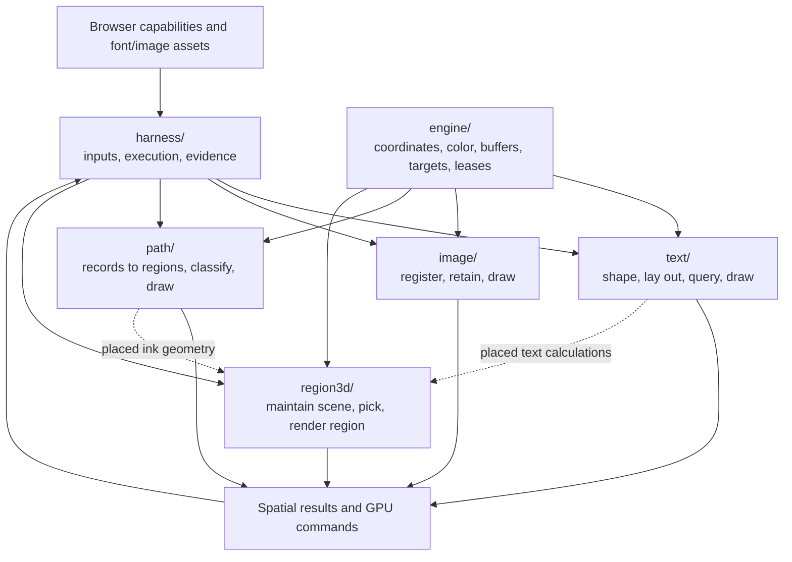

# Client — rendering and spatial computation

The client turns text, images, paths and bounded 3D scenes into spatial answers and GPU work. Four content families share an engine for record execution, pure surface paint/sample, coordinates, color, GPU transport and render-target ownership (`engine/executor_test.clj`, `engine/executor_pending_test.clj`, `engine/surface_test.clj`). The 3D kind also runs sphere/coating records through this shared executor and CPU compositor, retaining regions and paintings as values (`region3d/{surface_region,coating,brush}_test.clj`). The browser harness constructs inputs, composes frames and collects evidence (`harness/coating.cljs`, `test/render_engine/run_verifier.mjs`).

The [Softland-in-Softland product](../../../src-inland/README.md) is another caller of the text, path, Region3D and engine families. It supplies authored material through Electric and owns its render surfaces, nodes and font-provider disposal. Enter that source map for product behavior and accepted-state ownership; this map remains the rendering-family boundary.

The diagrams are Mermaid source inside Markdown. IntelliJ displays them in Markdown preview with the [Mermaid plugin](https://plugins.jetbrains.com/plugin/20146-mermaid). Neovim in Kitty can display formatted text and diagrams directly in the buffer using [render-markdown.nvim](https://github.com/MeanderingProgrammer/render-markdown.nvim) and [Snacks image](https://github.com/folke/snacks.nvim/blob/main/docs/image.md), with Mermaid CLI installed. A browser preview is also available through [markdown-preview.nvim](https://github.com/iamcco/markdown-preview.nvim) with `:MarkdownPreview`. Edit the fenced text to update the diagram; generated images are disposable views. The prose and role tables remain available without a renderer.

Arrows show inputs and consumed results. The caller determines execution order: family preparation produces retained resources or derived values, and drawing encodes commands into caller-owned passes. The engine provides shared infrastructure; content selection belongs to callers.

| Enter a scope | Responsibility | State owner |
|---|---|---|
| [engine/](engine/README.md) | Validation, group coordinates, scene color, GPU transport, target allocation and region leases. | Callers own pure registries; explicit pools, binding owners and compositors hold resources. |
| [text/](text/README.md) | Font loading, shaping, positioned layout, source/geometry queries and outline rendering. | Providers hold shaping resources; results hold layout; renderer systems hold GPU resources. |
| [image/](image/README.md) | Source verification, crop/placement rules, asynchronous texture residency and ordered draws. | Each renderer system holds its source registry, bytes and GPU residency. |
| [path/](path/README.md) | Records to path values to regions; packing for the camera; CPU membership and coverage; one instanced coverage draw. | Callers execute recipes into path values; renderer systems receive named placement diffs and hold current geometry, packs, atlas and rows (`path/frame_test.clj`, harness path push counters). |
| [region3d/](region3d/README.md) | Sphere/coating records to regions and paintings; scene derivation, queries, placed content and offscreen rendering. | Callers own record results and continuations (`region3d/brush_test.clj`); renderer systems retain scenes/buffers and engine compositors own physical texture leases. |
| [harness/](harness/README.md) | Browser acquisition, fixtures, frame driving, readback and bounded checks. | Drivers hold test resources and evidence; the entry publishes browser completion state. |

Component values describe input. Derived representations can be reconstructed from that input and may be retained for reuse. GPU ownership adds allocation, invalidation and teardown responsibilities. These three meanings stay distinct even when one system map holds all three.

The [browser build configuration](../../../shadow-cljs.edn) enters the render verifier through the harness. That entry exercises rendering with controlled fixtures; it does not establish an interactive product path. External asset formats, browser behavior and libraries remain dependencies of the corresponding family.

To zoom in, open a folder map, then a source file's namespace docstring, then a function's docstring. To zoom out, follow the containing folder's map. Folder maps describe immediate children; file and function explanations live with their code. [Agent upkeep instructions](AGENTS.md) describe how to keep those levels consistent during changes.

Path production geometry: [path/README.md](path/README.md) maps the capsule union and declared stroke policies; evidence is in `test/app/client/path/{nib,stroke,component,frame}_test.clj`.
