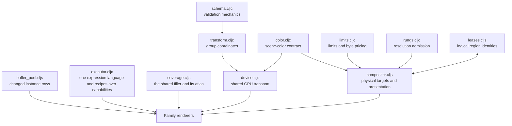

# Engine — shared rendering infrastructure

[Up: client](../README.md)

Input: declared data, group transforms, device handles, scene-color settings and target requests. Output: checked values, coordinate calculations, GPU transport, admitted render targets and presentation commands. The engine supplies shared computation and resource ownership for the content families.

| File | Role in this computation |
|---|---|
| [schema.cljc](schema.cljc) | Apply declared schemas and report malformed values with paths and named errors. Families supply the vocabulary. |
| [color.cljc](color.cljc) | Define transfer calculations and the legacy/linear-premultiplied scene-color modes. |
| [transform.cljc](transform.cljc) | Derive a shared affine coordinate system and compact GPU indexes from a caller-owned group registry. |
| [device.cljs](device.cljs) | Allocate/upload shared camera and group buffers and configure matching shader color behavior. |
| [buffer_pool.cljs](buffer_pool.cljs) | Retain an ordered instance vector and upload rows whose values changed. |
| [limits.cljc](limits.cljc) | Read selected device limits and calculate nominal texture storage cost. |
| [rungs.cljc](rungs.cljc) | Choose a resolution within a supplied physical budget using pure arithmetic. |
| [leases.cljs](leases.cljs) | Preserve logical region identities and composite indexes across physical resource replacement. |
| [compositor.cljs](compositor.cljs) | Allocate, reuse and retire physical targets; reconcile region leases; encode presentation. |
| [executor.cljc](executor.cljc) | Evaluate one EDN expression language for width rules and recipe arguments; execute ordered capability calls. Missing bindings/operators throw. Evidence: `test/app/client/engine/executor_test.clj`. |
| [coverage.cljs](coverage.cljs) | The per-pixel coverage program text and paths share, the dynamic curve/band atlas paths pack into, and the region instance row. |

The caller owns group registries and pure results. Buffer pools retain instance storage; binding owners retain logical associations; compositors own physical textures and retirement; an atlas owns its two textures and their mirrors. The executor holds no state or clock. Its complete supplied inputs define the computation; static expression references are diagnostics, never cache keys (`executor_test.clj`). Logical identity, admission arithmetic and physical allocation are separate responsibilities. The browser caller acquires the GPU device and supplies it to this infrastructure.
