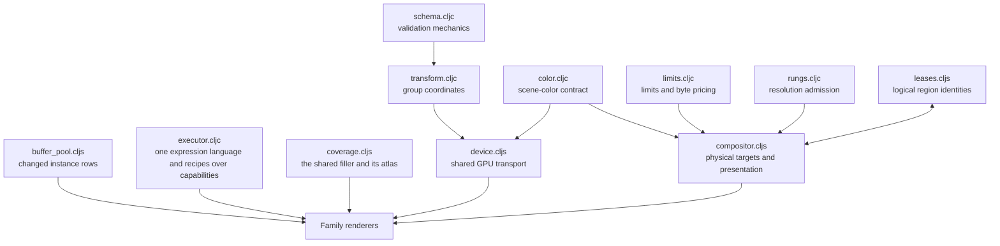

# Engine — shared rendering infrastructure

[Up: client](../README.md)

Input: declared data, group transforms, device handles, scene-color settings and target requests. Output: checked values, coordinate calculations, GPU transport, admitted render targets and presentation commands. The engine supplies shared computation and resource ownership for the content families.

| File | Role in this computation |
|---|---|
| [schema.cljc](schema.cljc) | Apply declared schemas and report malformed values with paths and named errors. Families supply the vocabulary. |
| [color.cljc](color.cljc) | Define transfer calculations and the legacy/linear-premultiplied scene-color modes. |
| [transform.cljc](transform.cljc) | Derive a shared affine coordinate system and compact GPU indexes from a caller-owned group registry. |
| [device.cljs](device.cljs) | Allocate/upload shared camera and group buffers and configure matching shader color behavior. |
| [buffer_pool.cljs](buffer_pool.cljs) | Supply legacy vector comparison and direct range writes. Named path pushes use ranges and set the draw count; the physical counter test is `harness/path_push.cljs`. |
| [limits.cljc](limits.cljc) | Read selected device limits and calculate nominal texture storage cost. |
| [rungs.cljc](rungs.cljc) | Choose a resolution within a supplied physical budget using pure arithmetic. |
| [leases.cljs](leases.cljs) | Preserve logical region identities and composite indexes across physical resource replacement. |
| [compositor.cljs](compositor.cljs) | Allocate, reuse and retire physical targets; reconcile region leases; encode presentation. |
| [executor.cljc](executor.cljc) | Evaluate one EDN expression language; run records with named capability arguments and explicit loop state; suspend/resume byte continuations; return computation subjects. Evidence: `test/app/client/engine/executor_test.clj`. |
| [executor_read.cljc](executor_read.cljc) | Stop pending reads before state advances; route one answer by phase/item/step and compare complete requests; retain declared provisional reads. Evidence: `test/app/client/engine/executor_pending_test.clj`. |
| [surface.cljc](surface.cljc) | The compositor's pure CPU reference: immutable RGBA32F values, color paint, nearest sampling of surface and capability layers, chart adapters supplied by the kind, linear mix, and exported pictures. Evidence: `test/app/client/engine/surface_test.clj`, `test/app/client/region3d/brush_test.clj`. |
| [value_bytes.cljc](value_bytes.cljc) | Encode nested data as UTF-8 EDN with little-endian float32 payloads; compare complete values including array contents. Evidence: executor and surface tests. |
| [surface_png.cljc](surface_png.cljc) | Deterministic PNG encoding for the CPU picture, without a canvas or GPU. Evidence: `surface_test/png-is-a-readable-picture`. |
| [coverage.cljs](coverage.cljs) | The shared coverage program, curve/band atlas and instance row. Named pack removal reports relocated slots after compaction (`harness/path_push.cljs`); existing users may still supply a retained set. |

The caller owns group registries and pure results. Buffer pools retain instance storage; binding owners retain logical associations; compositors own physical textures and retirement; an atlas owns its two textures and their mirrors. The executor retains nothing between runs and reads no clock. Its recipe is the program plus whole roots reached statically by the transition; its result subjects read dependencies from `:return` separately. Actual reads are diagnostics only (`executor_test.clj`). A continuation carries the record, caller roots, projected consumed items, state and history; encoding preserves array contents and load checks schema, vocabulary and surface lengths (`executor_test.clj`, `pickup_test.clj`).

`surface.cljc` and `compositor.cljs` are one compositor: pure values/operations and physical ownership. The CPU runner supplies color/source-over paint and nearest sampling. A pending layer contributes its declared partial color, then layers above it compose in order; unsupported reads and missing policy stop the read (`test/app/client/engine/surface_test.clj`). The kind supplies chart point/texel conversion through `ctx :domains`, and a layer supplies a pure snapshot plus its sampler. Snapshots retain whole values, including an unknown contributor; no grant or runtime function becomes the snapshot (`surface_test.clj`, `region3d/brush_test.clj`). Texture paint, presentation through these CPU operations and a GPU runner remain **unimplemented and untested**. Timing belongs to callers. No GPU performance claim is made for the CPU pickup. Logical identity, admission arithmetic and physical allocation are separate responsibilities. The browser caller acquires the GPU device and supplies it to this infrastructure.

A read capability declares `:snapshot` separately from `:run`. Pending and
needs-policy suspend before `:next`; `:pending :provisional` explicitly
consumes the known composition and marks the subject/history. Requests carry
phase as well as item/step position. A continuation keeps committed loop
state even if replayed pre-loop work pends again, and retains the producer
records used to check `:from` inputs. Tests: `executor_pending_test.clj`.
The current caller owns grants and continuation storage; no scheduler is
implemented. [The adopted ownership ruling](../../../../docs/below-the-waist/production/DESIGN-1.md#12-read-derivation-custody--ruled-by-sid-2026-09-07)
keeps the paused continuation in the session's uncommitted store under the
read it awaits, never as a row. The store's own runner executes the read's
request row and produces a derived row under its full declared input value;
the frame caller grants work per frame, and ownership follows the held key.
The derivation key is distinct from the executor request used to check answer belonging.
This store/session/frame integration is **unimplemented and untested**;
`region3d/brush_test.clj` and `brush_wire.clj` demonstrate continuation
reproduction under manually supplied reads and grants.

Result subjects include resolved pre-loop reads that feed loop state as well as loop reads; unused pre-loop reads stay out (`executor_pending_test/a-loop-subject-includes-the-read-that-initialized-state`). The sphere brush exercises real withheld binding work, provisional history, stale answers and producer subjects through the same executor (`test/app/client/region3d/brush_test.clj`).
