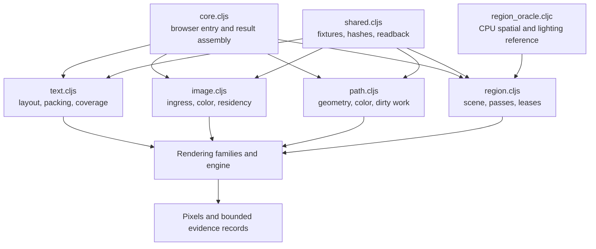

# Harness — rendering execution and evidence collection

[Up: client](../README.md)

Input: a WebGPU-capable browser, static font/image assets and the rendering modules. Output: pixel bytes, preview images, hashes, check results and completion state. The harness constructs components and explicitly drives the rendering families through preparation, passes, submission and readback.



| File | Role in this computation |
|---|---|
| [core.cljs](core.cljs) | Acquire browser/GPU/assets, select full or focused execution, assemble results and publish completion. |
| [shared.cljs](shared.cljs) | Supply fixture conventions, byte hashing, pixel helpers, environment metadata and readback utilities. |
| [text.cljs](text.cljs) | Drive text layout/packing/rendering and compare selected coverage, source and group behavior. |
| [image.cljs](image.cljs) | Drive source ingress, sampling/color, residency, preparation and resource reconstruction checks. |
| [path_production.cljs](path_production.cljs) | Read pixels for device-width zooms, snapped pans, screen groups, retained recipe edits, nonlinear union, containing discs, returned clips and taper; runs inside the repo verifier. |
| [path_push.cljs](path_push.cljs) | Count real queue writes, row comparisons and per-item checks at 1,600 placements; test atlas relocation and range shifts. Also holds explicit whole-fixture setup for pixel tests. |
| [pickup.cljs](pickup.cljs) | Run the CPU pickup, continuation bytes and four edits in the browser; export its PNG and text-golden values. The JVM counterpart is `pickup_test.clj`. |
| [path.cljs](path.cljs) | Drive the definer's records through their constructions and the coverage route; compare CPU membership and coverage with GPU pixels, the crossing's union and dabs, a clip, the frame's rebuild rates and colour. |
| [coating.cljs](coating.cljs) | Execute the sphere coating brush eagerly and from continuations, compare full values, hash all float32 pixels and decode/read the exported PNG. `region3d/brush_test.clj` and `brush_wire.clj` are the JVM evidence. |
| [region_oracle.cljc](region_oracle.cljc) | Compute CPU reference answers for selected scene, lighting and occlusion checks. |
| [region.cljs](region.cljs) | Compose explicit Region3D frames and exercise update, lease, pressure, recovery and rejection behavior. |

Drivers own fixture sequencing and test resources. Mutable renderer cases are sequenced where they share state; independent drivers can run concurrently. Evidence records have different meanings: pixel hashes measure repeatability, reference comparisons check selected answers, renderer returns report work, and some harness counters summarize or infer work. Each check's exact scope lives beside its implementation.

The harness executes real rendering modules with controlled inputs. It does not exercise a product server or interactive editing loop. A named check, an available fixture and a passing run are separate facts; preserve that distinction when using its results.

Run the repo browser surface from the checkout root:

```sh
clj -Sdeps '{:deps {thheller/shadow-cljs {:mvn/version "2.28.23"}}}' -M -m shadow.cljs.devtools.cli release render-verifier
node test/render_engine/run_verifier.mjs
node test/render_engine/dump_result.mjs <output-directory>
```

The verifier compares checked-in goldens and returns nonzero on a failed
guard or comparison (`test/render_engine/run_verifier.mjs`). The dump writes
`path-step.json`, `region3d-floor.json`, shader digests and PNGs; production
pixel samples and scene timings are in `path-step.json` (`dump_result.mjs`).
The default adapter is headless SwiftShader. The existing
`RENDER_VERIFIER_HARDWARE=1` dump option selects the desktop adapter; hardware
results are untested in this production slice.

The repo verifier also compares `test/app/fixtures/render_engine/path-pickup.json`
against the browser CPU runner. Its full-surface hash was recorded from the JVM
`pickup-wire save` command; existing GPU image goldens are unchanged in slice A.
`test/app/client/path/pickup_wire.clj` gives save/resume commands for a continuation
crossing a fresh JVM. PNGs are evidence exports, not a live product painting UI.

The Region3D lane includes the CPU coating brush (`coating.cljs`) alongside
its scene floor. The verifier compares
`test/app/fixtures/render_engine/region3d-coating.json`, recorded by the JVM
`brush-wire save` command, against the browser's full float32 hash, all four
colors/carries, changed texels and decoded PNG pixel count. The nested result
is `region3d-floor.json` → `coating`; `dump_result.mjs` exports its
`cpu-region3d-coating.png` and its nearest-neighbour 8x preview
`cpu-region3d-coating-8x.png` (`coating/pixels!`). This is a chart-patch picture; applying the painting
to a displayed sphere is unimplemented and untested. Fresh-process commands
and the supported construction boundary are in [Region3D](../region3d/README.md).
