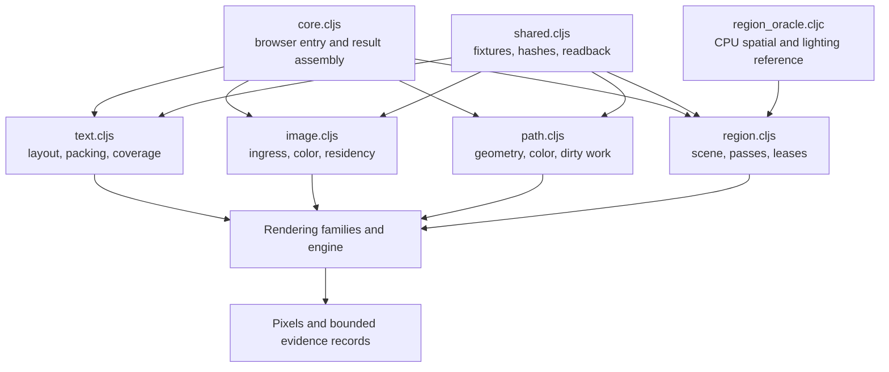

# Harness — rendering execution and evidence collection

[Up: client](../README.md)

Input: a WebGPU-capable browser, static font/image assets and the rendering modules. Output: pixel bytes, preview images, hashes, check results and completion state. The harness constructs components and explicitly drives the rendering families through preparation, passes, submission and readback.

| File | Role in this computation |
|---|---|
| [core.cljs](core.cljs) | Acquire browser/GPU/assets, select full or focused execution, assemble results and publish completion. |
| [shared.cljs](shared.cljs) | Supply fixture conventions, byte hashing, pixel helpers, environment metadata and readback utilities. |
| [text.cljs](text.cljs) | Drive text layout/packing/rendering and compare selected coverage, source and group behavior. |
| [image.cljs](image.cljs) | Drive source ingress, sampling/color, residency, preparation and resource reconstruction checks. |
| [path.cljs](path.cljs) | Drive the definer's records through their constructions and the coverage route; compare CPU membership and coverage with GPU pixels, the crossing's union and dabs, a clip, the frame's rebuild rates and colour. |
| [region_oracle.cljc](region_oracle.cljc) | Compute CPU reference answers for selected scene, lighting and occlusion checks. |
| [region.cljs](region.cljs) | Compose explicit Region3D frames and exercise update, lease, pressure, recovery and rejection behavior. |

Drivers own fixture sequencing and test resources. Mutable renderer cases are sequenced where they share state; independent drivers can run concurrently. Evidence records have different meanings: pixel hashes measure repeatability, reference comparisons check selected answers, renderer returns report work, and some harness counters summarize or infer work. Each check's exact scope lives beside its implementation.

The harness executes real rendering modules with controlled inputs. It does not exercise a product server or interactive editing loop. A named check, an available fixture and a passing run are separate facts; preserve that distinction when using its results.
