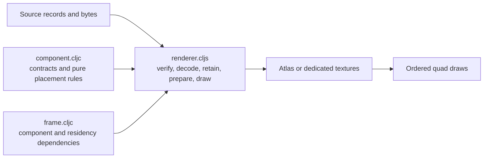

# Image — verified sources to resident textures and ordered draws

[Up: client](../README.md)

Input: source provenance and bytes for registration, then image components and shared transforms for frames. Output: source/residency status and textured quad draws. Registration performs asynchronous byte verification and decoding; frame preparation consumes the resulting residency synchronously.

| File | Role in this computation |
|---|---|
| [component.cljc](component.cljc) | Define source/component contracts and pure crop, atlas-placement, instance and adjacent-binding-run calculations. |
| [frame.cljc](frame.cljc) | Derive the dependency key from component/group identities and residency revision. |
| [renderer.cljs](renderer.cljs) | Verify/decode/upload sources, retain atlas/dedicated resources, prepare instance rows and encode ordered draws. |

Each renderer system owns retained source bytes, source registry, atlas state, dedicated textures, placeholder, instance buffer and residency revision. Camera/group buffers come from the [engine](../engine/README.md). Unresolved sources have explicit placeholder state; frame preparation does not initiate decoding. The caller owns registration scheduling, frame composition and teardown.
