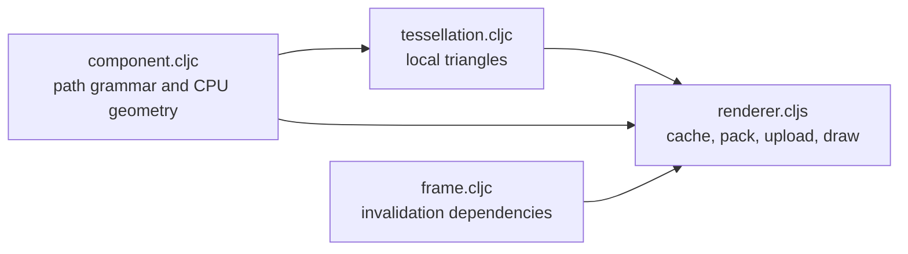

# Path — local geometry to triangles and spatial answers

[Up: client](../README.md)

Input: ink strokes or filled contours, paint, container identity, zoom and shared transforms. Output: CPU hit classifications and GPU triangle draws. The component remains the geometric input for picking; tessellation derives the render representation.

| File | Role in this computation |
|---|---|
| [component.cljc](component.cljc) | Define accepted path data, content identity, paint and local point/boundary classification. |
| [tessellation.cljc](tessellation.cljc) | Expand ink and triangulate filled contours into deterministic local meshes, reusing caller-supplied cache values. |
| [frame.cljc](frame.cljc) | Derive the dependency key that decides whether packed frame data needs preparation. |
| [renderer.cljs](renderer.cljs) | Own the mesh cache and vertex buffer; prepare ordered path ranges and draw them into an open pass. |

Components and transforms belong to callers. Tessellation returns derived values; a renderer system retains its cache and buffer. [Engine](../engine/README.md) camera/group resources are borrowed. The frame caller determines draw order, clipping, submission and renderer lifetime. [Region3D](../region3d/README.md) also consumes path geometry for placed ink.
