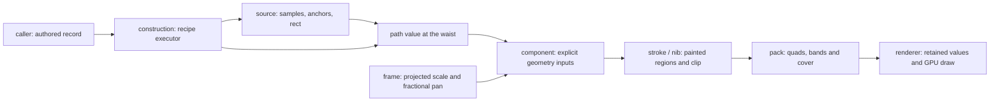

# Path — authored records, path values, regions, coverage

[Up: client](../README.md)

The caller keeps the authored tool record and executes its recipe at an edit
boundary. The renderer takes named placement pushes containing the resulting `:path/value`,
paint and numeric parameters. It performs geometry and packing with explicit view inputs;
it executes no recipe. `construction_test/geometry-never-executes-a-source-recipe`
and the browser's `path_production` captures exercise that separation.

| File | Responsibility | Evidence |
|---|---|---|
| [construction.cljc](construction.cljc) | Execute a recipe into a validated component. Recipes return a path or a path plus paint overrides. Custom source declarations cross without a renderer source-kind gate. | `construction_test.clj`; browser `path_production/recipe-check!` |
| [component.cljc](component.cljc) | Validate path-value components; expose complete geometry inputs; derive regions/clip; answer CPU membership and name paint colors. | `component_test.clj` |
| [source.cljc](source.cljc) | Source capabilities for pen samples (streamline, pressure, taper, fit), anchors and rectangles. | `source_test.clj`; browser taper pixels |
| [width.cljc](width.cljc) | Compile width rules with the same EDN expression language used by recipe arguments. | `engine/executor_test.clj`, `source_test.clj` |
| [value.cljc](value.cljc) | The bench vocabulary: `:kind :line/:quad/:cubic`, `:p/:c/:c1/:c2`, `:closed?`, `:knots`; path operations and source correspondence. | `value_test.clj` |
| [stroke.cljc](stroke.cljc) | Cap/join/alignment/ribbon/dash policies and ordered dabs; one union region for nib overlap. | `stroke_test.clj`; browser crossing check |
| [nib.cljc](nib.cljc) | Centerline/radius subdivision and round capsule union, retaining containing discs whole. | `nib_test.clj`; browser nonlinear and containing-disc pixels |
| [pack.cljc](pack.cljc) | Cubic lowering, quads, sorted bands, cover, CPU coverage, snapping. | `pack_test.clj`; browser parity at seven zoom stations |
| [frame.cljc](frame.cljc) | Per-placement preparation inputs and explicit view facets; screen groups ignore the world camera. | `frame_test.clj`; browser border and screen-group pixels |
| [placements.cljc](placements.cljc) | Pure named changes to current geometry, packs, group/view dependents, order and ranges. | `frame_test.clj` |
| [push.cljs](push.cljs) | Apply affected sets to the atlas and direct row range writer; propagate relocated slots. | `harness/path_push.cljs` |
| [renderer.cljs](renderer.cljs) | Own the system, pipeline and drawing; expose `push!`/`frame!`. | repo browser verifier, path push and pixel captures |
| [surface.cljc](surface.cljc) | Bind path coverage and executor step keys into the engine's pure compositor. Paths lower in texel coordinates at quarter-texel tolerance. | `pickup_test.clj`, including the rotated-domain case |
| [records.cljc](records.cljc) | The definer's shared fixtures, used by JVM tests and the browser. | source, stroke, construction tests and browser records check |

All JVM evidence above is under `test/app/client/`; browser evidence is in
`harness/path.cljs` and `harness/path_production.cljs`, included by the repo
verifier. Run the pure checks with
`clj -M:test -i test/app/client/path/run_pure.clj`.
The [harness README](../harness/README.md) names the build, verifier and dump.

The edit boundary is explicit. A source/recipe edit calls `construct`; an
independent paint edit can update the returned component. The default recipe
captures its overlap declaration so replacing it with the dabs recipe changes
the rendered region list (judge A5). Recipes whose paint reads change must
be run by their caller. The harness calls construction explicitly; renderer scheduling is described at its entry point below.

Geometry inputs contain path, geometry paint declarations, numeric parameters,
clip and snap flag. Device width adds projected scale. Snapping adds scale
and fractional device pan, including group translation. Color and identity
belong to instance/preparation inputs. Static expression references select
width parameters from an authored tool; they are not observations or keys.
`component_test/geometry-inputs-are-complete-values-with-explicit-view-declarations`
and `frame_test` pin these distinctions. The browser measures the border's
stroke alpha across seven screen-constant zoom fixtures and snapped pans.
The scalar model supports positive uniform scale and translation; correct
snapping under rotated/sheared groups and one device pixel under nonuniform
scale or perspective projection are untested.

There is no renderer run cache. Each placement holds its current geometry
and complete input, replacing both when the input changes. Pack identity is the actual path and rule; bucket
covers use the bucket's lower scale, so the first frame's zoom cannot silently
choose a different cover. Current row inputs are compared only for affected placements; the writer
accepts explicit ranges and compares no prior rows (`harness/path_push.cljs`). The browser
rates and scale trace use named edits and separate source execution from
preparation; no new memo, bucket or atlas was added. These measurements do
not establish interactive scene capacity. `frame_test/different-regions-never-alias-through-a-hash`
is the hash-collision regression (A3).

The round nib's union is capsule loops, filled nonzero and painted once.
The Z's old 26-curve/4-band counts described the tracer, not the shape:
`stroke_test/the-z-skin-matches-the-bench` pins membership and the browser
pins crossing alpha. Nonround caps/joins, aligned rings and ribbon retain
the base policy tracer, which the ported capsules did not implement;
`stroke_test` exercises butt, square, open miter limits, dash, ribbon and
alignment. Both use the new radius subdivision. General formula subdivision
samples radius error; arbitrary oscillation between samples is untested.
Source width variable `s` uses sample arc fraction and `v` uses sample speed;
geometry width uses normalized segment parameter and `v=0`, as the existing
geometry route did. Equating those quantities is untested. Local-width
silhouettes use local tolerance, so extreme-zoom silhouette accuracy is
untested. The offset-stroker design remains a separate question.

CPU membership intersects clips (`component_test/classification-intersects-the-returned-clip`,
A4); the browser checks arithmetic returned clips and empty clips. Placed ink
consumes the same value and carries the packed clip (`region3d/path_placement_test.clj`).
Caller order, camera/group buffers, scissors and pass lifetime stay with the
caller; the Region3D tree golden exercises the placed-ink draw.

The broader client pure suite remains red on the pre-existing placed-text
provider error. The [pickup and push handoff](../../../../docs/below-the-waist/path-kind/production/HANDOFF-2.md)
links that receipt, the focused suite and the passing repository browser
verifier. This slice adds a CPU pickup text golden; the GPU goldens and shader
digests match. The [first production handoff](../../../../docs/below-the-waist/path-kind/production/HANDOFF-1.md)
records the earlier intentional self-crossing and placed-ink tree goldens.
Nearest-outline distance remains a distance
to contributor outlines; exact external-boundary distance for overlapping
unions and clips is untested.

A2 receipt correction: the judge's literal record omits the tool width rule;
the baseline source produces widths `[4.4 8.0]`, not `[1.6 16.0]`. Supplying
`size=16, width=size*p` already retains the larger disc on the baseline.
Its coincident-center variation loses the later larger disc there;
`nib_test/a-containing-disc-is-kept-whole` now tests both center orders through
`stroke/envelope` and pins the explicitly declared radii. No source default
was changed to make the judge's stated radii appear.

The pickup is `records/pickup`, a fixture record in the same grammar an
author supplies; it is measured by `pickup_test/the-definers-pickup-and-checkpoint-through-bytes`.
The caller constructs its path at L0, then passes `construction/program-record`
and `{:path (:path/value component)}` to `executor/run` with
`construction/capabilities`. The program calls `:surface/new`, `:path/dabs`,
`:sample`, `:mix`, and `:paint`; the table declares named `:args` and `:needs`
groups. The single top-level `:each` declares its `:item`, `:fields`, initial
`:state`, steps and whole replacement `:next`. `[:get ...]` references values;
`[:literal ...]` quotes data. No compatibility step syntax remains
(`engine/executor_test.clj`, `construction_test.clj`).

`run` with `{:until 12}` yields a continuation. `executor/encode` writes its
UTF-8 EDN bytes, `decode` takes those bytes and the capability table, and
`resume` takes the continuation, table and options. An edited record or
caller scope goes under `:record`/`:scope` in those options. The pickup
consumes `[:x :y :path]` from each dab, so moving the last sample can preserve
the first twelve projections; changing first pressure, pickup or surface
dimensions refuses the saved prefix (`pickup_test.clj`). Surface arrays
compare by contents through `value-bytes/equal?`, never host array identity
or a hash. The unchanged run and byte-resumed run have equal painting bytes,
history and subjects. The returned surface is a CPU value; showing it in the
scene through the renderer is **not implemented**.
`test/app/client/path/pickup_wire.clj` saves and resumes in separate JVMs;
the browser harness round trip stays in one page. Exchanging a continuation
between the JVM and browser is **untested**.

`renderer/init-path-system` takes the initial view after the camera and group
buffers. `push!` takes `{:upsert {placement-id {:path/material component
:container group-id}} :remove #{placement-id} :order [placement-id …]
:groups world-transforms}`; omit order/groups when unchanged. The same material
in two groups is two placements, and its caller names both on a material edit.
`frame!` takes just the view. A pan checks snapped world placements; a zoom
checks world placements because even a quadratic region's cover depends on
the pack bucket. Screen groups ignore the world camera. Geometry reruns only
when its full declared inputs change (`frame_test.clj`).

The system retains current values, group membership, view-dependent id sets,
pack users and row ranges. A color edit prepares its placement and directly
writes its range. A geometry edit updates only that placement's geometry and
region packs; a changed row count shifts later ranges. Removing the last user
of a pack removes that named atlas key. Existing atlas compaction may move
surviving slots; every placement using a moved slot gets new rows. Reorder and
range shifts also appear in `:reran :rows`. `item-range` takes a placement id.
The physical receipt `harness/path_push.cljs` counts queue writes, packed rows,
prior-row comparisons and per-item input checks for one edit among 1,600; it
also compares a compaction survivor's packed row with a fresh renderer.
`prepared-rows` explicitly materializes the population for inspection; frames
and named edits do not call it. No Missionary wiring is implemented.
