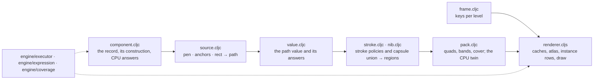

# Path — records to regions to coverage

[Up: client](../README.md)

Input: a record a tool supplies (its numbers, what it saw, what to paint, who it is), group transforms and the view. Output: CPU answers (membership, boundary distance) and one instanced coverage draw through the shared filler. Every 2D tool is data above this folder; the code here exists once.

| File | Role in this computation |
|---|---|
| [component.cljc](component.cljc) | Accept the record; derive its construction as data; run it through the executor into a path, ordered regions and a clip; classify points; name colours. |
| [source.cljc](source.cljc) | Build the path from what the tool saw: a pen's samples (streamline, pressure, the width rule, tapers, fit, spline), a designer's anchors, a rectangle's numbers. |
| [value.cljc](value.cljc) | The value at the waist: subpaths of lines, quadratics and cubics with knots that keep ids, widths and pressure; closing, reversal, bounds, evaluation, flattening with source correspondence. |
| [stroke.cljc](stroke.cljc) | Apply cap, join, alignment, ribbon and dash declarations; emit ordered dabs or one union region. Evidence: `test/app/client/path/stroke_test.clj`. |
| [nib.cljc](nib.cljc) | Subdivide centerline and radius response, then union round capsules, retaining a containing disc whole. Evidence: `test/app/client/path/nib_test.clj`. |
| [pack.cljc](pack.cljc) | Lower a region for the camera: cubics to quadratics at the bucket's tolerance, bands sorted for the shader's early exit, the cover; winding and coverage on the CPU with the filler's arithmetic. |
| [frame.cljc](frame.cljc) | The dependency keys: what the frame, a pack and an instance row depend on. |
| [renderer.cljs](renderer.cljs) | Own the caches per level, the curve and band atlas and the instance rows; prepare a frame and draw it into an open pass. |

The four rates. A record's construction runs per edit and reports what it read; the renderer keeps that report and reruns only when a read value changes, so a colour edit rebuilds nothing and a device-unit width or a snapped record reruns per scale or per frame because it read the view. A pack is cached per region, and per power-of-two bucket of device pixels per local unit only when the region has cubics to lower (a stroke's skin of lines and arc quads packs once for every zoom); a pan, a zoom inside the bucket and a group's move are camera moves, and a group's scale enters through the bucket. Instance rows carry the colour, the group index and the pack's slot and are rewritten only when they change.

The record's construction is data: the source's kind names the capability that builds the path, the paint names the operations on it, and a record may carry its own construction over the same vocabulary. A tool's name selects nothing. The bench that established these meanings is `docs/below-the-waist/path-kind/bench-9/` with its handover; the definer's records live in the tests as fixtures.

Records and transforms belong to callers. The pure namespaces return values; the renderer system retains caches and GPU resources and borrows the [engine](../engine/README.md)'s camera and group buffers. The frame caller owns draw order, scissors, submission and the renderer's lifetime. [Region3D](../region3d/README.md) draws placed ink through the same regions and packs under its plane projection.

Production geometry change: the round union uses capsule loops rather than the
bench tracer's one outline. The Z's old 26-curve count was an implementation
count; its membership and single-paint meaning remain the test
(`stroke_test/the-z-skin-matches-the-bench`, `harness/path` crossing check).
Explicit nonround caps/joins and aligned rings still use the policy tracer;
`stroke_test` exercises butt, square, miter limit, dash, ribbon and alignment.
Radius sampling is an adaptive estimate for general formulas; arbitrary
oscillation between the samples and extreme-zoom silhouette error are untested.
Pack keys contain the path value (`frame_test/different-regions-never-alias-through-a-hash`).
CPU classification intersects the clip (`component_test/classification-intersects-the-returned-clip`).
Repository verifier after this change: six guards and all text goldens pass;
the crossing and placed-ink tree goldens differ. Pixel reconciliation and
intentional recording remain pending.

A2 receipt correction: the judge's literal record omits the tool width rule;
the baseline source produces widths `[4.4 8.0]`, not `[1.6 16.0]`. Supplying
`size=16, width=size*p` already retains the larger disc on the baseline.
Its coincident-center variation loses the later larger disc there;
`nib_test/a-containing-disc-is-kept-whole` now tests both center orders through
`stroke/envelope` and pins the explicitly declared radii. No source default
was changed to make the judge's stated radii appear.
