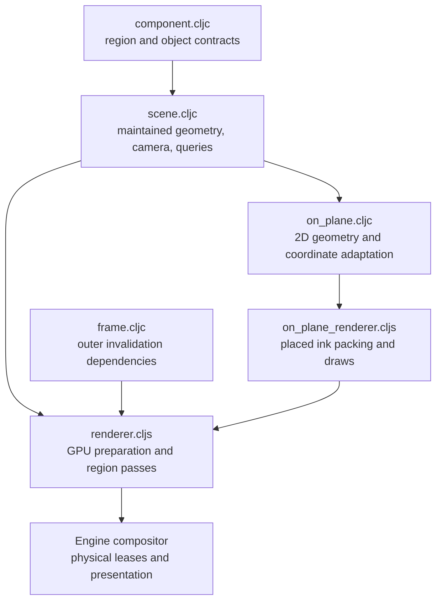

# Region3D — a spatial scene inside a 2D region

[Up: client](../README.md)

Input: region objects, transforms, meshes, shading/lights, camera, background and 2D extent; optional session overlays and resolved placements. Output: CPU spatial answers and an offscreen scene image composited into that region.

| File | Role in this computation |
|---|---|
| [component.cljc](component.cljc) | Canonicalize and validate region, object, geometry, shading, light and view data. |
| [scene.cljc](scene.cljc) | Derive and maintain transforms, instances, triangles and spatial indexes; compute camera projections and hits. |
| [frame.cljc](frame.cljc) | Derive the outer dependency keys that gate preparation. |
| [on_plane.cljc](on_plane.cljc) | Adapt existing text/path computations to object-local planes: placed ink as the path kind's regions and packs, ray intersections and projected anchors. |
| [on_plane_renderer.cljs](on_plane_renderer.cljs) | Retain per-region atlas, instance rows and placement matrices; draw resolved ink placements as one coverage draw under the plane projection. |
| [renderer.cljs](renderer.cljs) | Retain prepared scenes, upload changed resources, encode shadow/interior passes and composite region content or rejection fill. |

Source scene objects, derived spatial state and prepared GPU regions are different representations. Scene functions return values; renderer systems retain them with buffers and dirty state. [Engine](../engine/README.md) compositors own physical texture leases, while logical bindings preserve region identity across replacement.

The placement calculations reuse [text](../text/README.md) and [path](../path/README.md). The placement GPU lane currently supports ink; accepted placement data and available CPU calculations do not by themselves imply GPU support for every kind. The frame caller owns ordering, pass submission and lifetime across these systems.

Placed ink now receives a constructed path value; it runs no source recipe.
Its packed clip accompanies the painted regions (`path_placement_test.clj`).
The browser region3d tree golden exercises the placed-ink draw. Device width
on a perspective plane still uses the existing unit placement scale; true
pixel width over a perspective-varying projection is untested.
