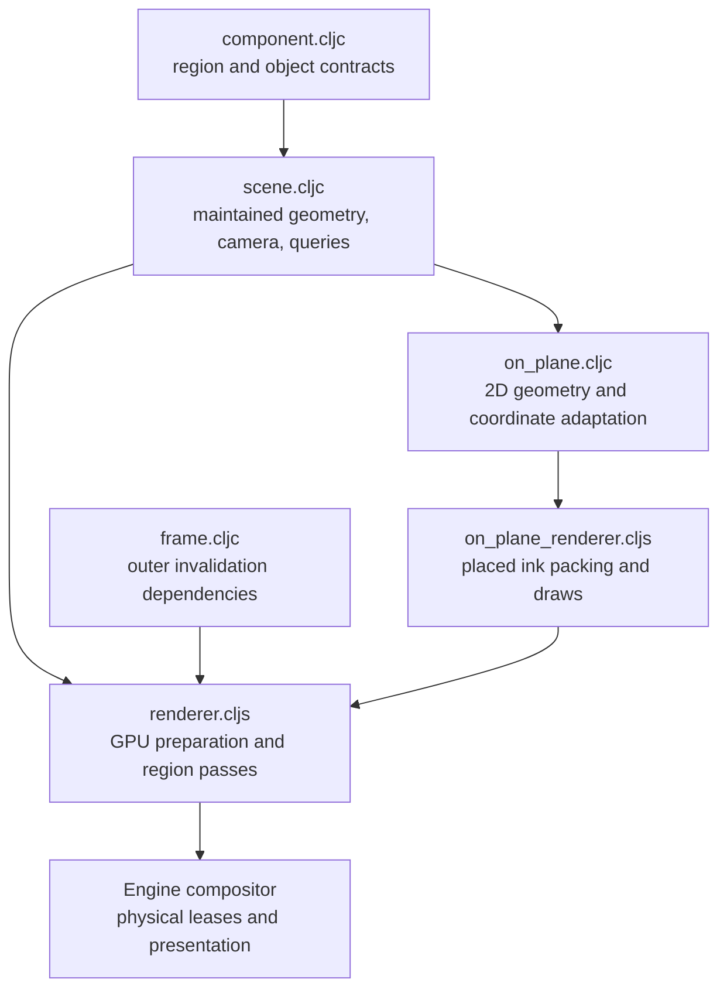

# Region3D — spatial scenes and record constructions

[Up: client](../README.md)

Input: region objects, transforms, meshes, shading/lights, camera, background and 2D extent; optional session overlays and resolved placements. Output: CPU spatial answers and an offscreen scene image composited into that region. Scene evidence is in `test/app/client/region3d/{component,scene,frame}_test.clj` and the browser floor in `harness/region.cljs`. The record construction road below also accepts a whole support, retained marks and a recipe, returning regions, reads, paintings and continuations (`brush_test.clj`).



| File | Role in this computation |
|---|---|
| [component.cljc](component.cljc) | Canonicalize and validate region, object, geometry, shading, light and view data. |
| [scene.cljc](scene.cljc) | Derive and maintain transforms, instances, triangles and spatial indexes; compute camera projections and hits. |
| [frame.cljc](frame.cljc) | Derive the outer dependency keys that gate preparation. |
| [on_plane.cljc](on_plane.cljc) | Adapt existing text/path computations to object-local planes: placed ink as the path kind's regions and packs, ray intersections and projected anchors. |
| [on_plane_renderer.cljs](on_plane_renderer.cljs) | Retain per-region atlas, instance rows and placement matrices; draw resolved ink placements as one coverage draw under the plane projection. |
| [renderer.cljs](renderer.cljs) | Retain prepared scenes, upload changed resources, encode shadow/interior passes and composite region content or rejection fill. |

Source scene objects, derived spatial state and prepared GPU regions are different representations. Scene functions return values; renderer systems retain them with buffers and dirty state. [Engine](../engine/README.md) compositors own physical texture leases, while logical bindings preserve region identity across replacement.

The placement calculations reuse [text](../text/README.md) and [path](../path/README.md). The placement GPU lane currently supports ink; accepted placement data and available CPU calculations do not by themselves imply GPU support for every kind. The frame caller owns ordering, pass submission and lifetime across these systems.

Placed ink now receives a constructed path value; it runs no source recipe.
Its packed clip accompanies the painted regions (`path_placement_test.clj`).
The browser region3d tree golden exercises the placed-ink draw. Device width
on a perspective plane still uses the existing unit placement scale; true
pixel width over a perspective-varying projection is untested.

## Sphere records through the waist

The CPU construction is five namespaces, with its host passed as an explicit
argument wherever used. The shared [executor](../engine/executor.cljc) runs
these records and [surface](../engine/surface.cljc) paints and samples their
chart patches. Evidence: [brush_test.clj](../../../../test/app/client/region3d/brush_test.clj).

| File | Computation and evidence |
|---|---|
| [support.cljc](support.cljc) | Sphere unit points, intrinsic great-circle distance, revisioned charts, metric and retained arc. `surface_region_test/charts-describe-the-same-points-with-one-piece-owner`. |
| [surface_region.cljc](surface_region.cljc) | Immutable spherical cap with area, bounds, conservative chart pieces and membership; radius saturates at pi R before trigonometry cycles. `surface_region_test/radius-saturates-before-trigonometry-can-cycle`, `reach-is-intrinsic-and-retained-as-data`, `chart-piece-bounds-are-conservative-at-a-cut`. |
| [coating.cljc](coating.cljc) | Invert retained binding chains on periodic branches, apply root restrictions, classify marks and compose under an explicit order. A withheld grant or missing chain remains pending. `coating_test.clj` tests all three revisions, unseen restricted points, removal, order and partial color. |
| [capabilities.cljc](capabilities.cljc) | Named vocabulary bound to the engine's executor and compositor. Paint evaluates region/clip membership once per texel centre. `brush_test.clj` pins the four dabs, both provisional schedules, stale answers and reused values. |
| [records.cljc](records.cljc) | The definer's sphere, reach, sequence, pickup and clip as fixture records; also the cold author's reach and dab. `brush_test/cold-authors-fixtures-keep-their-authored-inputs` checks their copied JSON inputs; `returned-regions-and-paintings-are-reusable-under-their-subjects` executes them. |

Run the focused JVM surface (includes the path pickup and its engine tests):

```sh
clj -M:test -i test/app/client/region3d/run_pure.clj
clj -M:test -m app.client.region3d.brush-wire save /tmp/softland-coating
clj -M:test -m app.client.region3d.brush-wire resume /tmp/softland-coating
```

The last two commands are separate processes. The second reads the saved
continuation and compares the entire state, results, history and subjects
against the eager run. `brush_wire.clj` also writes a PNG and a numeric golden;
it decodes that PNG and counts its painted pixels. [Harness](../harness/README.md)
commands run the browser twin, which reads the decoded PNG through a canvas
and compares the full RGBA32F hash, colors, carries and pixel count to the JVM
golden (`harness/coating.cljs`, `test/render_engine/run_verifier.mjs`).

This support implements the sphere. General smooth/trimmed supports, region
algebra, a clip on a read, distance-field/material slots, a GPU brush runner,
a painted sphere in the scene, live editing and automatic work grants are
**unimplemented and untested**. Chart pieces are conservative bounds; membership
decides coverage, so a cut can name two pieces without double painting
(`surface_region_test/chart-piece-bounds-are-conservative-at-a-cut`,
`brush_test/the-definers-four-dabs-through-the-shared-executor-and-compositor`).
The retained binding search uses the design's three periodic branches
(-1, 0, 1); domains that require a more distant branch are untested.
No cache is introduced or credited. Timings in harness output describe only
that run, with no performance conclusion.
