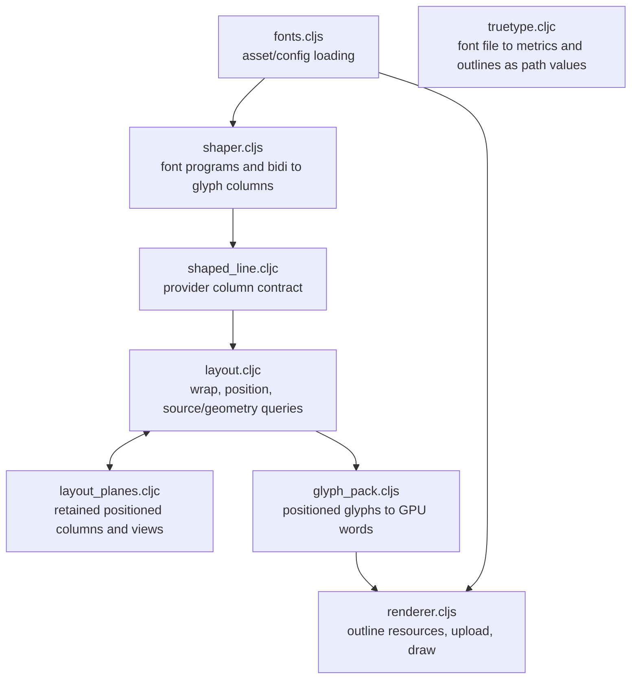

# Text — source text to positioned geometry and outline rendering

[Up: client](../README.md)

Input: text, font programs/outlines, shaping/layout options and shared transforms. Output: retained layout for measuring, wrapping, copying, carets, selection, clipping and hits, followed by glyph instances and GPU draws. The layout is shared across these readers so they use one positioning result.

| File | Role in this computation |
|---|---|
| [fonts.cljs](fonts.cljs) | Select font configurations and assemble loaded shaping/outline assets. |
| [shaper.cljs](shaper.cljs) | Load the shaping runtime and font handles; provide synchronous shaping through retained provider closures. |
| [shaped_line.cljc](shaped_line.cljc) | Define the typed provider result and its accessors/conversions. |
| [truetype.cljc](truetype.cljc) | Read a TrueType file's metrics, character map and glyphs as path values in font units (quadratic outlines, composites resolved); the view's shape capability answers from it on the JVM and in the browser. Evidence: `test/app/client/text/truetype_test.clj`. |
| [layout.cljc](layout.cljc) | Derive wrapped, positioned layout; manage explicit layout-cache transitions; answer source and geometry queries. |
| [layout_planes.cljc](layout_planes.cljc) | Store positioned columns and spans, expose primitive reads and reconstruct rich views when requested. |
| [glyph_pack.cljs](glyph_pack.cljs) | Resolve glyph outline metadata and pack positioned columns directly into GPU instances. |
| [renderer.cljs](renderer.cljs) | Own outline textures and instance resources, prepare text draws and evaluate outlines through the engine's shared coverage program in em units. |

Source positions use UTF-16 offsets. Shaping produces integer font units; layout converts to local positioned coordinates; packing produces the renderer's instance format. Retained arrays are mutable storage used as stable results after construction. Provider closures own shaping resources, results own layout arrays, and renderer systems own GPU resources while borrowing shared [engine](../engine/README.md) buffers.

Font fallback chooses a face for text. Layout fallback constructs a missing positioned result for a draw item. Those are separate operations with separate costs and meanings. [Region3D](../region3d/README.md) consumes placed-text calculations; support for drawing that placement belongs to its renderer boundary.
