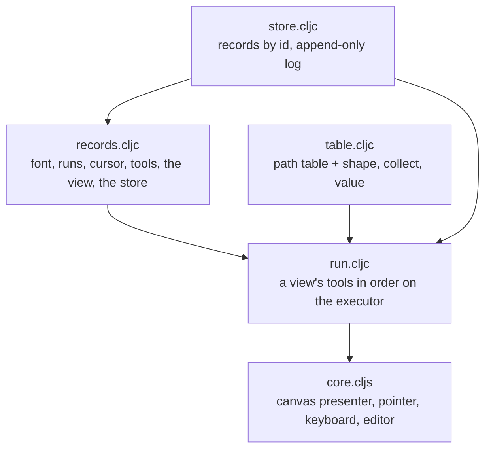

# View — the first client, built out of the tools

[Up: client](../README.md)

Input: a store of records (a font, runs of keystrokes, a cursor, the tools as
records, a view), the browser's canvas, pointer and keyboard. Output: the
view's painting on the canvas, what the pointer is on, and the records edited
in place. The view stands above the kinds: it composes the path kind's
capability table and the engine's executor and CPU compositor; no kind
requires it.

| File | Role in this computation |
|---|---|
| [table.cljc](table.cljc) | The vocabulary the view's tools run over: the path kind's table plus the words the text tool needed as records: shape (one run's keystrokes to glyph items, from a font record's inline glyphs or from the TrueType file the table was built with, `text/truetype.cljc`), place (an outline in font units to local units at a point), collect (a loop step that emits a collection), value (a step that names what it is given, the `:let` the leaves lack). |
| [store.cljc](store.cljc) | The uncommitted store: records by id, saved as they are, every put logged with what it replaced. Pure; the browser holds one atom. |
| [records.cljc](records.cljc) | The base records: a box font and a TrueType font record naming its file (Noto Sans Regular from the repository's assets; the file's metrics and digest complete the record when it is loaded); two runs of keystroke records, one Sid's and one a foreign paste; the cursor; the query, layout, paint, caret-place, caret-paint and hit tools as executor programs over the table; the first view; the store holding them. A glyph is the same record in both fonts: advance, bounding box and outline in the font's units, y up. |
| [run.cljc](run.cljc) | The runtime for a view: its per-view tools run in order, then each tool marked `:per :run` runs once per run the subject names, keyed `[tool run]`; every declared `:inputs` resolved from the earlier instances with their subjects; the scope the view names (its subject, its pins, the store, the run). The runner sizes each run's painting to the layout's box, so a run paints on its own small surface at its place. Between frames each instance resumes the continuation it kept (without its history); a resume the executor refuses is a fresh run. A hit asks each run's hit tool in order. Pure; a clock can be injected. |
| [core.cljs](core.cljs) | The browser entry: the runs' surfaces composited at their places on a 2D canvas by the CPU runner, the pointer mapped through the view's zoom and origin into the hit tools, keystrokes appended to the cursor's run, any record edited as EDN and put back, the store kept across reloads. |

What a view record says: `:subject` (the where-clause its query tool
matches), `:tools` (record ids, in order; a tool marked `:per :run` runs per
run), `:hit-tool`, `:pins` (scope name → record id), `:zoom`, `:origin`,
`:by`, `:from`. Running a view is running its tools under that scope; two
people on one subject are two views.

Rows the tools hand each other: the query's run ids → per run, the layout's
placements, rings and box → the painter's painting on that box → the caret
place over the placements → the caret bar over the painting → the hit's
answer over the placements. Placements are the row the caret and the hit
read (settled ground: a layout pass is a row); rings are what the painter
fills; a painting is the CPU compositor's surface value.

Why one instance per run: a loop resumes only at its tail, so a layout over
all runs concatenated could resume for the last run alone; per run, a
keystroke is a tail append of that run's items and its layout and painter
run the new glyph alone (`run_test.clj`,
`a-keystroke-resumes-the-run-it-grew-and-edits-rerun`). A run's surface is
its box, so each ring's paint copies that box, not the view.

Receipts: `test/app/client/view/run_test.clj` (JVM, pure tier, the box
font for exact numbers and Noto Sans from its file) and the driven browser
checkpoints under `probes/text-tool-on-the-waist/view/` (screenshots and
timings). The GPU compositor's quad and fill are not bound here; the
HarfBuzz shaper is not bound, so there is no kerning, no ligatures and no
bidi; the CPU filler pays about 38 ms per real glyph at zoom 4.
