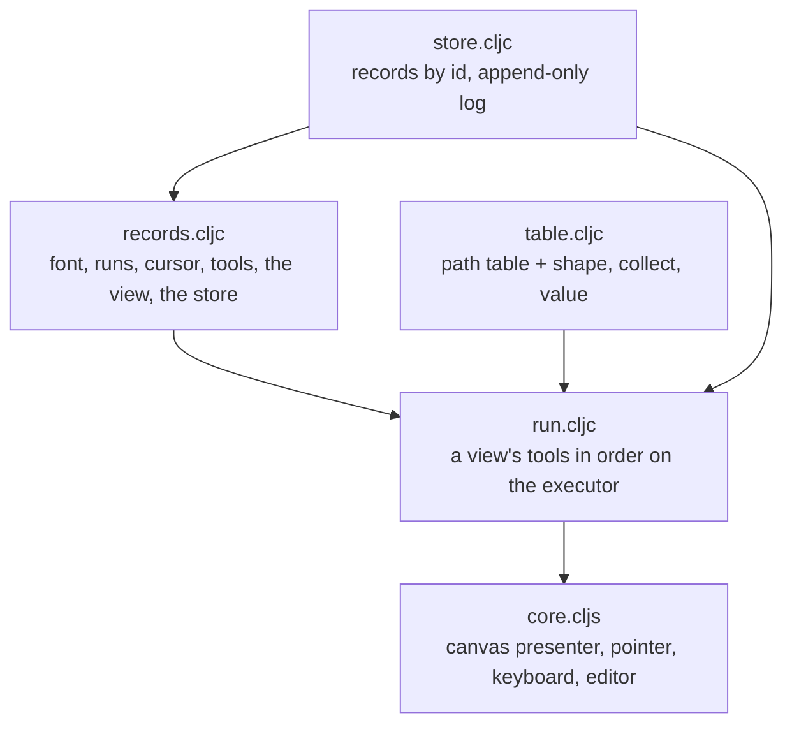

# View — the first client, built out of the tools

[Up: client](../README.md)

Input: a store of records (a font, runs of keystrokes, a cursor, the tools as
records, a view), the browser's canvas, pointer and keyboard. Output: the
view's painting on the canvas, what the pointer is on, and the records edited
in place. The view stands above the kinds: it composes the path kind's
capability table and the engine's executor and CPU compositor; no kind
requires it.

| File | Role in this computation |
|---|---|
| [table.cljc](table.cljc) | The vocabulary the view's tools run over: the path kind's table plus the three words the text tool needed as records: shape (keystrokes to glyph items, a box font for now), collect (a loop step that emits a collection), value (a step that names what it is given, the `:let` the leaves lack). |
| [store.cljc](store.cljc) | The uncommitted store: records by id, saved as they are, every put logged with what it replaced. Pure; the browser holds one atom. |
| [records.cljc](records.cljc) | The base records: a box font; two runs of keystroke records, one Sid's and one a foreign paste; the cursor; the query, layout, paint and hit tools as executor programs over the table; the first view; the store holding them. |
| [run.cljc](run.cljc) | The runtime for a view: its tools run in the order it names, each tool's declared `:inputs` resolved from the earlier runs with their subjects, the scope the view names (its subject, its pins, the store, the painting declaration from its zoom and origin). A hit runs the view's hit tool at a point. Pure; a clock can be injected for timing. |
| [core.cljs](core.cljs) | The browser entry: the painting presented on a 2D canvas by the CPU runner, the pointer mapped through the surface's plane map into the hit tool, keystrokes appended to the cursor's run, any record edited as EDN and put back. |

What a view record says: `:subject` (the where-clause its query tool
matches), `:tools` (record ids, in order), `:hit-tool`, `:pins` (scope name →
record id), `:zoom`, `:origin`, `:by`, `:from`. Running a view is running its
tools under that scope; two people on one subject are two views.

Rows the tools hand each other: the query's run ids → the layout's
placements, rings and caret → the painter's painting and the hit's answer.
Placements are the row the caret and the hit read (settled ground: a layout
pass is a row); rings are what the painter fills; the painting is the CPU
compositor's surface value.

Receipts: `test/app/client/view/run_test.clj` (JVM, pure tier) and the driven
browser checkpoints under `probes/text-tool-on-the-waist/view/` (screenshots
and timings). The GPU compositor's quad and fill are not bound here; the
HarfBuzz shaper and font outlines are not bound as the shape capability yet.
