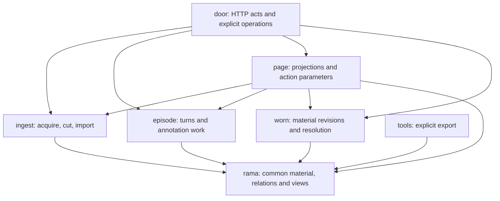

# Server — stored material, ingestion and application operations

This tree contains the server behind the `src-dev/dev.cljc` and
`src-prod/prod.cljc` entry points: HTTP operations, external-material ingestion,
conversation turns, revisioned facet material, projections, and their Rama
storage. It includes reusable value transformations, foreign clients and module
definitions; a file's presence does not mean the HTTP host starts it.

The [Inland build](../../../src-inland/README.md) has a separate entry point,
Rama module, connection and process lifecycle under `src-inland/`. Its server
does not boot this tree's HTTP application. It uses the
[client renderers](../client/README.md), whose source hierarchy describes that
rendering boundary. Use each map for the implementation it actually covers.

## Enter a scope

| Folder | Responsibility | State and boundary |
|---|---|---|
| [door/](door/README.md) | Ring/Jetty endpoints, request orchestration, cluster-handle lookup and explicit ingest/migration commands. | Owns or retains HTTP/process resources and foreign handle bundles; acquiring handles is separate from deploying modules or starting watchers. |
| [rama/](rama/README.md) | Common object storage, transcript operations, typed relations, trail/face views and foreign-client helpers. | Modules own their PStates and accepted decisions. Runtime helpers provide handles; owned IPC constructors have explicit close paths. The ingest epoch is a process-local signal. |
| [ingest/](ingest/README.md) | Read files/Git, cut material into addressable units, submit imports and relations, and read/refine transcript blocks. | Adapters build values; import drivers borrow storage runtimes. Watchers own threads and file-watch resources. A separate capture module remains in `transcript.clj`. |
| [worn/](worn/README.md) | Define facet grammars, compile and resolve material, import candidates, and change active/instance revisions. | Common storage owns source, revisions and pointers. Pure resolution functions consume supplied values; JVM adapters borrow runtime handles. |
| [episode/](episode/README.md) | Construct conversation turns, choose resident sessions, harvest transcripts and derive recorded model annotations. | Common storage holds material and turn records. Session warmth is process-local. The separate `llm-module` owns model-run state; provider calls occur outside its transaction. |
| [page/](page/README.md) | Compose conversation/material views, inspection evidence and resident context; build action parameters and submit block edits. | Borrows runtime handles. Read projections and action effects have different entry points; a page assembled from multiple reads is not one transactional snapshot. |
| [tools/](tools/README.md) | Export a selected inventory of deployed PStates as EDN. | An explicit operator tool with its own manager/output lifetime; it is not an HTTP endpoint or a general recovery mechanism. |

Rama code is not confined to `rama/`: the episode LLM module and ingest's
separate capture module live with those responsibilities. Conversely, `page/`
and `worn/` can call Rama without owning the PStates they read or change.

Arrows show major calls or consumed APIs, not boot order or one transaction.
The folder maps explain the return values and additional relationships, such
as worn instance writes maintaining episode discovery rows and page verb
declarations supplying binding validation.

## Startup and resource ownership

[Development](../../../src-dev/dev.cljc) and
[production](../../../src-prod/prod.cljc) call
`door/server-jetty/start-server!`, which builds the Ring handler and returns a
Jetty server. Those main functions configure port 8080. They do not launch Rama
modules, invoke migration/ingestion, or start file watchers.

`door/cluster` resolves a manager and foreign depot/PState/query bundles for
the deployed modules. Request handlers obtain those bundles as needed. Successful
acquisitions are retained for the JVM; this namespace does not close the manager
or invalidate successful bundles. A returned handle is not a fresh availability
check. Deployment belongs to [bin/land](../../../bin/land); the cluster namespace's
ingest, migration and watcher operations are separate explicit calls.

Runtime constructors used for focused execution can create an InProcessCluster;
their close helpers release it according to their ownership contract. Watcher
stop functions release watcher resources without closing a borrowed runtime.
The door's resident-turn path owns a CLI child and SSE output. Its ambient
annotation path uses a separately created LLM IPC. Enter the door and episode
maps for the different process, completion and shutdown behavior.

## Follow a change through the folders

- **External material:** ingest adapters construct common import requests;
  drivers append them through the Rama runtime. ObjectContainer stores material
  and decisions; typed relation requests go through RelationKernel separately.
  Transcript completion/cursor checks and later distillation have their own
  contracts. Page and episode consume the resulting blocks through `river-page`.
- **Facet material:** worn imports a candidate and changes an active pointer
  through separate operations. Instance writes can also maintain episode
  discovery rows. Page combines stored state and caller-supplied scene evidence
  for inspection; resolving or validating a binding does not execute its verb.
- **Resident turn:** the HTTP door constructs and records a turn through episode,
  then invokes the CLI after an accepted turn decision. Completion requests a
  final status and transcript harvest. Best-effort annotation work has its own
  request/claim/observation path and storage boundaries.

An append acknowledgement, an accepted decision, a visible projection, and a
completed external action are different observations. Common material, typed
relations, model-run state and local replay logs are not one atomic write.
Keep those distinctions when following a helper's summary counts or status.

This map describes inspected source, not a fresh application run or a decision
that the architecture must remain as it is. The child maps retain concrete
read limits, incomplete integrations and differences from intended behavior.
Use [project documentation](../../../docs/README.md) for vision, intended
decisions and historical context; use [the upkeep instructions](AGENTS.md) to
keep these explanations aligned with code changes.
