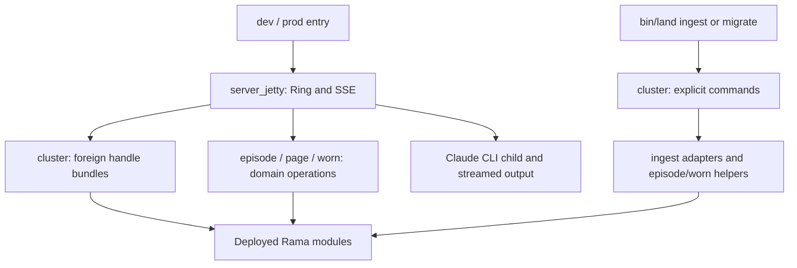

# Door — HTTP acts and external-cluster access

This folder connects Ring requests and explicit maintenance commands to the
server's existing domain owners. It starts an HTTP listener, resolves foreign
Rama handles, and composes writes and reads. The deployed modules own durable
state; the door owns process resources and transport.

| File | Responsibility | State and lifetime |
|---|---|---|
| [server_jetty.clj](server_jetty.clj) | EDN act routes, episode SSE/CLI orchestration, room reconciliation and relation submission. | Returns a Jetty server for the caller to stop; owns per-response writers and child-process handling. Retains a delayed ambient LLM IPC runtime and an optional relation-log writer lock. |
| [cluster.clj](cluster.clj) | Foreign manager/bundles for deployed modules; explicit ingest, migration and watcher commands. | Retains manager and successful handle bundles in the JVM. Projection address/failure atoms are process state. Watcher callers receive a nested `:stop!`; this namespace provides no manager close/reset operation. |

The diagram shows calls and dependencies, not one transaction. A returned handle,
a depot acknowledgement, an accepted decision and a queryable result are distinct
stages. Each route's function docstring states which stage it waits for.

## Entry points and boundaries

[dev](../../../../src-dev/dev.cljc) and
[prod](../../../../src-prod/prod.cljc) call `start-server!`. Its middleware handles
explicit `/api/*` act paths and otherwise returns the downstream 404. It does not
install a browser application or Electric handler. The
[Inland product](../../../../src-inland/README.md) has a separate server entry.
This registration trace establishes a callable path, not a fresh runtime receipt.

`wrap-file-api` owns route dispatch. Relations go to
[relation-kernel](../rama/relation_kernel.clj); utterance, block birth and geometry
use [episode](../episode/episode.clj). Material-room operations use
[page projections and request composition](../page/matter_room.cljc),
[block-edit](../page/block_edit.clj), and the
[worn revision/activation owners](../worn/facet_master.clj). Instance deviations
use [material-truth](../worn/material_truth.clj). The route inventory and status
handling live beside `wrap-file-api`, rather than being duplicated here.

Episode output is EDN in SSE `data:` frames. The accepted turn record precedes
Claude spawn; process completion leads to best-effort status recording and
transcript distillation. Durable request identity does not suppress repeated CLI
execution. The response waits for the waiter callback's promise, and disconnect
is not wired to process cancellation. Consult `run-episode-turn` and
`stream-cli-process` before changing this lifecycle.

The durable-turn notification calls [cascade/react!](../episode/cascade.clj),
whose declared handler resolves back to `run-ambient-autotag!`. Cascade supplies
the asynchronous future. That handler can lazily launch the
[LLM IPC lifecycle runtime](../episode/llm.clj); annotation records and relations
use the external OC/RK handles through
[material-circulation](../episode/material_circulation.clj). No shutdown for this
retained ambient runtime is wired in this folder.

## Cluster and command lifecycle

`cluster` resolves object-container/transcript-ops, relation-kernel, TrailView
and face-arsenal resources already deployed by [bin/land](../../../../bin/land).
The composite trail bundle includes handles from several modules; it is not a
new owner of their PStates. Failed acquisitions return nil and can retry, while
successful bundles remain retained without being revalidated on every call.

HTTP startup performs no corpus sweep or bridge replay. `bin/land ingest` and
`bin/land migrate` invoke explicit commands; `facet-materials-ingest!` separately
installs registered facet grammars and activates revisions. The
[ingest watcher owner](../ingest/ingest_watchers.clj) handles file discovery and
watcher resources. Command results can contain partial failures and bounded
coverage; they are not cross-module atomic operations.

The current `LAND_CLUSTER=0` branch enables the relation assertion file log but
still uses external-cluster handles. `cluster-boot?` therefore does not establish
an IPC boot path. Normal external bundles omit the block-edit log and explicitly
disable the face-wear log. Explicit migration can still replay legacy logs;
`ingest-config`'s nil assert-log path selects the replayer's default file. The
[Git import owner](../ingest/git_import.clj) owns that replay.

`POST /api/relation/assert` confirms depot append acknowledgement and does not
await relation admission/materialization. Its optional file bridge flushes a
line before append, using only a JVM-local lock. The detailed contracts and
limitations live with `assert-relation-handler` and `append-assert-log-line!`.

Existing [parser](../../../../test/app/server/door/parser_test.clj) and
[relation route tests](../../../../test/app/server/door/relation_assert_route_test.clj)
are evidence entry points, not checks run by this documentation change.
