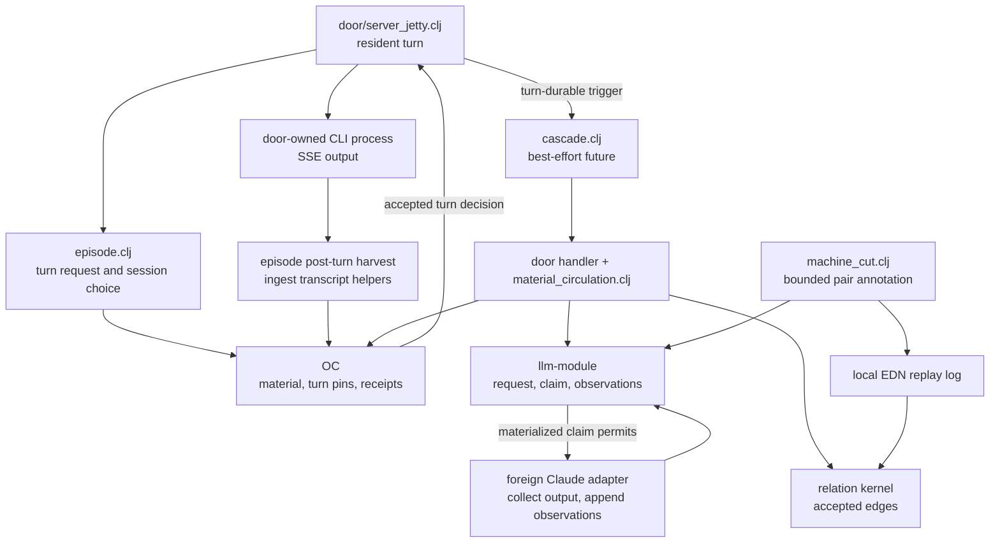

# Episode — conversation turns and model-derived annotations

This folder builds native conversation material, chooses CLI sessions for
resident turns, and turns model observations into recorded annotations. It
contains both pure record constructors and foreign clients of Rama. The
resident-turn process is started by the HTTP door; annotation workers use the
separate `llm-module` lifecycle defined here.

## Where to read

| File | Responsibility | State and effects |
| --- | --- | --- |
| [episode.clj](episode.clj) | Native utterance imports, geometry cells, pinned turn records, instance discovery hints, episode selection and post-turn harvest. | Borrows OC handles. OC stores material and projection rows; `!episode-chains` holds process-local lane warmth. Calls ingest and advances ingest epoch after distill returns. |
| [llm.clj](llm.clj) | Run intent, claim grants, ordered observations, controls and derived run views; foreign-client runtime and Claude adapter. | `llm-module` owns its depots and PStates. `start-llm-runtime!` creates an owned InProcessCluster. The adapter owns a child process during invocation. |
| [material_circulation.clj](material_circulation.clj) | Capture mechanical receipts, bank explicit references, annotate material, and compose experience with historical activation context. | OC owns receipt carriers and annotation records; the relation kernel owns accepted edges; LLM owns run state. No local mutable store. |
| [machine_cut.clj](machine_cut.clj) | Pair responses with human prompts over a bounded transcript page and reconcile this annotator's relations. | Borrows OC, relation and LLM runtimes. Writes `data/machine-cut-log.ednl` before relation requests; replay uses that file without another model call. |
| [cascade.clj](cascade.clj) | Enumerate trigger/handler declarations and dispatch matching handlers. | Static declaration vector and unretained best-effort futures; no durable queue, retry or completion receipt. |
| [claude_cli.cljc](claude_cli.cljc) | Build generic provider argv and normalize complete Claude JSON output. | Pure helpers. The two execution paths above use their own argv builders. |

There are no child scopes. Descend into a namespace's docstring for its inputs,
outputs and approach, then into function docstrings for local contracts.

## Two execution paths

Arrows describe calls and prerequisite reads, not one transaction covering the
diagram. The door requires an accepted `record-turn!` result before invoking
`stream-cli-process`. It emits `:episode/turn-durable`, constructs the resident
prompt, and uses `summon-argv` for a fresh or resumed session. Its process
completion callback requests a terminal turn status and calls
`post-turn-distill!`. That terminal record write is best-effort; process
completion alone does not prove the final turn cell was updated. Enter
[server_jetty.clj](../door/server_jetty.clj) for SSE, process teardown, invocation
settings and error handling.

The cascade's declared handler is `server-jetty/run-ambient-autotag!`. The
handler skips work when a gold receipt exists or a relation runtime is absent,
and requires visible candidate material before invoking autotag. It lazily
starts `ambient-autotag-runtime` through `llm/start-llm-runtime!`; that run
lifecycle is in an IPC, while its material and relation outputs use the
cluster-backed handles supplied by the door. A close helper exists, but no
production close call for this delayed IPC was found in the searched trees.

The LLM topology consumes four depots, keyed by run id: requests, claims,
observations and controls. Its microbatch transaction maintains run truth and
cross-key indexes together. Provider execution is outside that transaction.
The supplied adapter drains output and returns a collected event vector;
callers append observations afterward. It does not deliver controls back to
the running child. Run controls and executor recovery indexes therefore do
not, by themselves, establish an interactive provider control/recovery loop.

## Material and identity boundaries

A conversation id maps to one transcript object key. Native utterances and
imported transcript material use that shared address with distinct unit
identities. `episode.clj` builds OC imports; it declares no OC PState.
Geometry, turn records and instance registry entries are projection hints at
separate order-key prefixes. Turn updates reuse `(time-ms, turn-id)` for the
cell and use a separate import identity per status. The helper does not impose
monotonic status transitions. Geometry and instance discovery hints similarly
upsert their cells; registry hints do not create or authorize facet masters.
[worn/material_truth.clj](../worn/material_truth.clj) performs the master write
first and catches discovery-index errors afterward.

A conversation lane can outlive several CLI episodes. The process-local warmth
map and, after restart, stored turn records guide `current-episode!`. The
default idle boundary is one hour; an older session file provides a fallback
for a lane without stored episode history. Session choice and its warmth stamp
are separate operations, not a lock around concurrent turns. Turn records
carry the chosen episode id so the page can merge its material into the lane.

Receipts preserve what was picked, placed, visible and worn when material was
created or sent. They do not assert what the material means. Explicit human
`:references` edges, silver machine `:felt-at` associations and literal-tag
`:instance-of` proposals remain separately identified. Circulation's as-of
reads use registered masters' active-pointer revision histories; missing or
ambiguous history is not replaced with the current worn state.

Autotag records its observation, interpretation and proposal in OC before
asserting a successful proposal's relation. A repeat call reads that record
and may recheck its edge without another model invocation. Machine-cut instead
records its validated edge recipe in a local EDN log before relation writes.
Its annotated scope is the shown river-page window, not the whole conversation.
A successful LLM run with no corresponding OC record or completed log entry
has an explicit incomplete outcome; the run id alone cannot reconstruct the
missing annotation recipe.

## Callers, reads and limits

- [The HTTP door](../door/server_jetty.clj) exposes episode block birth and
  geometry writes, controls the resident process, and emits the cascade trigger.
- [Transcript ingest](../ingest/transcript.clj) owns complete-line reading and
  stored file offsets; [transcript-import](../ingest/transcript_import.clj)
  supplies cutting, distillation and river pages. `post-turn-distill!` uses
  those helpers for one session file and labels the returned summary
  `:distilled`; it does not check a separate distill success predicate.
- [Face projection](../page/face_projection.clj) consumes utterances, geometry,
  turns, receipt/annotation records and composed experience. It also serves
  `cascade/rows` as an inert declaration table; enumeration executes no handler.
- [Cluster migration](../door/cluster.clj), through `migrate!`, invokes starter
  classification, the policy/activation report, and `machine-cut-bridge!` log
  replay. No automatic caller of `annotate-conversation!` was found outside
  tests in the searched trees; replay is the traced cluster integration.
- [OC runtime](../rama/object_container/runtime.clj) provides append and decision
  reads. Episode wrappers report `:accepted` only for an accepted decision;
  a timeout's nil decision maps to `:rejected`. They do not independently check
  every imported projection/index row. LLM `await-materialized` similarly
  returns its last value on timeout, so callers must inspect the predicate.
- [Relation kernel](../rama/relation_kernel.clj) owns assertion/retraction state.
  Annotation counts use read-back status checks. OC records, LLM state, relation
  transitions and local log writes are not a single atomic operation. The log
  writer flushes and closes output under a JVM lock; it has no explicit fsync or
  cross-process lock. Repeat-path summary labels must be read alongside edge
  status and unmaterialized counts.

Existing [episode tests](../../../../test/app/server/episode/) include request
identity, lifecycle, annotation and cascade fixtures. The model seams accept
canned stream-JSON lines. These are source pointers, not a claim that tests or
provider calls were run during documentation work.
