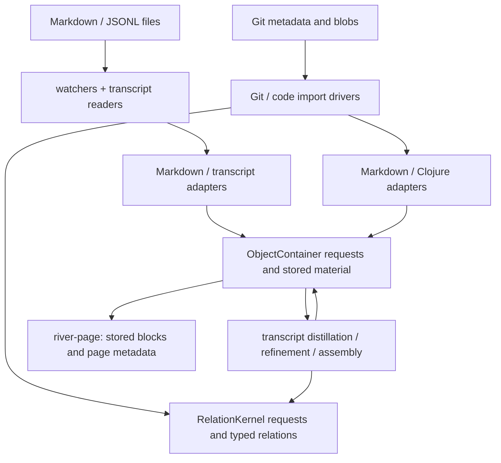

# Ingest — external material into common storage

This folder acquires files and Git material, cuts text into addressable units,
and builds requests for the server's common storage. It also contains transcript
block refinement, assembly and the bounded read used by episode/page consumers.
The adapters construct values; the import drivers submit them and inspect the
results. They do not own the deployed ObjectContainer or RelationKernel state.

| File | Responsibility and next read |
|---|---|
| [markdown_adapter.clj](markdown_adapter.clj) | Line-based Markdown cutting, document/unit/anchor rows and common import requests. Headings, list items and paragraphs are its supported structural forms. |
| [clojure_adapter.clj](clojure_adapter.clj) | Non-evaluating top-level form cutting with rewrite-clj, comment spans, source anchors and code-outline import material. The guarded entrypoint refuses denied paths before invoking a reader thunk. |
| [transcript_adapter.clj](transcript_adapter.clj) | One already-redacted observation becomes conversation/message/tool/audit material, projection hints and source-line status hints in an ObjectContainer request. |
| [transcript.clj](transcript.clj) | File identity, JSONL byte readers, redaction, common import/completion/cursor checks and polling watches. Also houses a separate parked capture module and its IPC helpers; the namespace docstring distinguishes them. |
| [transcript_import.clj](transcript_import.clj) | Classification, per-part text cutting, block/class imports, optional mechanical relations, refinement and assembly. `river-page` reads persisted imported and native episode blocks. |
| [git_import.clj](git_import.clj) | Commit metadata imported through the Markdown adapter, commit-parent relations, inferred transcript-to-commit/document relations, and assertion-log serialization/replay. |
| [code_import.clj](code_import.clj) | Git blob/history ingestion and form lineage; separate HEAD analysis reconciles namespace/var relations. Also supplies committed-form address helpers. |
| [ingest_watchers.clj](ingest_watchers.clj) | Explicit existing-file sweep and create/modify watchers with per-path debounce and serialized Markdown/JSONL imports. A separate helper sequences Git replay/sync/join extraction. |

Arrows denote submitted requests or consumed material, not a single transaction.
The [ObjectContainer runtime](../rama/object_container/runtime.clj) supplies the
foreign append/read helpers. Its [modules](../rama/object_container.clj) own
material, import decisions, source-line completions, transcript controls and safe
file offsets. [RelationKernel](../rama/relation_kernel.clj) owns typed relation
assertions/retractions and their decisions. Composition rows inside an OC import
and separately submitted typed relations are different write paths.

## Callers and activation

[door/cluster.clj](../door/cluster.clj) exposes explicit operations:
`ingest!` runs an existing-file sweep and then assertion-log replay, commit sync
and transcript join extraction. `first-light-ingest!` performs the initial
transcript harvest and distillation used by migration. `start-watchers!` starts
filesystem watchers over configured document roots. These are explicit calls;
`run-git-spine-boot!` retains an older name and does not itself register a boot hook.

[episode/episode.clj](../episode/episode.clj) is the incremental conversation path.
Its `harvest-episode-increment!` reads from the stored offset, imports only complete
new lines, and advances the offset after material/completion checks.
`post-turn-distill!` then distills the conversation, marking native user events
with class-only rows, and bumps the ingest epoch. The turn completion path in
[door/server_jetty.clj](../door/server_jetty.clj) calls it. Corpus file watchers
re-read JSONL from zero and do not perform this cursor advancement.

The parked `transcript-module` has its own ledger/run/conversation/tool PStates
and a `start-transcript-runtime!` IPC constructor. It is absent from the deployed
module list in [bin/land](../../../../bin/land). Common-runtime and parked-module
harvest/watch branches remain in `transcript.clj`; choose by the runtime supplied,
not by the similar function names. [rama/transcript_ingest.clj](../rama/transcript_ingest.clj)
also delegates its common-runtime watch entry to this namespace.

`code-sync!` and `analyzer-sync!` are callable drivers, with no call from the
cluster ingest/migration path traced here. Their smaller helpers are used by
[page/verb_release.clj](../page/verb_release.clj) to resolve committed form
addresses. Git commit reads also feed the escape report in
[page/face_projection.clj](../page/face_projection.clj). Transcript `river-page`
is consumed by cluster starter-culture ingestion and by
[episode/machine_cut.clj](../episode/machine_cut.clj)'s default river loader.

## State, completion and resource boundaries

Default ObjectContainer and relation request appends use `:append-ack`; an append
return confirms the depot append, not an accepted outcome. The common transcript
import loop explicitly checks accepted OC decisions and matching source-line
completions. Its file-state helper then verifies an exact safe offset. A returned
container count counts declarations/attempts, not newly created objects.

Git/code/distillation drivers expose decisions or accounting with weaker
aggregate guarantees. For example, distillation collects decisions but does not
stop on each rejection; mechanical, refinement and assembly relations can be
appended after an unaccepted or timed-out OC request. Relation processing is a
microbatch, separate from OC's stream path. The analyzer polls touched relation
statuses, but ignores the final poll result before returning/updating its basis.
Read the entrypoint contract before treating any count as accepted material.

Watcher controllers own process resources: a WatchService, timers, an importer
executor and thread, or a polling thread with local offsets. Call their `:stop!`;
this does not close the borrowed runtime or guarantee an in-flight import has
finished. The filesystem watcher listens for create/modify, has no delete import
or overflow reconciliation sweep, and its recursive registration currently leaves
`Files/list` streams without an explicit close. `ingest-epoch` is a process-local
invalidation signal; it is not persisted ingest truth.

Git join extraction optionally writes a file-signature cursor scoped by a caller
run id. It also reads the assertion log whose writer is `door/server_jetty.clj`;
the route can disable this bridge log when using the durable cluster. Code analysis retains per-pass text/cuts and a
caller-owned reconciliation basis; its temporary HEAD tree is cleaned in `finally`,
while its delayed clj-kondo configuration directory is kept for the process.
Runtime startup/close helpers are explicit and are separate from ordinary imports.

## Source identity and read limits

Markdown/Clojure anchors use UTF-16 offsets into supplied text. Transcript line
anchors use byte offsets into the original JSONL file; per-part distilled text
returns to UTF-16 spans. Redaction means a stored transcript preview is not the
original byte-addressed line. Parsed payload redaction follows sensitive key
names; malformed lines use best-effort raw-text patterns. Neither is a blanket
claim that arbitrary embedded secrets are removed.

Default source/import keys are deterministic, but that does not make every
request byte-identical: request ids/times may be fresh, and transcript predecessor
context affects its fingerprint. Full offset-zero re-import can therefore differ
from the original import. The incremental episode path avoids rebuilding those
prior message chains.

`river-page` reads a first page with separate imported and native budgets and
returns truncation/read-plan metadata plus geometry/camera/turn rows. It does
not take a continuation cursor. Its `:seek-count` is arithmetic over calls, not
measured storage I/O, and its retained `:seek-bound` field omits the native lane and assumes unit
reads stay within the returned-block budget.
The function docstring describes the exact limits for consumers.

Existing [ingest tests](../../../../test/app/server/ingest) and
[transcript ingest tests](../../../../test/app/server/rama/transcript_ingest_test.clj)
are navigation to coverage source, not evidence that a runtime or suite was run
for this documentation change. For implementation detail, descend from this map
to namespace and function docstrings; keep responsibilities here and local
algorithms/limits beside the functions.
