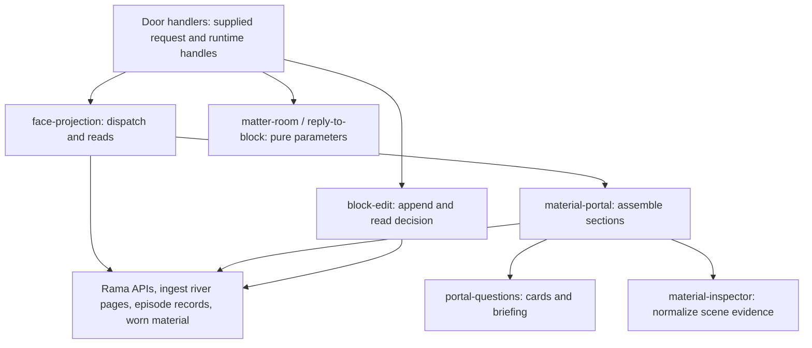

# Page — projections, material explanations and action parameters

This folder turns existing server state and caller-supplied scene evidence into
conversation pages, material inspection results and resident context. It also
contains the verb vocabulary and small request builders used around those
views. It owns no Rama module, PState or durable store. The application caller
supplies runtime handles and decides when to read or act.

The source integration is [door/server_jetty.clj](../door/server_jetty.clj):
room entry and rollback checks call `face-projection/serve`; episode turns call
its seed and briefing helpers. Room entry can **write** residents through the
import/edit paths even though the portal projection it reads is read-only.
These are traced server call sites, not evidence of a running browser flow.

Arrows identify calls or consumed APIs, not transaction or scheduling boundaries.
`material-portal` receives a closure over `serve` for its sub-projections; it
never requires `face-projection`, so the namespace dependency stays one-way.

## Read the next level

| File | Responsibility and boundary |
|---|---|
| [face_projection.clj](face_projection.clj) | Resolve face names to projection functions, compose bounded conversation/material reads, shape transport envelopes, and prepare episode seeds and portal briefings. Borrows ObjectContainer, relation-kernel and face-arsenal handles. |
| [material_portal.clj](material_portal.clj) | Join an entity pick or master anchor to materials, placement, history, bindings, recovery and experience. Combines sub-projections and direct reads; collects per-section errors and declares read limits. |
| [portal_questions.cljc](portal_questions.cljc) | Define the question/card order and pure answer-presence, recipe, provenance, truncation and briefing transformations. Returns presentation data and text, not pixels. |
| [material_inspector.cljc](material_inspector.cljc) | Extract contribution stamps from supplied trees/scene slots and normalize wearer evidence. The durable-state join belongs to `face-projection`. |
| [matter_room.cljc](matter_room.cljc) | Derive server room identities, normalize action parameters and describe ordered residents from portal data. Performs no births, refreshes or activations itself. |
| [reply_to_block.cljc](reply_to_block.cljc) | Build a reply request around one subject and bounded preceding context; concatenate seed, briefing and utterance into a prompt. Performs no append or model call. |
| [verb_registry.cljc](verb_registry.cljc) | Code-owned name/version, effect, continuation, argument and floor-reservation declarations. Used by [binding_material.cljc](../worn/binding_material.cljc) validation and interaction-table reads; contains no verb dispatcher. |
| [verb_release.clj](verb_release.clj) | Build, import and read the fixed reply-to-block release evidence chain through the [ingest adapters](../ingest/clojure_adapter.clj) and ObjectContainer. Importing evidence does not install or activate the verb. |
| [block_edit.clj](block_edit.clj) | Construct one object edit, append it through the runtime helper, read its stored decision and update an ephemeral ingest epoch for an accepted non-replay result. |

## Read ownership and limits

`face-projection/serve` resolves static aliases first, then faces present in the
[face arsenal](../rama/face_arsenal.clj) to the conversation projection, then a
direct projection keyword. Its selected-function error boundary returns a named
error data-context. Individual projections called directly can still throw;
local fallbacks differ by read. The registry is code-owned data, not a durable
registration mechanism or proof that every projection has a transport caller.

Conversation projection starts from [transcript-import/river-page](../ingest/transcript_import.clj),
weaves thread and successor-episode pages, groups blocks into turns, and adds
geometry, turn records, circulation experience and pair structure. Each block
retains its own object key across that weave. The time cut operates within the
bounded pages already read; there is no full-conversation cursor here. Page
limits, lane failures and source errors appear in the returned data. Pair-edge
read failures log and return an empty edge vector, so that absence is not proof
that no relation exists.

Material reads use [worn/](../worn/) for master, instance, activation and
binding semantics and [ObjectContainer runtime](../rama/object_container/runtime.clj)
for stored values. Active, latest, candidate, previous and pinned revisions
remain separate facts. Wearer rows are the caller's scene snapshot, not a durable
attachment census; blast/recipe results must be read with their reported basis
and truncation. Portal section joins use multiple reads and do not establish a
shared transactional snapshot. The declared one-client-call plan does not mean
one Rama read or a measured latency result.

The portal result excludes the serve-time clock. Canonicalization makes equal
input values print consistently; it does not make separately read worlds equal.
`material-portal-projection` enriches room experience before producing the human
portal envelope, while `portal-briefing` reads `material-portal/open` directly.
Consequently the resident briefing is the canonical serialization of **its own**
read result; byte identity with a prior human portal is not guaranteed by these
paths. `portal-questions/answered?` checks key presence, including error and
not-applicable answers, rather than successful reads.

The one long-lived mutable value in this folder is `escape-gauge-state`:
a process-local last report and in-flight promise. An explicit gauge request
starts one worker over Git and provenance activation history. Concurrent callers
receive the previous report; a timed-out owner receives a timeout report while
the worker continues and eventually updates the retained value. Once idle, a
new request starts another computation. Standard portal open links the gauge
without running it. This documents existing process state, not durable truth or
a proposed caching design. Other helpers retain no handles; acquisition and
shutdown belong to their callers.

## Actions and their owners

`matter-room` and `reply-to-block` build values. In the door handler, a registered
room conversation takes precedence when narrowing resident context; otherwise
the addressed-block path keeps the subject and its permitted preceding context.
The door composes the prompt and drives the episode/CLI path. No model is called
inside a page projection or briefing formatter.

For room entry, the door reads the portal, composes residents and compares each
with stored unit content. Missing residents use [episode/utterance-import-request](../episode/episode.clj);
changed refreshable residents use `block-edit/submit-block-edit!`; unchanged
residents and existing non-refreshable trail residents do not take the edit
path. Deviation, activation and rollback validation also starts in `matter-room`,
with effects performed by the door through worn APIs. A valid parameter map is
not an accepted durable decision.

`block-edit` borrows the runtime's append/read APIs. The runtime edit helper can
write its configured edit log before appending to the ObjectContainer stream.
The wrapper waits for `:ack`, reads the decision and returns a summary rather
than the full decision row. Its ingest-epoch increment is a process-local hint,
not an exactly-once durable notification. `verb-release/append-release!` likewise
returns the decision it reads after the import; its wait can expire with nil.
Validation of a stored release chain checks the implemented shape/fields, not
whether the referenced receipt ran or the described deployment occurred.

Keep changes at the level they explain: folder relationships here, each file's
role in its namespace docstring, and request/result/failure details beside the
function. This map describes source behavior; it is not a runtime verification
receipt or a decision that this architecture must remain.
