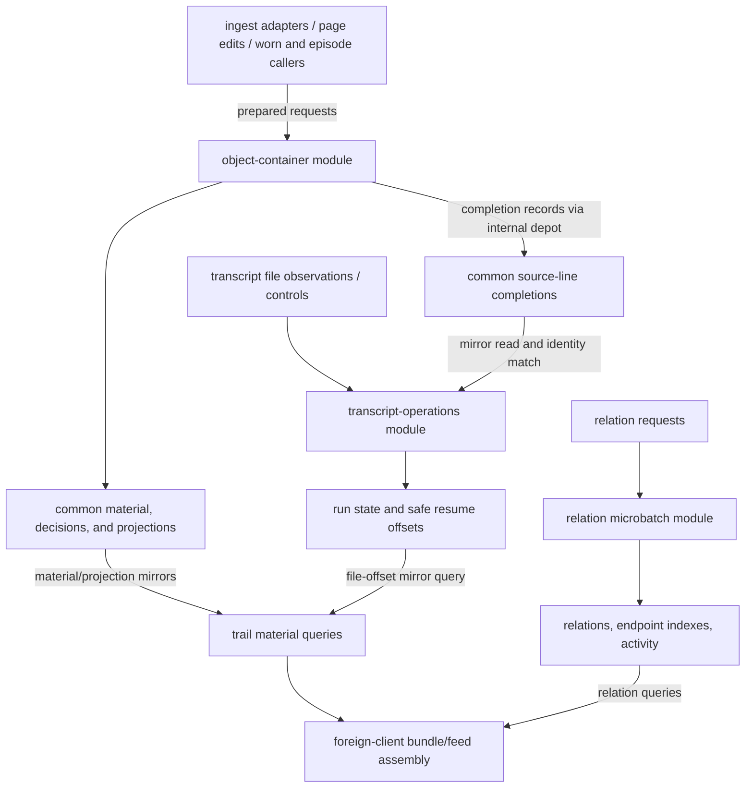

# Rama — stored material, relations, and read composition

This folder defines the common object-container store, transcript operational
tracking, typed relations, face-name/usage indexes, and trail queries over that
state. It also contains shared envelope helpers and a separate transcript store
with its own row vocabulary. These are different owners, even when one caller
receives their handles in a single runtime map.

Enter through the [server map](../README.md) for acquisition, HTTP, and product
composition. [door/cluster.clj](../door/cluster.clj) constructs foreign handles for
the durable cluster. The `start-…-runtime!` helpers here create in-process clusters
for focused use; they do not connect to the durable cluster. Source declarations
and handle construction describe available paths, not which modules are currently
deployed or healthy.

## Responsibilities and state

| Read next | Responsibility and ownership |
|---|---|
| [object_container.clj](object_container.clj) | Defines the common material module and a separate transcript-operations module. Owns import/edit decisions, source artifacts, containers/revisions, derived units, anchors, composition and indexes; operations owns run state, observed file lines, and safe resume offsets. |
| [object_container/](object_container/README.md) | Foreign-client wrappers, IPC lifetime, optional edit-log replay, and pure common transcript identities. Borrows the modules' stored state. |
| [relation_kernel.clj](relation_kernel.clj) | Owns assertion/retraction decisions, current typed relations, transition history, endpoint indexes/descriptors, and activity buckets. References other owners' material without owning it. |
| [face_arsenal.clj](face_arsenal.clj) | Owns face-name pointers and wear history/counts/journal. Face source and revisions remain in object-container. Includes foreign wrappers and optional wear-file replay. |
| [trail_view.clj](trail_view.clj) | Owns query definitions and result assembly, with OC/operations mirrors and relation query calls. Declares no depot, stored PState, or write topology. |
| [transcript_ingest.clj](transcript_ingest.clj) | A standalone transcript module with `tc:*` containers and its own run, offset, audit, and tool indexes. Its harvest/watch wrappers can instead delegate a common OC runtime to the current acquisition layer. |
| [envelope.clj](envelope.clj) | Request/event construction, validation, fingerprints, and reusable decision/authorization folds. Owns no storage. Modules choose which helpers to call. |
| [ingest_epoch.cljc](ingest_epoch.cljc) | A JVM/process-local counter incremented by selected write callers. It stores neither accepted material nor a durable cursor. |

The arrows represent calls and consumed results. They do not imply one atomic
operation across modules. Face usage and the standalone transcript store are
separate paths described below.

## Common material: request, decision, and readback

Adapters in [ingest/](../ingest/README.md), along with
[worn/facet_master.clj](../worn/facet_master.clj) and
[episode/](../episode/README.md), construct import bundles containing material
rows and projection hints. `object-container-module` receives
`:object-container/import-material` and `:object/edit` requests through
`*object-container-requests-depot`. The module interprets already prepared
material; parsing files, calling providers, and watching directories belong to
callers outside it.

The common stream first checks the audit decision, then its partition-scoped
idempotency journal. Imports also check import completion fingerprints and
stored native identity claims. Edits validate the request and loaded target,
check client/lineage sequence order, and either graduate a derived unit into an
authored container or write another revision. A derived unit keeps its imported
content; graduation changes the target/content returned by `read-unit`.

Material rows are grouped by object key. Source-ref/version lookup, tool-name
indexes, request audit projections, and physical file completion rows require
additional routing. The stream's transaction scope is each task event between
partitioners, not the entire import. The fresh-import path writes source and
projection indexes before its final decision; source-line completions travel
through another depot using `:append-ack`. The existing-completion branch can
publish an audit decision before resending those completion records. A decision
read therefore does not establish that operational file tracking has caught up.

`object-container-transcript-ops-module` owns the distinction between an observed
line and a completed import. It records observations, reads the common completion
index through a mirror, and advances through matching contiguous byte spans.
Generation, line hash, import key, fingerprint, and byte span participate in that
match. Its run-control stream records status; it does not itself start acquisition.
The status-update fold keeps terminal rows, while another harvest/watch control
with the same request ID constructs an initial row again.

Foreign wrappers document their acknowledgement defaults. In particular,
`append-object-container-request!` defaults to `:append-ack`, which does not wait
for a decision. Callers such as
[ingest_watchers.clj](../ingest/ingest_watchers.clj) append and then poll the audit
decision. [page/block_edit.clj](../page/block_edit.clj) uses the edit wrapper with
`:ack` and reads the decision before reporting its edit result. Accepted and
rejected decisions are both stored outcomes; successful append alone is neither.

## Relations, face pointers, and views

The relation module keeps its authoritative row and history by relation ID,
copies current rows into each endpoint's target index, and projects accepted
transitions into arrival-day buckets. Its microbatch includes these writes in
one cross-partition batch transaction. Idempotency is scoped by relation ID and
key; a journal hit stops processing without comparing a new payload. Identity
builders include the original asserter, but the topology trusts the supplied
routing and endpoint keys rather than recomputing them. Targets may be dangling.

The public composed reads are `relations-for-targets`, `relation-detail`, and
`relation-activity`. The target query uses small direction/kind descriptors to
choose a whole target-index read or prefix ranges; it has no result page limit.
Microbatch processing does not participate in depot `:ack`, so relation callers
needing visibility must query or poll it separately. The HTTP assertion path in
[door/server_jetty.clj](../door/server_jetty.clj) returns submission identifiers
after append; that return is not a relation decision.

The face module has a different purpose. Its roster lives under one constant
top-level key; wear history/count/journal live on the face-name task. A repeated
face-name/wear-id is a no-op. Registration updates a pointer and supplied validity
metadata; it does not validate face material itself. Unregistration removes the
pointer while retaining usage. [page/face_projection.clj](../page/face_projection.clj)
reads the roster/usage wrappers. Registration and wear append helpers remain
available here; no caller of those write helpers was found elsewhere in `src/`.
Their presence is not evidence of a current UI write.

Trail views read OC/operations through mirrors, then combine those results with
relation queries in foreign-client code. A mirror references the owning module's
state; it does not create another durable copy here. Context bundles, conversation
pages, feeds, EDN addresses, and text renderings belong to this read layer.
The combined result is not one cross-module snapshot. Child/relation caps apply
after context material is collected; `:layers` is retained in the address but does
not select query work, and the declared `:text` cap is not enforced. Recent activity
filters by arrival time after full file/source-completion scans, while relation
activity uses day buckets. See the wrapper docstrings for these result limits.

## Runtime and compatibility boundaries

`object-container/runtime`, relation, and trail launchers each create an IPC that
their close helper releases. Face startup can instead borrow an existing IPC and
records whether it owns it. These ownership flags and process handles are not
durable rows. [door/cluster.clj](../door/cluster.clj) acquires and retains the
production manager; it currently provides no manager close/reset path.

The optional block-edit and face-wear EDN logs support explicit replay workflows.
The durable cluster's OC bundle omits `:block-edit-log-path`, and its face bundle
sets `:face-wear-log-path` to nil, disabling these file appends. File writers close
their writers under a process-local lock but do not fsync or transact with a depot
append. Replay helpers must be invoked explicitly; their counts report append
attempt outcomes, not counts of newly accepted changes.

The standalone `TranscriptIngestModule` owns transcript-specific material rather
than populating the common OC tables. `door/cluster` does not bind it, and no
outside namespace reference was found in the checked current source trees. Its
source remains useful for understanding its own API and compatibility branch:
common OC handles cause its harvest/watch wrappers to delegate to
[ingest/transcript.clj](../ingest/transcript.clj). On its standalone path the run
gate tests existence, including failed runs; observed file offsets are stored
without common completion matching. Watch stop and IPC close are separate
operations. These differences should not be inferred away from the similar names.

The epoch counter has current increment sites in ingest, page, worn, and episode
code. No presentation subscription to it was found in the checked source tree;
increments alone do not establish a reactive refresh path.

Read a file's namespace docstring for its computation and boundaries, then its
function docstrings for inputs, results, side effects, and preconditions. Keep
those explanations and this immediate-child map aligned when responsibilities
change. This is a map of the implementation, not an adopted redesign or a fresh
runtime/performance receipt.
