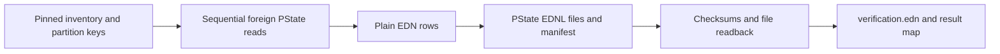

# Tools — explicit external-state export

This folder contains [export_current_data.clj](export_current_data.clj), a command
that reads the pinned external Rama PState inventory and writes an archive to a
new directory. It is read-only with respect to Rama and writes local archive
files. It does not deploy modules, append requests, migrate the store or restore
an archive. HTTP startup does not call it.

The namespace owns the module/PState inventory, scan strategy, portable EDN
normalization and archive checks. It opens and closes its own foreign manager
inside `export!`; no process-global runtime is retained. Durable source data
remains with the [Rama modules](../rama/).

## Running boundary

From the repository root, the command entry is:

```sh
clj -M -m app.server.tools.export-current-data /absolute/path/to/new-archive
```

This is an operational command that connects to the localhost conductor. Its
preconditions matter before use:

- The deployment must have exactly the module names in `module-specs`, each
  reporting `RUNNING`. The tool checks this once before scanning.
- The pinned PState shapes and eight-task partition layout must match the store.
  The layout corresponds to [bin/land](../../../../bin/land)'s deployment options;
  the exporter does not discover or validate task counts or schemas remotely.
- The caller must establish quiescence for a consistent multi-query capture.
  The exporter does not pause writers or take a shared snapshot. Its manifest's
  `:quiescent-multi-query-snapshot` label records an assumption.
- The output directory must be new and its parent must exist. Lexical checks
  exclude the repository, `/mnt/data/rama`, and the filesystem root. Paths are
  normalized without resolving symlinked ancestors.

The missing-argument exception still prints the old `app.tools.export-current-data`
namespace. The command above follows the actual namespace declaration; correcting
that executable error string is outside this documentation change.

## Scan and archive



The inventory names object-container, transcript-ops, relation-kernel and
face-arsenal as owners. TrailView is included in the deployment check but has no
owned PStates to export. This is an explicit inventory, not an automatic census
of everything a future module declares. The scan helpers distinguish flat maps,
subindexed nested maps, and plain inner maps. Pages bound individual reads; the
tool still retains a complete PState's rows in memory before writing its file.

| Output | Meaning |
|---|---|
| `pstates/*.ednl` | One EDN row per outer PState key with module, PState and partition identity. Nested values preserve the inner map and leaf count. |
| `manifest.edn` | Pinned layout, Git custody, deployment status, row/leaf counts and each PState file's hash. |
| `SHA256SUMS` | Hashes of the PState files and manifest. It does not include the later verification file. |
| `verification.edn` | PState-file readback results, timestamp and a hash of `SHA256SUMS`. |

`plain-edn` removes record constructors and represents Throwables as diagnostic
maps; Nippy thaw failures abort the export. `edn-line` requires equality after
EDN readback. `verify-archive` checks the files listed in the manifest against
its hashes and entry/leaf counts. It does not compare against the live store,
prove cross-query consistency, verify `SHA256SUMS`, or validate a restore path.
The archive contains PState values, not depot history.

Failures can leave a partial output directory. `export!` does not delete it or
resume into it; the next attempt must satisfy the new-directory precondition.
A manifest marked complete is written before final verification, so inspect the
verification result rather than treating that field alone as successful export.

[Existing focused test source](../../../../test/app/server/tools/export_current_data_test.clj)
covers normalization, routing-key buckets, lexical destination checks and the
pinned inventory. These tests were not run as part of documenting the exporter.
Follow namespace and helper docstrings for cursor assumptions and exact checks.
