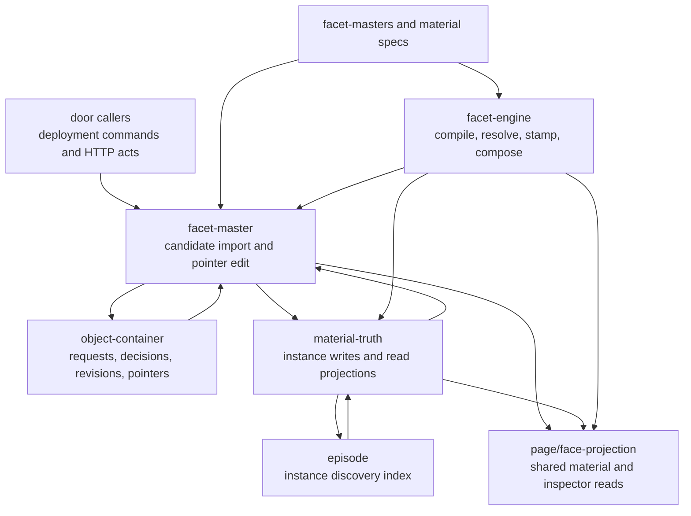

# Worn — revisioned facet material

This folder defines versioned material for facets such as attention, placement,
folding and invocation, and the operations that select which revision applies.
A **facet master** is a named source document with immutable candidate revisions
and a separate revisioned **active pointer**. “Worn” means the material resolved
for a subject from an instance override or pin, the shared active revision, or a
compiled fallback. Importing a candidate and choosing it for use are separate
operations.

The implementation has two parts: pure `.cljc` specifications and resolution
functions, and JVM adapters that read or submit requests to object-container.
These files do not own a renderer, input loop, provider process or Rama module.
They describe the current material mechanism; their presence does not establish
that every declared facet is consumed by a running interface.

Arrows show calls, supplied values or storage results, not a single transaction.
An instance write through `material-truth` calls `facet-master`, then attempts
index upkeep through `episode`; serving uses that index to discover what to read.

## Responsibilities and state

| Enter a file | Responsibility and boundary |
| --- | --- |
| [facet_master.clj](facet_master.clj) | Builds source/container/revision imports, edits active pointers, synthesizes instance identities and walks pointer history. Borrows an object-container runtime; returns requests, decisions and reread state. |
| [material_truth.clj](material_truth.clj) | Adds episode index upkeep to instance writes and derives served instances, scope estimates, announcements, declared-ground reports and per-master history cuts. No state is retained here. |
| [facet_engine.cljc](facet_engine.cljc) | Compiles EDN against explicit grammar versions, validates served material, resolves instance/shared/floor precedence, stamps contributions and reports composition conflicts. Pure; no revision fetch or activation. |
| [facet_masters.cljc](facet_masters.cljc) | Ordered registry of shared specs and facet/id/floor-label lookups. Requiring it does not import or activate material. Instance specs are synthesized separately. |
| [activation_event.cljc](activation_event.cljc) | Constructs, validates and reads pointer-content events. Retains compatibility with bare revision-id sources and distinguishes unknown grounds from explicitly empty grounds. |
| [binding_material.cljc](binding_material.cljc) | Validates gesture-to-verb rows, resolves containment/tier precedence and produces interaction/drill tables. Borrows verb definitions from [page/verb_registry.cljc](../page/verb_registry.cljc); choosing a descriptor does not execute the verb. |

Durable source, containers, revisions, pointers and decisions belong to the
[object-container module](../rama/object_container.clj). This folder requests
changes through its [foreign runtime helpers](../rama/object_container/runtime.clj).
The [episode registry](../episode/episode.clj) records discoverable
`(facet, subject, instance-master-id)` entries using object-container projection
rows; it does not create instance material. `material-truth` checks the instance
containers it discovers and can also probe caller-supplied subjects.

`facet-master` increments the borrowed
[ingest epoch](../rama/ingest_epoch.cljc) after an accepted write whose request
had no decision before the append. That atom is a process notification, not a
copy of the material. Production handles come from
[door/cluster.clj](../door/cluster.clj), where `object-container-bundle*` resolves
the depot, PStates and queries. `worn` neither acquires nor closes those handles.
The runtime helper's separate IPC constructor is available to test callers.

## Material specifications

Each material file owns its immutable spec, explicit grammar declarations,
source forms and code floor. Small wrappers delegate compilation and wear
resolution to `facet-engine`; local validators describe the actual accepted
values. A default form is used to bootstrap missing storage. A code floor is a
local fallback and can use a different grammar from that default. Neither
implies that a deployed master currently wears those bytes.

| Specification | Material described |
| --- | --- |
| [attention_material.cljc](attention_material.cljc) | Hit padding, border/background, contribution composition and user/machine hit-area bindings, including the reply row. |
| [foldable_material.cljc](foldable_material.cljc) | Fold defaults, section-header copy, toggle binding and outside-paste display clamp. |
| [positioned_material.cljc](positioned_material.cljc) | Reply spacing, fallback position, ordered anchor rules, persistence flag and block drag rows. |
| [provenance_material.cljc](provenance_material.cljc) | Provenance tint and append/priority composition policy. |
| [space_material.cljc](space_material.cljc) | Zoom bounds and bindable anchor/marquee rows. Camera-inclusive floor rows remain in `binding-material`. |
| [text_body_material.cljc](text_body_material.cljc) | Positive floor and fallback wrap-column counts. |
| [threaded_material.cljc](threaded_material.cljc) | Column adoption reach and thread-edge rail appearance. |
| [invocation_material.cljc](invocation_material.cljc) | Model string, local effort vocabulary and `thread+N` precontext setting. It validates data without checking provider availability. |

Compilation reads the grammar version in the form and validates its declared
material keys. It does not evaluate EDN as code. Missing or invalid served
shared material falls back through `resolved-wear`. `wear-for-subject` adds the
instance tier: a valid pin selects its supplied compiled target; a valid
deviation supplies its material snapshot; inheritance follows the shared
revision. Invalid instance material falls through to shared resolution, while
an unresolved pin explicitly falls to the floor. These functions consume values
already supplied by the caller and perform no I/O.

Binding resolution first walks the innermost claim outward. At the first depth
with matching rows, instance precedes master, then floor. Priority and modifier
specificity rank rows within that tier; remaining ties produce a deterministic
winner and conflict data. Composition of visual contributions is separate:
`facet-engine/compose` orders supplied descriptors and diagnoses incompatible
same-slot contributions. Neither operation performs the resulting interaction
or drawing.

## Storage and callers

`facet-master/import-candidate!` retains source without requiring it to compile.
An ordinary import changes the latest candidate, leaving the active pointer
alone. `activate!` reads the requested revision, checks its document ownership
and grammar, then edits the separate pointer container. Pointer content records
the material revision, declared kind/scope, actor, time and grounds; the pointer
revision has its own identity and parent link. Bootstrap can import the initial
material and pointer together.

These writes use object-container's request depot with `:ack` and then read the
durable decision. The module uses a stream topology with request/idempotency
journals; acknowledgement alone is not the returned acceptance verdict. An
import followed by activation, or a sequence of reads, is not one transaction.
Instance ids retain the parent's two-segment routing shape using `~i~`;
the exact reason is beside `facet-engine/instance-marker` and the corresponding
routing is in `object-container/extract-object-key`.

The source-traced entry points are:

- [door/cluster.clj](../door/cluster.clj), `facet-materials-ingest!`: an explicit
  deployment command that ensures registered masters and imports/activates
  named grammar revisions. This is separate from acquiring server handles.
- [door/server_jetty.clj](../door/server_jetty.clj), the `/api/matter-room/deviate`,
  `/api/matter-room/activate` and `/api/matter-room/rollback` handlers: call the
  corresponding matter-room adapters and then `worn` writes. The matter-room
  activation path validates declared event metadata before `activate!`; the
  lower-level adapter itself does not enforce that event contract.
- [page/face_projection.clj](../page/face_projection.clj): registers
  `:facet-materials` and `:material-truth` projections, reads shared and instance
  material, and supplies interaction and inspector views. Shared compilation
  uses the generic engine; invocation's richer local error wrapper is separate.
- [episode/episode.clj](../episode/episode.clj): registers and reads instance
  discovery entries after material writes. Pin/deviation material remains in the
  facet-master containers, independent of discovery success.

These are implementation call paths, not fresh runtime or performance receipts.
The `.cljc` location permits shared use but does not by itself establish a browser
consumer. Follow a caller's map for its presentation or invocation behavior.

## Limits that affect readers

`material-truth/served-instances` reads the registry once, then reads each
instance and any pin target individually. The page projection's returned-value
cap is applied after those reads. Index registration is best-effort: its result
or caught failure is not included in the returned facet write result. Extra
subjects and `rebuild-instance-registry!` can rediscover existing instance
containers; rebuilding requires a supplied subject set and does not clear stale
registry entries.

`facet-master/activation-trail` fetches the first 1000 order-indexed rows and
walks parent links from a separately read current tip. It does not paginate or
fetch missing parents. Its completeness flag checks page size only; the chain
can be incomplete or empty if the tip/parents are outside the page. Reports
inherit that limit. `world-at` describes independently read cuts for registered
shared masters, not an atomic historical world including all instances.

Scope estimates count the supplied candidate subjects; announcements attach the
caller's affected set rather than reconstruct past membership. Ground reports
repeat declared grounds without verifying their truth. Function docstrings also
record two write-path discrepancies: pin/unpin preserve the deviation flag but
rebuild values from shared material, and instance-write acceptance treats a
pre-observed decision as success even when that earlier decision was rejected.
Those are current limitations to investigate, not intended guarantees or fixes
made by this documentation change.

Read namespace docstrings for each file's inputs, effects and ownership, then
function docstrings for local contracts. Keep changed explanations beside their
source and update this map when a responsibility or cross-folder relationship
changes. Return to the containing [server map](../README.md) for adjacent scopes.
